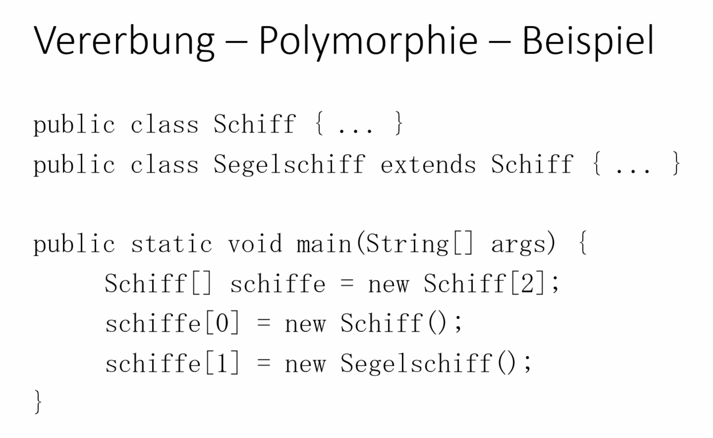
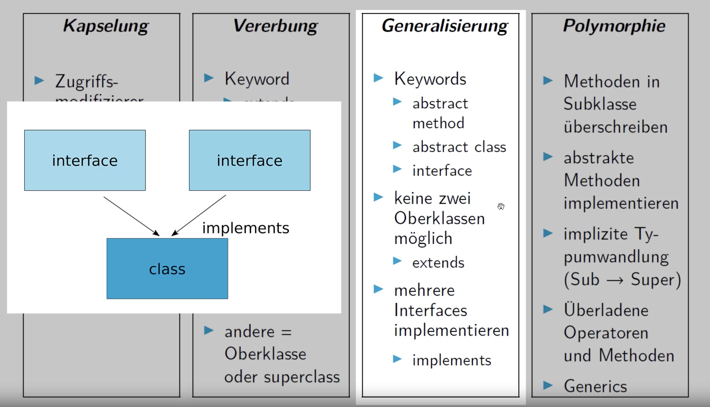

# Vererbung - Polymorphie

- Objekte einer Klasse können auch als Objekte der Superklasse  
    behandelt werden
- Objekte gleicher Superklasse können so z.B. in einem Array  
    zusammen gespeichert werden

# Interfaces

- enthält nur Methodenköpfe
- wird ein Interface von einer Klasse implementiert, muss diese auch die Methoden des Interfaces implementieren
- „Vererbung" von mehreren „Klassen"

# Abstrakte Klassen

- im Gegensatz zu Interfaces Vererbung (von Attributen und  
    Methoden) möglich
- zu implementierende Funktionen werden mit dem Stichwort abstract gekennzeichnet und sind (wie bei Interfaces) nur Funktionsköpfe
- wenn eine Klasse von einer abstrakten Klasse erbt, muss diese auch die abstrakten Funktionen der Superklasse implementieren

# Generics

• wenn noch unbekannt, welchen Datentyp ein Objekt hat

Beispiel:

Ihr schreibt einen Algorithmus, der zwei Arrays miteinander vergleicht.

Der Algorithmus funktioniert dabei immer gleich, egal welcher Datentyp in den Arrays gespeichert ist. Ihr wollt allerdings nicht für jeden Datentypen eine eigene Klasse schreiben.

# 4 Säulen der OOP

