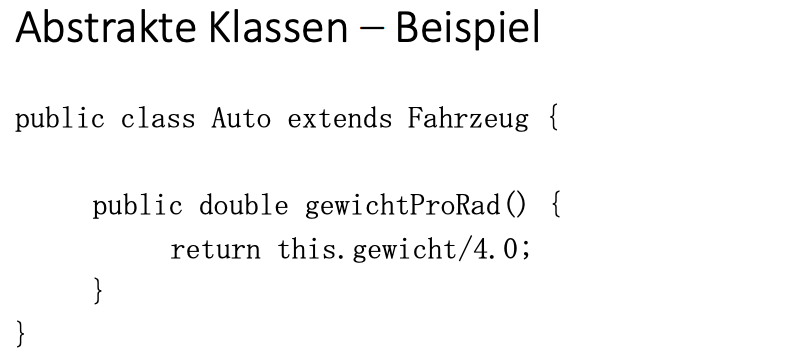
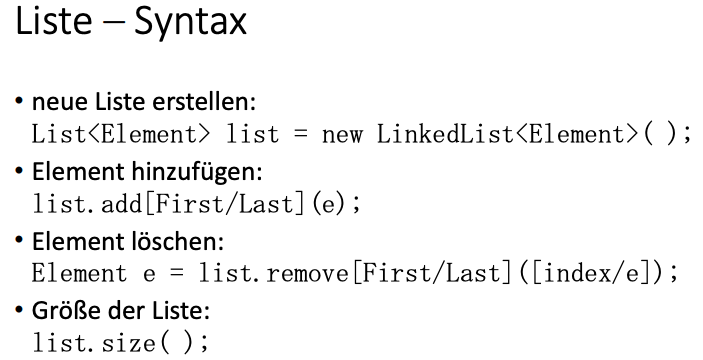
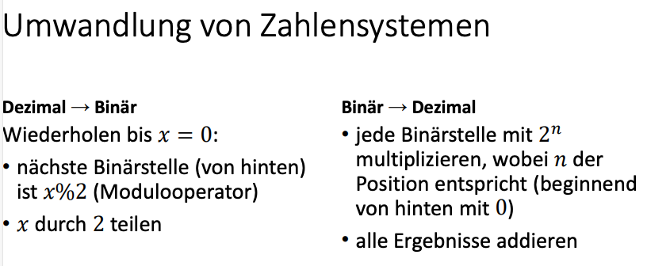

Themen:

- Assertionen (**assertions**)
- *Unit Testing*
- Javadoc Kommentare
- Behandlung von Ausnahmen (`exceptions`)
- Die Schnittstellen **Comparator** und **Comparable**
- Wdh: Wachstumsordnungen
- Empirische und Analytische Laufzeitanalyse
- Praktische Bestimmung von Laufzeitkomplexität
- Laufzeit von Java Collections
- Vorrangwarteschlange (***priority queue***, Prioritätenwarteschlange)
- indizierte Vorrangewarteschlange

# Wiederholung

## Schlüsselwörter – Lösung 
Was bedeuten die folgenden Begriffe? 
- static: Funktion ohne Erstellung eines Objekts aufrufbar. 
- this (in Bezug auf Variablen): Die Attribute des Objekts. 
- extends: Die Klasse erbt von einer Superklasse.


## Vererbung – Polymorphie 

- Objekte einer Klasse können auch als Objekte der Superklasse behandelt werden 
- Objekte gleicher Superklasse können so z.B. in einem Array zusammen gespeichert werden


## Interfaces 

- enthält nur Methodenköpfe 
- wird ein Interface von einer Klasse implementiert, muss diese auch die Methoden des Interfaces implementieren 
- „Vererbung“ von mehreren „Klassen“


## Abstrakte Klassen 
-  im Gegensatz zu Interfaces Vererbung (von Attributen und Methoden) möglich 
-  zu implementierende Funktionen werden mit dem Stichwort abstract gekennzeichnet und sind (wie bei Interfaces) nur Funktionsköpfe 
-  wenn eine Klasse von einer abstrakten Klasse erbt, muss diese auch die abstrakten Funktionen der Superklasse implementieren





# Generics 
• wenn noch unbekannt, welchen Datentyp ein Objekt hat

# Arrays, Listen, Queues, Stacks

## Arrays 
• zusammenhängende Felder im Speicher 

Vorteil: 
• benötigen für Zugriffe keine komplexeren Funktionen 

Nachteil: 
• haben feste Größen und Positionen


## Listen 
• Verkettung von Objekten mithilfe einer komplexen Datenstruktur 

Vorteil: 
• Länge und Positionen sind variabel 

Nachteil: 
• Zugriffe benötigen immer vordefinierte Funktionen

### Listen – Arten 
• LinkedList: verkettete Liste 
• ArrayList: Liste mit Array-Indizes 
• Queue: siehe spätere Folien 
• Stack: siehe spätere Folien




## Queue 

FIFO (First In First Out) 
• Elemente die zuerst eingefügt werden, werden auch als erstes wieder heraus genommen 
Funktionen: 
• offer: Element wird hinzugefügt 
• poll: Element wird heraus genommen


## Stack
FILO (First In Last Out) 
• Elemente die zuerst eingefügt werden, werden als letztes wieder heraus genommen 

Funktionen: 
• push: Element wird hinzugefügt 
• pop: Element wird heraus genommen


# Hausaufgabenblatt 02




# Aufgabe5


## Aufgabe 1: Laufzeit - Grundlagen

1. Die Laufzeiten von Schritten, die nacheinander ausgeführt werden, werden addiert.
2. Die Laufzeiten von Schritten, die in einer Schleife ausgeführt werden, werden mit der Komplexität der Schleife multipliziert.
3. Wenn ein Problem in jedem Schritt doppelt so groß wird, ist die Laufzeit exponentiell.
4. Wenn ein Problem sich exponentiell schnell seiner Abbruchbedingung nähert, ist die Laufzeit logarithmisch.
5. Konstanten werden bei der Angabe der Komplexität weggelassen.


```java
abstract class Vehicle {
    protected int numberOfWheels;

    abstract void refillAir(int num);

    public Vehicle(int numberOfWheels) {
        this.numberOfWheels = numberOfWheels;
    }

    public void repair() {
        for (int i = 0; i < numberOfWheels; i++) {
            refillAir(i);
        }
    }
}

class Car extends Vehicle {
    public Car() {
        super(4);
    }

    @Override
    public void refillAir(int num) {
        System.out.print("C" + num);
    }
}

class Bicycle extends Vehicle {
    public Bicycle() {
        super(2);
    }

    @Override
    public void refillAir(int num) {
        System.out.print("b" + num);
    }
}
public class Garage {
    public static void main(String[] args) {
        Vehicle[] allVehicles = new Vehicle[3];
        Vehicle[] vehicles = new Vehicle[3];
        Car c1 = new Car();
        allVehicles[0] = c1;
        Bicycle b1 = new Bicycle();
        allVehicles[1] = b1;
        Bicycle b2 = new Bicycle();
        allVehicles[2] = b2;

        try {
    for (int i = 0; i <= 3; i++)
        allVehicles[i].repair();
} catch (Exception e) {
    System.out.println(e);
}

    }
}


```

