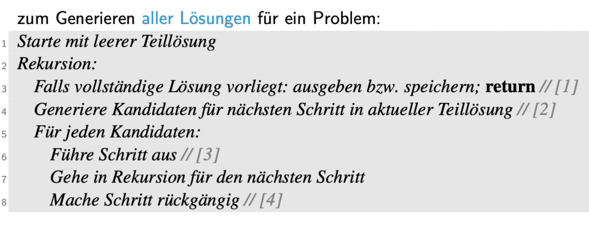
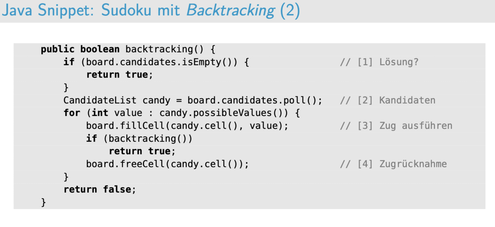

d# Backtracking







# Greedy Algorithmen


![[截屏2024-05-14 12.50.45.png]  


# PriorityQueue

• Elemente mit der höchsten Priorität werden als erstes wieder herausgenommen 
• Elemente müssen vergleichbar sein


# Aufgabe 1


# Aufgabe 2


# Junit


```java

import static org.junit.jupiter.api.Assertions.*;
import org.junit.jupiter.api.Test;

public class StringGenomeTest {

//	public void addNucleotide(char c) {
//		if (c == 'A' || c == 'C' || c == 'G' || c == 'T')
//			s = s + c;
//		else
//			throw new RuntimeException("Illegal nucleotide");
//	}
	@Test
	public void testAddNucleotide() {
		//TODO
		StringGenome genome = new StringGenome();
		genome.addNucleotide('A');
		assertEquals("A", genome.toString());
		genome.addNucleotide('C');
		genome.addNucleotide('G');
		genome.addNucleotide('T');
		assertEquals("ACGT", genome.toString());

		try {
			genome.addNucleotide('X');
			fail();
		} catch (Exception e) {
			assertEquals("ACGT", genome.toString());
		}
	}

	@Test
	public void testNucleotideAt() {
		//TODO
	}

	@Test
	public void testLength() {
		//TODO
		StringGenome genome = new StringGenome();
		// hier muss die laenge 0 sein
		assertEquals(0, genome.length(), "this is an error message");
		//assertTrue(0 == genome.length());
		genome.addNucleotide('A');
		genome.addNucleotide('C');
		assertEquals(2, genome.length());
	}

	@Test
	public void testToString() {
	//TODO
	}

	@Test
	public void testEqualsObject() {
	//TODO
	}

}

```