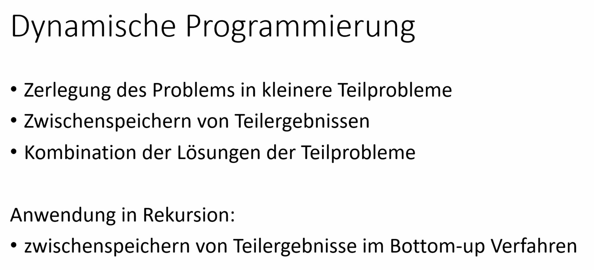

# Dynamischen Programmierung





在动态规划（Dynamic Programming）中，Top-Down和Bottom-Up是两种常见的实现方法。它们都用于解决具有重叠子问题和最优子结构性质的问题，但在实现方式和计算顺序上有所不同。

### Top-Down 方法（自顶向下）

Top-Down方法通常与递归和记忆化（Memoization）一起使用。它从问题的最高层开始，通过递归的方式将问题逐渐分解为子问题，同时利用记忆化技术存储已经计算过的子问题的结果，以避免重复计算。

**特点：**
- 递归方式实现。
- 通过记忆化避免重复计算。
- 适合用于问题规模较小时的快速实现。

**步骤：**
1. 定义一个递归函数来解决问题。
2. 使用一个数据结构（如数组或字典）存储已经计算过的子问题的结果。
3. 在递归函数中，首先检查子问题是否已经计算过。如果计算过，则直接返回结果；否则，计算子问题的结果并存储起来。
4. 递归调用子问题并返回最终结果。

**示例代码：**
```python
def fib(n, memo={}):
    if n in memo:
        return memo[n]
    if n <= 1:
        return n
    memo[n] = fib(n-1, memo) + fib(n-2, memo)
    return memo[n]

print(fib(10))  # 输出：55
```

### Bottom-Up 方法（自底向上）

Bottom-Up方法通过迭代的方式，从最小的子问题开始，逐步解决更大的子问题，直到最终解决原问题。它通常不使用递归，而是通过循环来完成计算。

**特点：**
- 迭代方式实现。
- 通过填表格（如数组）从小到大解决子问题。
- 对于大规模问题更有效率，因为它避免了递归调用的栈空间消耗。

**步骤：**
1. 定义一个数据结构（如数组）来存储子问题的结果。
2. 从最小的子问题开始，逐步计算并填充数据结构。
3. 根据前面的子问题结果，逐步解决更大的子问题。
4. 最终返回原问题的结果。

**示例代码：**
```python
def fib(n):
    if n <= 1:
        return n
    dp = [0] * (n + 1)
    dp[1] = 1
    for i in range(2, n + 1):
        dp[i] = dp[i - 1] + dp[i - 2]
    return dp[n]

print(fib(10))  # 输出：55
```

### 比较与选择

- **时间复杂度和空间复杂度：** 两种方法的时间复杂度通常是相同的，但Top-Down方法可能因为递归调用和记忆化的实现细节导致空间复杂度略高于Bottom-Up方法。
- **代码易读性：** Top-Down方法通过递归实现，代码往往更简洁直观；而Bottom-Up方法则通过迭代实现，代码可能稍显复杂，但在处理大规模问题时更高效。
- **适用场景：** 对于较小的问题或者需要快速实现的场景，可以选择Top-Down方法；而对于大规模问题，尤其是递归深度较大时，Bottom-Up方法通常更优。

两种方法各有优劣，选择使用哪种方法取决于具体问题的规模和实现要求。
# Aufgabe 1


