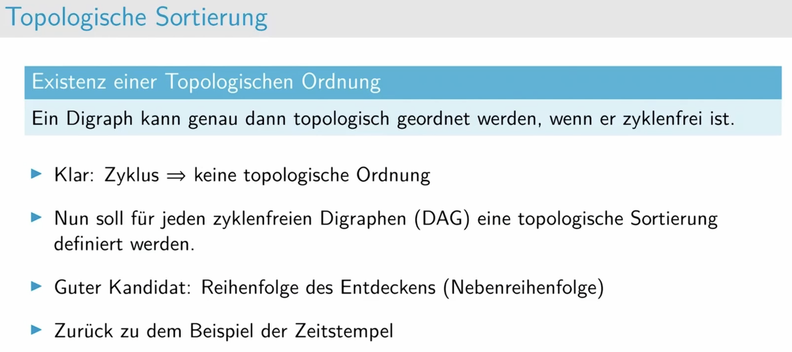
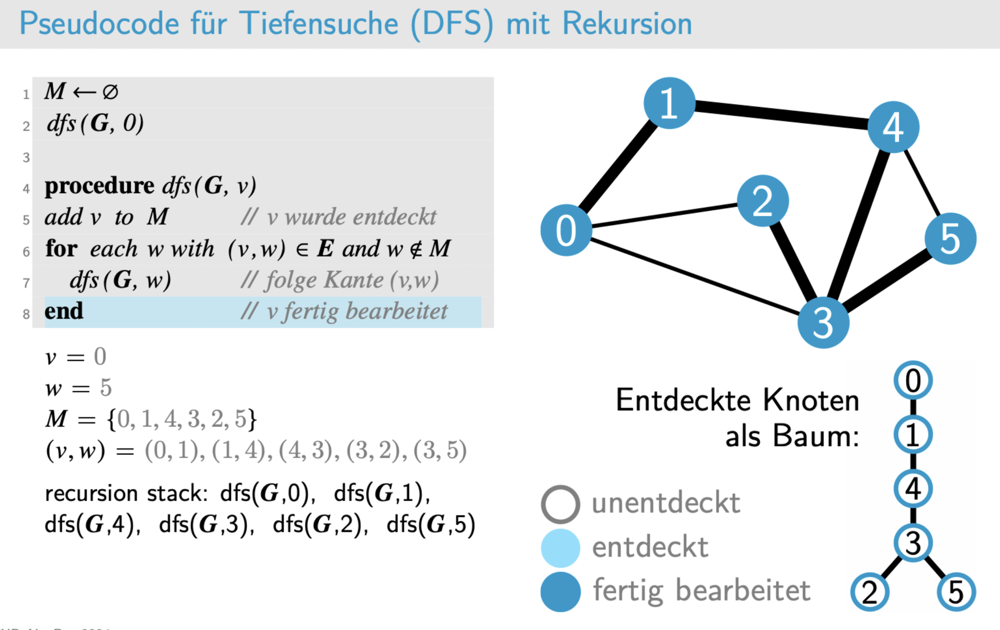

dfs和bfs看视频
# Topologisches Sortieren

# Aufgabe 1: Graphenalgorithmen (Klausurvorbereitung)

|  |  |
| ------------------------------ | ------------------------------ |

dicht 密集的
dünne 细的

后面两题见ppt

# Aufgaben 2

# HA

