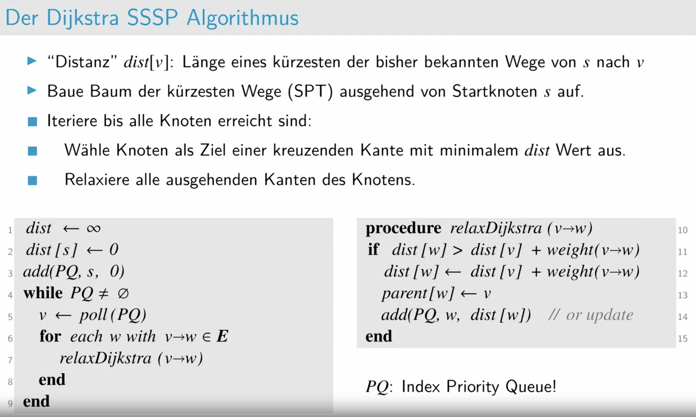
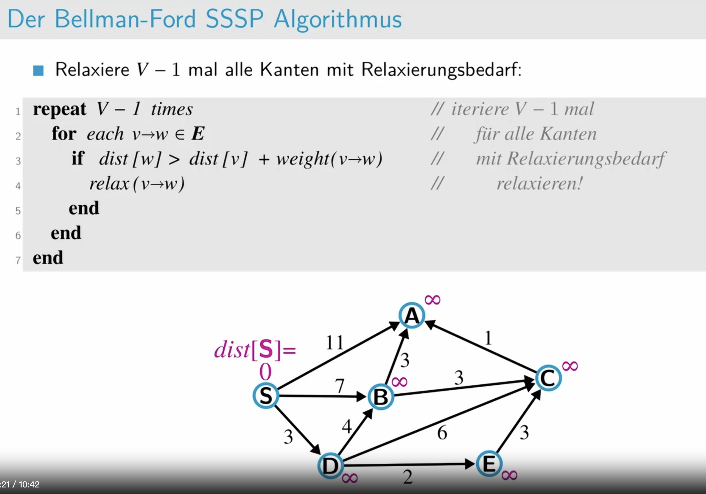

# Einführung

# Dijkstra Algorithmus
in Digraphen mit nicht-negativen Gewichten

**中文**：Dijkstra算法无法处理负权边，因为它基于贪心策略，假设所有已选择的路径都是最短的，而负权边可能会在后续更新中找到更短的路径，破坏这一假设。

**德语**: Der Dijkstra-Algorithmus kann keine negativen Kantengewichte verarbeiten, da er auf einer gierigen Strategie basiert, die annimmt, dass alle ausgewählten Wege die kürzesten sind, während negative Kanten in späteren Aktualisierungen kürzere Wege finden könnten und diese Annahme zerstören.

# Bellman-Ford Algorithmus

# Aufgabe 1: Algorithmus von Dijkstra (Klausurvorbereitung)

# Aufgabe 2: Algorithmus von Bellman-Ford (Klausurvorbereitung)

Dijkstra:详细看cloud tut

看tutorium cloud