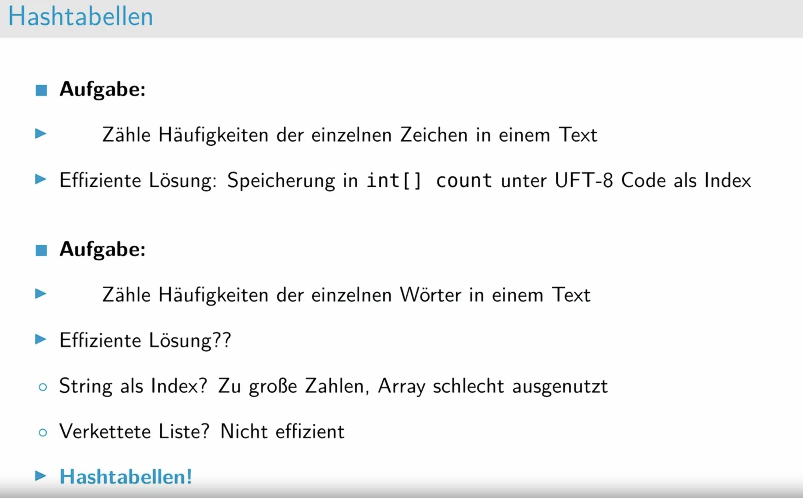
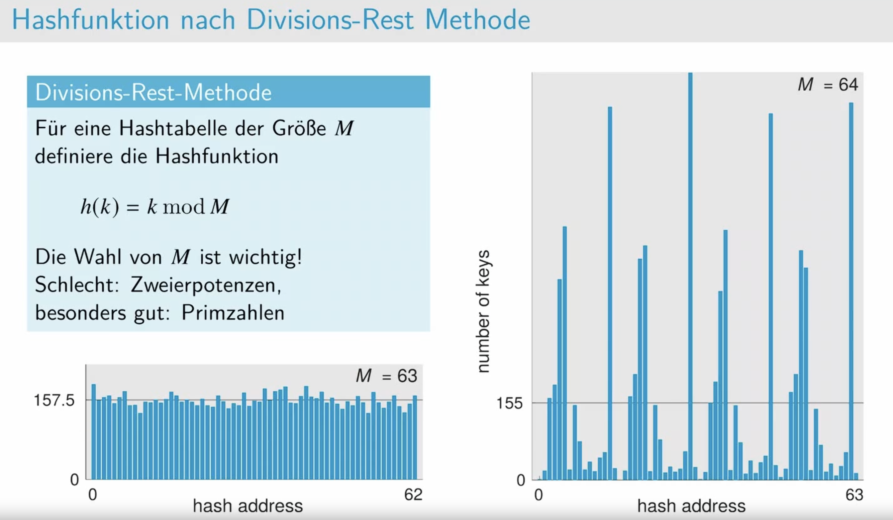
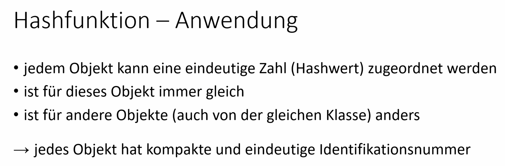
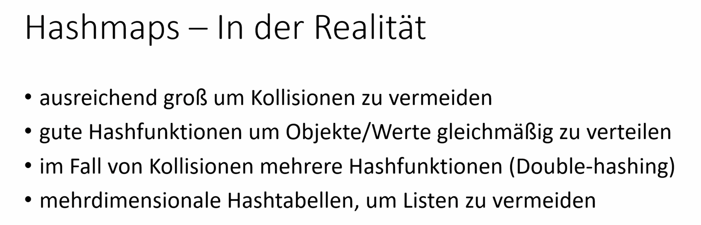

# Einführung

# Hashfunktionen

"häufung" 是德语中的一个词，意思是“堆积”或者“积累”。在日常用语中，它可以用来描述事物或现象的聚集或集中，也可以指积累的数量增加。

# Kollisionsauflösung:
- mit Verkettung (_separate chaining_)
- mit Sondierung (_open addressing_), lineare und quadratische Sondierung; _Double Hashing_

删除哈希表中元素的过程涉及以下步骤：
1. **定位元素**：

• 使用哈希函数找到要删除元素的初始位置。
• 如果初始位置没有找到目标元素，则按照相同的探测规则（线性或二次）继续搜索，直到找到目标元素或确认元素不存在。

2. **标记删除**：

• 一旦找到要删除的元素，将其标记为“删除”。通常，这不会直接删除元素，而是设置一个特殊标记表示该位置曾经被占用过但现在已删除，以便继续探测时能够正确跳过。

3. **重新插入受影响的元素**：

• 由于删除操作可能会影响到后续插入的元素，需要重新插入可能受影响的元素。通常，这是通过在删除位置之后继续探测并重新插入这些元素来完成的，确保哈希表的结构不被破

# Aufgabe 1: Hashing

# Aufgabe 2 Wiederholung

- 2.2

