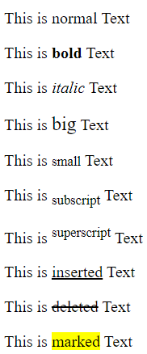

https://pool-fall-62f.notion.site/HTML-746696344761457ea9d83f6a554d8e42?pvs=74

# HTML Grundlagen

## Grundlegender Aufbau

Ein HTML-Code sollte immer mit `<!DOCTYPE html>` beginnen. Danach folgt der **Opening-Tag** `<html>`, der am Ende des Codes mit dem **Closing-Tag** `</html>` geschlossen wird. Alles zwischen und inklusive eines solchen Tag-Paares heißt **Element**. 

Ein HTML-File sollte immer ein `<head>` und ein `<body>` Element beinhalten. Alles was im `<head>` steht, ist nicht direkt sichtbar auf der Webseite, aber enthält wichtige Meta-Informationen. Alles was im `<body>` steht, wird dem Besucher direkt angezeigt.

**Kommentare** erzeugt man mit: `<!-- Hier der Kommentar -->`

<aside>
💡 Um schnell die Basics zu erstellen, gib nur `!` in VSC ein um die Grundlagen zu erhalten

(evtl Sprache anpassen)

```html
<!DOCTYPE html>
<html lang="de">
<head>
    <meta charset="UTF-8">
    <meta http-equiv="X-UA-Compatible" content="IE=edge">
    <meta name="viewport" content="width=device-width, initial-scale=1.0">
    <title>Document</title>
</head>
<body>

</body>
</html>
```

</aside>

### Was gehört in den `<head>`?

- Title
    
    ```html
    <title>Document</title>
    ```
    

- Icon
    
    ```html
    <link rel="icon" href="icon.jpg" type="image/jpg">
    Hier ist das Icon direkt im gleichen Ordner, wie die HTML-Datei.
    ```
    
- Meta-Informationen
    
    ```html
    <meta charset="UTF-8"> <!-- Codierung (Mit UTF-8 können z.B. Umlaute angezeigt werden) -->
    <meta http-equiv="X-UA-Compatible" content="IE=edge"> <!-- No idea -->
    <meta name="viewport" content="width=device-width, initial-scale=1.0"> <!-- What? -->
    ```
    

### Was gehört in den `<body>`?

Alles was hier reingeschrieben wird, sollte angezeigt werden… auch wenn man einfach nur Text ohne irgendwelche Tags reinschreibt

**Mögliche Elemente:**

- Header-Tags: `<h1>`
    
    Es gibt Header-Tags, die Überschriften nachstellen sollen. Der größte von ihnen ist `<h1>`, aber es gibt auch `<h2>`, `<h3>`… bis `<h6>`.
    
- Paragraph-Tags `<p>`
    
    Einfach ein Paragraph für den vorher ein Absatz kommt und danach auch.
    
    <aside>
    💡 Wenn man in VSC einfach nur `lorem` schreibt, wird automatisch Sample-Text hinzugefügt.
    
    </aside>
    
- Br-Tags `<br>`
    
    Brauchen keinen Closing-Tag. Erzeugen einen Zeilenumbruch.
    
- Horizontal-Rule `<hr>`
    
    Braucht keinen Closing-Tag. Erzeugt eine horizontale Linie.
    

### Weiteres:

- **Boolean-Attribute** sind Attribute, die durch ihr einfaches Hinschreiben aktiviert werden (hier `loop`).

```html
<audio src="audio.mp3"></audio>
<audio loop src="audio.mp3"></audio>
```

- **Text formatieren** ist auf verschiedene Wege einfach möglich. Unten sind alle schnellen Wege aufgeführt Text zu formatieren.
    
    
    ```html
    <p>This is normal Text</p>
    
    <p>This is <b>bold</b> Text</p>
    
    <p>This is <i>italic</i> Text</p>
    
    <p>This is <big>big</big> Text</p>
    
    <p>This is <small>small</small> Text</p>
    
    <p>This is <sub>subscript</sub> Text</p>
    
    <p>This is <sup>superscript</sup> Text</p>
    
    <p>This is <ins>inserted</ins> Text</p>
    
    <p>This is <del>deleted</del> Text</p>
    
    <p>This is <mark>marked</mark> Text</p>
    ```
    
    
    

## Bauteile:

Unter ⬆️ Grundlegender Aufbau sind die Textblöcke.

### Hyperlinks

Werden mit den Opening/Closing-Tags `<a></a>` erstellt. In dem Opening-Tag verlinkt man wie unten gezeigt mit `href=""` seinen Code:

```html
<a href="https://www.example.com" target="_blank" title="Go to Example.com">
    <h1>Hier gehts los!</h1>
</a>
```

In diesem Beispiel wird dem User "Hier gehts los!" angezeigt, und wenn man draufklickt, wird man auf die Seite [www.example.com](http://www.example.com) weitergeleitet. Durch das `target="_blank"` wird die Seite in einem neuen Tab geöffnet. Das `title="Go To Example.com"` erzeugt eine kleine Textbox, in der "Go to Example.com" steht, wenn man mit der Maus über den Link hovert.

Wenn man auf ein weiteres File im gleichen Ordner verlinken möchte, muss man einfach nur den vollständigen Namen (z.B. `page2.html`) angeben.

Man kann auch mit `mailto:test@example.com` direkt das Standard-Mailprogramm öffnen und einen Entwurf für die angegebene Mail erstellen.

### Images

Adde Bilder mit dem ``-Tag, wie hier: (In dem Beispiel ist auf dem Bild gleichzeitig ein Hyperlink)

```html
<a href="https://pixabay.com/de/photos/schwarz-tafel-kreidespuren-schule-1072366/" target="_blank">
    
</a>
```

Mit `height="200" width="500"` wird die **Größe des Bildes** angepasst und mit `alt=""` hinterlegt man einen alternativen Text, der angezeigt wird, wenn das Bild nicht geladen werden kann oder der ausgegeben wird, falls Personen sich den Inhalt einer Webseite vorlesen lassen.

Die Quelle (`src="/.ressources/tafel.jpg"`) zeigt nicht auf ein Bild, das im selben Ordner wie die HTML-Datei ist, sondern auf einen **Unterordner** namens “.ressources”. Wenn viele Bilder in einem Projekt verwendet werden, lohnt es sich, diese in einem eigenen Ordner zu speichern. 

Man kann auch **Bilder aus Onlinequellen** benutzen. Dafür gibt man bei `src` einfach nur einen Link an: ``

### Audio

Adde Audio mit den `<audio></audio>`-Tags, wie vorher aus einer Quelle mit `src=""` .

```html
<audio controls autoplay muted loop src="audio.mp3"></audio>
```

Unterstützte Datentypen: MP3 & WAV 

- **Extras** *Attribute* wie z.B. `controls autoplay muted loop` (alles [boolean-attribute](HTML.md))
    
    Mit `controls` wird ein Audio-Player angezeigt. Ohne diesen wird auf der Webseite nicht angezeigt, dass Audio gespielt wird. Der Player ermöglicht Pausieren, Skippen, Lautstärke regeln, Muten, Herunterladen, Geschwindigkeit einstellen und mehr.
    
    Mit `autoplay` wird die Audio-Datei direkt beim Betreten abgespielt.
    
    Mit `muted` wird erst Ton abgespielt, sobald der User die Audio aktiv entmuted. 
    
    Mit `loop` wird die Audio immer wieder von vorne abgespielt.
    
    Weitere gibt es [hier](https://developer.mozilla.org/en-US/docs/Web/HTML/Element/audio#attributes).
    

### Video

Adde Video mit den `<video></video>`-Tags, wie vorher aus einer Quelle mit `src=""`.

```html
<video controls autoplay muted loop src="video.mp4"></video>
```

Unterstützte Datentypen: MP4, WebM & Ogg 

- **Extras** *Attribute* wie z.B. `controls autoplay muted loop` (alles [boolean-attribute](HTML.md))
    
    Mit `controls` wird ein Video-Player angezeigt. Ohne diesen wird auf der Webseite nicht angezeigt, dass Video gespielt wird. Der Player ermöglicht Pausieren, Skippen, Lautstärke regeln, Muten, Herunterladen, Geschwindigkeit einstellen und mehr.
    
    Mit `autoplay` wird die Video-Datei direkt beim Betreten abgespielt.
    
    Mit `muted` wird erst Ton abgespielt, sobald der User die Audio aktiv entmuted. 
    
    Mit `loop` wird das Video immer wieder von vorne abgespielt.
    
    Weitere gibt es [hier](https://developer.mozilla.org/en-US/docs/Web/HTML/Element/video#attributes).
    

## Alle Tags:

Alle Tags mit Erklärung gibt es auf dieser Seite: [https://www.w3schools.com/tags/](https://www.w3schools.com/tags/).