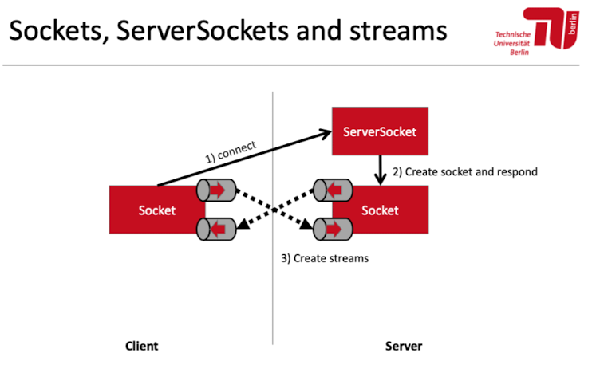

# Aufgabe 1 – Unchecked Exceptions 

Entwickeln Sie eine Methode addPositive(), die zwei positive Zahlen (ints, inklusive 0) addiert. Werden negative Zahlen als Eingabeparameter übergeben, soll eine IllegalArgumentException geworfen werden. Für welche Fehlerfälle sind „Unchecked Excepetions“ zu verwenden? Sollten diese Exceptions auch im Methodenkopf angezeigt werden? Schreiben Sie weiter eine main-Methode, die zwei int-Werte von der Konsole einliest und damit die Methode addPositive() aufruft. Falls ungültige Parameter eingegeben wurden, soll der Nutzer um erneute Eingabe gebeten werden.

```java
package aufgabe1;  
  
import java.util.Scanner;  
  
public class UncheckedExceptions {  
  
    public static void main(String[] args) {  
       Scanner in = new Scanner(System.in);  
       System.out.print("Enter a: ");  
       int a = in.nextInt();  
       System.out.print("Enter b: ");  
       int b = in.nextInt();  
       try {  
          System.out.println("a+b = " + addPositive(a, b));  
          main(args);  
       } catch (IllegalArgumentException e) {  
          System.out.println("Negative arguments entered. Please enter positive ones.");  
          main(args);  
       }  
       in.close();  
    }  
  
    /**  
     * adds two positive integer numbers. 0 is allowed. Negative values cause IllegalArgumentExcpetions.     ** @param a  
     * @param b  
     * @return sum of positive integers  
     */    private static int addPositive(int a, int b){  
       if (a < 0 || b < 0) {  
          throw new IllegalArgumentException(  
                "Only positive numbers are allowed");  
       }  
       return a + b;  
    }  
  
}


```

# Aufgabe 2 – Checked Exceptions 

Erstellen Sie eine Klasse ThreeObjectBucket. Diese Klasse soll bis zu 3 Objekte vom Typ Object speichern können und dazu intern ein Array der Länge 3 verwenden. Implementieren sie zudem Methoden zum Hinzufügen, Lesen und Entfernen von Objekten. 
Erstellen Sie nun eine main-Methode, die versucht vier Objekte in Ihr Bucket einzufügen. Was geschieht? Ist dieses Verhalten erwünscht? Wie können Exceptions helfen das Verhalten im Fehlerfall zu verbessern? Welche Art von Exceptions erscheint geeignet? 
Erstellen Sie nun eine eigene Exceptionklasse BucketFullException. Bieten Sie einen Konstruktor an, der das Setzen einer Fehlermeldung ermöglicht. Integrieren Sie diese Exception in die Klasse ThreeObjectBucket; behandeln und testen Sie ihr Auftreten in der main-Methode

```java
package aufgabe2;  
  
class BucketFullException extends Exception {  
  
    private static final long serialVersionUID = -5059495685587788623L;  
  
    //Parameterless Constructor  
    public BucketFullException() {}  
  
    //Constructor that accepts a message  
    public BucketFullException(String message)  
    {  
       super(message);  
    }  
}
```

```java
package aufgabe2;  
  
public class ThreeObjectBucket {  
    Object[] objectarray = new Object[3];  
  
    public void add(Object o) throws BucketFullException {  
       for (int i = 0; i < 3; i++) {  
          if (objectarray[i] == null) {  
             objectarray[i] = o;  
             System.out.println("Object added, toString(): " + o);  
             return;  
          }  
       }  
       throw new BucketFullException(  
             "The Bucket is full! Remove entries before adding more new ones.");  
    }  
  
    public Object get(int index) {  
       return objectarray[index];  
    }  
  
    public void remove(int index) {  
       objectarray[index] = null;  
    }  
  
}
```


```java
package aufgabe2;  
  
public class CheckedException {  
      
    public static void main(String[] args){  
       ThreeObjectBucket ob = new ThreeObjectBucket();  
       try{  
       ob.add("Hello");  
       ob.add(new Object());  
       ob.add("Hossa");  
       ob.remove(1);  
       ob.add("Yes");  
       ob.add("No");  
       }catch(BucketFullException e){  
          System.out.println(e.getMessage());  
       }  
         
    }  
}
```

Output:
```
Object added, toString(): Hello
Object added, toString(): java.lang.Object@30f39991
Object added, toString(): Hossa
Object added, toString(): Yes
The Bucket is full! Remove entries before adding more new ones.
```

# Aufgabe 3 – Thread vs. Runnable
In der Vorlesung haben Sie Threads und Runnables kennengelernt. Diese Aufgabe soll Ihnen helfen Unterschiede und Gemeinsamkeiten besser zu verstehen. Erstellen Sie eine Klasse SimpleThread, welche von Thread erbt. Überschreiben sie nun die run-Methode sodass sie „I'm a simple Thread.“ auf der Konsole ausgibt. Erstellen Sie nun eine Klasse ThreadAndRunnableDemo, in deren main-Methode eine Instanz von SimpleThread erzeugt wird. Die Klasse Thread bietet u.a. die Methoden run() und start() an. Worin unterscheiden sich diese Methoden? Wie lässt sich ein parallel laufender Thread starten? Erstellen Sie nun die Klasse SimpleRunnable, welche das Interface Runnable implementiert. Implementieren Sie die run-Methode so, dass sie „I'm a simple Runnable.“ auf der Konsole ausgibt. Erstellen und starten Sie in der main-Methode einen Thread, der das SimpleRunnable zur Ausführung bringt.


```java
package aufgabe3;  

public class ThreadAndRunnableDemo {  
  
    public static void main(String[] args) {  
       new SimpleThread().start();  
       new Thread(new SimpleRunnable()).start();  
    }  
}

public class SimpleRunnable implements Runnable {  
  
    @Override  
    public void run() {  
       System.out.println("I'm a simple Runnable.");  
    }  
  
}

public class SimpleThread extends Thread { 
	@Override 
	public void run(){ System.out.println("I'm a simple Thread."); 
	} 
}
``` 

```java
package tutorium;  
  
//import test.MyThread;  
  
public class MyThreads extends Thread{  
    public static String str = "Anwendungssysteme ist toll, vorallem das Tutorium vom Mo";  
    public char searchTerm;  
  
    public static void main(String[] args) {  
        MyThreads t = new MyThreads('o');  
        MyThreads t2 = new MyThreads('a');  
        MyThreads t3 = new MyThreads('m');  
        t.start();  
        t2.start();  
        t3.start();  
        System.out.println("Ich bin noch in der Main methode :p");  
    }  
  
    public MyThreads(char searchTerm){  
        this.searchTerm=searchTerm;  
    }  
  
    @Override  
    public void run() {  
        int count = 0;  
        for (int i = 0 ; i < str.length() ; i++){  
            if (str.charAt(i)==searchTerm)count++;  
        }  
        System.out.println("Youre string has " + count + " times the character: "+searchTerm);  
    }  
}

```

# Aufgabe 4 – Interrupts

Ein Interrupt ist die Aufforderung an einen Thread die aktuelle Ausführung zu unterbrechen und etwas anderes zu tun. Häufig ist das die Terminierung der Ausführung. Das Verhalten im Falle eines Interrupts ist jedoch vom Entwickler festzulegen. 

Übernehmen Sie die Klasse SimpleRunnable aus Aufgabe 3. Passen Sie die run-Methode so an, dass folgendes Verhalten erreicht wird: Solange der ausführende Thread nicht interrupted wurde, gibt er "I'm a simple Runnable." auf der Konsole aus und schläft danach für 100ms. Wenn der Thread interrupted wird, wird „SimpleRunnable interrupted!“ ausgegeben. Danach endet die Ausführung. 

Erstellen Sie nun die Klasse InterruptRunnableDemo und darin eine main-Methode, die das SimpleRunnable in einem neuen Thread startet und nach einer Sekunde wieder interrupted. 
Welches Verhalten des SimpleRunnables beobachten Sie? Ist das Verhalten gewünscht? Welche Besonderheit ist beim Arbeiten mit InterruptedExceptions zu beachten?

```JAVA
package aufgabe4;  
  
public class InterruptRunnableDemo {  
  
    public static void main(String[] args) throws InterruptedException {  
       Thread t = new Thread(new SimpleRunnable());  
       t.start();  
       Thread.sleep(1000);  
       t.interrupt();  
    }  
}

public class SimpleRunnable implements Runnable {  
  
    @Override  
    public void run() {  
       while (!Thread.currentThread().isInterrupted()) {  
          System.out.println("I'm a simple Runnable.");  
          try {  
             Thread.sleep(100);  
          } catch (InterruptedException e) {  
             System.out.println("SimpleRunnable interrupted!");  
             Thread.currentThread().interrupt(); // why is this important?  
                                        // remove and test!          
            }  
       }  
    }  
  
}
```

# Aufgabe 5 – Das Warten auf Threads mit join()

Implementieren Sie eine Klasse CountUp, die von Thread erbt und in ihrer run()-Methode die Zahlen von 1 bis zu einem im Konstruktor übergebenen Wert in aufsteigender Reihenfolge ausgibt. 

Implementieren Sie eine Klasse CountDown, die von Thread erbt und in ihrer run()-Methode die Zahlen von 1 bis zu einem im Konstruktor übergebenen Wert in absteigender Reihenfolge ausgibt. 

Erstellen Sie die Klasse ThreadJoinDemo, in der Sie CountUp, sowie CountDown instanziieren und starten, sodass die Zahlen von 1 bis 100 in aufsteigender und in absteigender Reihenfolge ausgegeben werden. Was stellen Sie bei der Ausführung fest? Sie wollen nun sicherstellen, dass die aufsteigende Zahlenreihe komplett vor der absteigenden ausgegeben wird. Wie können Sie dieses Ziel erreichen?


```JAVA
package aufgabe5;  

public class ThreadJoinDemo {  
  
    public static void main(String[] args) throws InterruptedException {  
  
       System.out.println("Counting up");  
       Thread cu = new CountUp(10);  
       cu.start();  
       cu.join();  
         
       System.out.println("Counting down");  
       Thread cd = new CountDown(10);  
       cd.start();  
       cd.join();  
         
       System.out.println("Done.");  
  
    }  
  
}

public class CountUp extends Thread {  
  
    private int counter;  
      
    public CountUp(int counter){  
       this.counter = counter;  
    }  
  
    public void run() {  
       for (int i = 1; i <= counter; i++) {  
          System.out.println("current value: " + i);  
       }  
    }  
}

public class CountDown extends Thread {  
  
    private int counter;  
      
    public CountDown(int counter){  
       this.counter = counter;  
    }  
  
    public void run() {  
  
       for (int i = counter; i > 0; i--) {  
          System.out.println("current value: " + i);  
       }  
    }  
  
}

```

# Aufgabe 6 – Synchronisierung

Implementieren Sie eine generische Queue auf Basis einer Liste, die maximal 10 Elemente aufnehmen soll. Erstellen Sie hierzu eine neue Klasse MyThreadSafeQueue. Es sollen eine enqueue- und eine dequeue-Methode angeboten werden. Beim Versuch ein elftes Element in die Queue einzufügen, soll eine von Ihnen zu implementierende checked Exception vom Typ QueueFullException geworfen werden. 

Damit mehrere Threads ihre Queueimplementierung parallel verwenden können, müssen gleichzeitige Zugriffe unterbunden werden. Synchronisieren sie die kritischen Abschnitte, sodass sichergestellt ist, dass sich immer nur ein Thread in einem solchen Abschnitt befindet. 

Nutzen sie diese Implementierung als Grundlage einer neuen Klasse MyBlockingQueue. Modifizieren Sie die Implementierung so, dass die enqueue- und dequeue Methoden blockieren bis die vorgesehene Operation ausgeführt werden kann. Tipp: Nutzen sie wait() und notifyAll().


```java
package aufgabe6;  
  
import java.util.LinkedList;  
import java.util.List;  
  
public class MyThreadSafeQueue<T> {  
  
    private List<T> queue = new LinkedList<>();  
    private int limit = 10;  
  
    public MyThreadSafeQueue(int limit) {  
       this.limit = limit;  
    }  
  
    public void enqueue(T item) throws QueueFullException {  
       synchronized (queue) {  
          if (queue.size() < limit)  
             queue.add(item);  
          else {  
             throw new MyThreadSafeQueue.QueueFullException();  
          }  
       }  
    }  
  
    public T dequeue() {  
       T result = null;  
       synchronized (queue) {  
          if (queue.size() > 0) {  
             result = queue.remove(0);  
          }  
       }  
       return result;  
    }  
  
    public static class QueueFullException extends Exception {  
  
       private static final long serialVersionUID = 6542023862330764753L;  
  
       public QueueFullException() {  
          super();  
       }  
  
       public QueueFullException(String message) {  
          super(message);  
       }  
  
       public QueueFullException(String message, Throwable cause) {  
          super(message, cause);  
       }  
  
       public QueueFullException(Throwable cause) {  
          super(cause);  
       }  
    }  
  
}

```

```java
public class MyBlockingQueue<T> {  
  
    private List<T> queue = new LinkedList<>();  
    private int limit = 10;  
  
    public MyBlockingQueue(int limit) {  
       this.limit = limit;  
    }  
  
    public synchronized void enqueue(T item) throws InterruptedException {  
       while (this.queue.size() == this.limit) {  
          wait();  
       }  
       if (this.queue.size() == 0) {  
          notifyAll();  
       }  
       this.queue.add(item);  
    }  
  
    public synchronized T dequeue() throws InterruptedException {  
       while (this.queue.size() == 0) {  
          wait();  
       }  
       if (this.queue.size() == this.limit) {  
          notifyAll();  
       }  
       return this.queue.remove(0);  
    }  
  
}
```

# Aufgabe 7 – Wait & notify

a) In der Vorlesung haben Sie das Producer-Consumer-Prinzip kennengelernt. Dieses Prinzip sollen Sie in dieser Aufgabe am Beispiel simulierter Münzwürfe und der Auswertung der relativen Häufigkeiten praktisch umsetzen. 

Erstellen Sie die Klasse ProducerConsumerDemo und versehen Sie sie mit einer Instanzvariable vom Typ BlockingQueue. Diese Queue soll zur Kommunikation zwischen Threads verwendet werden. Sie kann anderen Threads über deren Konstruktor oder setterMethoden bekannt gemacht werden. 

Implementieren Sie eine Klasse Producer, die von Thread erbt und in ihrer run()-Methode zufällig eines der Stringliterale „Kopf“ oder „Zahl“ mit einer Wahrscheinlichkeit von 50% erzeugt und in die Queue einreiht. Dieses Verhalten soll ausgeführt werden, bis der Thread interrupted wird. 

Implementieren Sie dann die Klasse Consumer, die die Ergebnisse der Münzwurfsimulation aus der Queue ausliest und die relative Häufigkeit des Auftretens von „Kopf“ auf der Konsole ausgibt. Auch dieses Verhalten soll ausgeführt werden, bis der Thread interrupted wird. 

Fügen Sie eine main()-Methode zur Klasse ProducerConsumerDemo hinzu, in der Producer und Consumer instanziiert und gestartet werden.


```java
package tutorium;  
//solusion from tutor
import java.util.LinkedList;  
  
public class ProCon {  
    public static int maxSize = 5;  
  
    public static void main(String[] args) {  
        LinkedList<Integer> queue = new LinkedList<>();  
        Producer producer1 = new Producer(queue);  
        Consumer consumer1 = new Consumer(queue);  
  
        Producer producer2 = new Producer(queue);  
        Consumer consumer2 = new Consumer(queue);  
  
        producer1.start();  
        producer2.start();  
        consumer1.start();  
        consumer2.start();  
    }  
}

  
public class Producer extends  Thread{  
    public LinkedList<Integer> queue;  
    private static int nextId = 0;  
    private int id = nextId++;  
  
  
    public Producer(LinkedList<Integer> queue){  
        this.queue = queue;  
        setName("Producer-"+id);  
    }  
  
    @Override  
    public void run() {  
        for (int i = 0 ; i < 100 ; i++){  
            int rdm = (int)(Math.random()*100);  
            synchronized (queue){  
                while (queue.size() >= ProCon.maxSize){  
                    try {  
                        System.out.println(getName()+": legt sich hin");  
                        queue.wait();  
                    } catch (InterruptedException e) {  
                        System.out.println(getName()+": InterruptedException");  
                    }  
                }  
  
                queue.add(rdm);  
                queue.notifyAll();  
                System.out.println(getName()+": produziert "+rdm);  
            }  
  
        }  
  
    }  
}


public class Consumer extends Thread{  
    public LinkedList<Integer> queue;  
    private static int nextId = 0;  
    private int id = nextId++;  
  
    public Consumer(LinkedList<Integer> queue){  
        this.queue = queue;  
        setName("Producer-"+id);  
    }  
  
    @Override  
    public void run() {  
        for (int i = 0 ; i < 100 ; i++){  
            synchronized (queue){  
                while (queue.isEmpty()){  
                    try {  
                        System.out.println(getName()+": legt sich hin");  
                        queue.wait();  
                    } catch (InterruptedException e) {  
                        e.printStackTrace();  
                    }  
                }  
                System.out.println(getName() + "konsumiert den Wert " + queue.pop());  
                queue.notifyAll();  
            }  
        }  
  
    }  
}
```

```java
//solution from musterloesung
package aufgabe7a;  
  
import java.util.concurrent.BlockingQueue;  
import java.util.concurrent.LinkedBlockingQueue;  
import java.util.concurrent.TimeUnit;
  
public class ProducerConsumerDemo {   
      
    public static void main(String[] args){  
       BlockingQueue<String> q = new LinkedBlockingQueue<>();  
       Producer p = new Producer();  
       p.setQ(q);  
       p.start();  
       Consumer c = new Consumer();  
       c.setQ(q);  
       c.start();  
       try { 
       // 设置线程运行的最大时间为10秒 
	       Thread.sleep(10000); 
	   } catch (InterruptedException e) { e.printStackTrace(); } 
	   // 停止生产者和消费者线程 
	   p.interrupt(); 
	   c.interrupt();
  
    }  
}

  
public class Consumer extends Thread {  
    private BlockingQueue<String> q;  
  
    private int heads = 0;  
    private int tails = 0;  
  
    public void run() {  
       while (!(Thread.currentThread().isInterrupted())) {  
          String s = q.poll();  
          if (s != null) {  
             System.out.println(s);  
             if (s.equals("Heads")) {  
                heads++;  
             } else {  
                tails++;  
             }  
             System.out.println("Relative frequency of heads = " + Math.round(((double)heads  
                   / (heads + tails))*100)/100.0);  
             try {  
                Thread.sleep(1000);  
             } catch (InterruptedException e) {  
                this.interrupt();  
             }  
          }  
       }  
    }  
  
    public void setQ(BlockingQueue<String> q) {  
       this.q = q;  
    }  
}

public class Producer extends Thread {  
  
    private BlockingQueue<String> q;  
  
    public void run() {  
       while (!(Thread.currentThread().isInterrupted())) {  
          double randomNumber = Math.random();  
          String result = randomNumber >= 0.5 ? "Heads" : "Tails";  
          q.add(result);  
          try {  
             Thread.sleep(1000);  
          } catch (InterruptedException e) {  
             this.interrupt();  
          }  
       }  
    }  
  
    public void setQ(BlockingQueue<String> q) {  
       this.q = q;  
    }  
}


```

b) Lassen sie den Producer nach Hinzufügen von „Kopf“ oder „Zahl“ zur Queue für 10ms schlafen. Passen Sie die main-Methode in der Klasse ProducerConsumerDemo so an, dass Consumer und Producer nach dem Starten 10 Sekunden ausgeführt werden, bevor die Ausführung durch ein Interrupt gestoppt wird. Fügen Sie Zählervariablen in die Klassen Producer und Consumer ein, um die Anzahl an Durchläufen der run()-Methoden zu überprüfen. Geben Sie diese Werte beim Beenden der Threads aus. Was stellen Sie im Bezug auf die Anzahl der Ausführungen fest? Stehen die Werte in einem angemessenen Verhältnis? Wie kann die Effizienz durch das Nutzen von wait() und notifyAll() verbessert werden? Passen Sie Consumer und Producer auf Basis Ihrer Erkenntnisse an und überprüfen Sie anhand der Zählervariablen, ob Sie eine Effizienzsteigerung erzielen konnten.

```java
package aufgabe7b;  
  
import java.util.concurrent.BlockingQueue;  
import java.util.concurrent.LinkedBlockingQueue;  
  
public class WaitNotifyDemo {     
      
    public static void main(String[] args) throws InterruptedException{  
       BlockingQueue<String> q = new LinkedBlockingQueue<>();  
       Producer p = new Producer();  
       p.setQ(q);  
       p.start();  
       Consumer c = new Consumer();  
       c.setQ(q);  
       c.start();  
         
       Thread.sleep(1000);  
       p.interrupt();  
       c.interrupt();  
  
    }  
}

public class Producer extends Thread {  
  
    private static long execCounter = 0;  
  
    private BlockingQueue<String> q;  
  
    public void run() {  
       while (!(Thread.currentThread().isInterrupted())) {  
          double randomNumber = Math.random();  
          String result = randomNumber >= 0.5 ? "Heads" : "Tails";  
          synchronized (q) {  
             q.add(result);  
             q.notifyAll();  
          }  
          try {  
             Thread.sleep(10);  
          } catch (InterruptedException e) {  
             this.interrupt();  
          }  
          execCounter++;  
       }  
       System.out.println("Number of producer executions: " + execCounter);  
    }  
  
    public void setQ(BlockingQueue<String> q) {  
       this.q = q;  
    }  
}

public class Consumer extends Thread {  
  
    private static long execCounter = 0;  
    private static long printCounter = 0; // 163763  
  
    private BlockingQueue<String> q;  
  
    private int heads = 0;  
    private int tails = 0;  
  
    public void run() {  
       while (!(Thread.currentThread().isInterrupted())) {  
          String s = q.poll();  
          synchronized (q) {  
             if (s == null) {  
                try {  
                   q.wait();  
                } catch (InterruptedException e) {  
                   this.interrupt();  
                }  
             }  
          }  
          if (s != null) {  
             if (s.equals("Heads")) {  
                heads++;  
             } else {  
                tails++;  
             }  
             System.out.println("Relative frequency of heads = "  
                   + Math.round(((double) heads / (heads + tails)) * 100)  
                   / 100.0);  
             printCounter++;  
          }  
          execCounter++;  
       }  
       System.out.println("Number of consumer executions: " + execCounter);  
       System.out.println("Number of consumer prints: " + printCounter);  
    }  
  
    public void setQ(BlockingQueue<String> q) {  
       this.q = q;  
    }  
}

```

# Aufgabe 8 – Files & Streams 

Sie sind Kleinunternehmer und Ihre Kundenverwaltungssoftware erlaubt den Export Ihrer Kundendatei als Textdatei (.txt). Sie möchten die Daten in einer Exceltabelle darstellen ohne sie manuell eintragen zu müssen. Dafür bietet sich das CSV-Format (comma-separated values) an. 

Erstellen sie ein Java-Programm, das die im ILIAS-System bereitgestellte Datei input.txt nutzt um ein CSV-File zu erstellen, das von Excel als Tabelle dargestellt wird.


```java
package aufgabe8;  
  
import java.io.BufferedReader;  
import java.io.BufferedWriter;  
import java.io.File;  
import java.io.FileReader;  
import java.io.FileWriter;  
import java.io.IOException;  
  
public class TextToCSV {  
  
    private static String INPUTPATH = "./Aufgabe8/input.txt";  
    private static String OUTPUTPATH = "./Aufgabe8/output.csv";  
  
    public static void main(String[] args) throws IOException {  
       BufferedReader br = new BufferedReader(new FileReader(new File(  
             INPUTPATH)));  
       BufferedWriter bw = new BufferedWriter(new FileWriter(new File(  
             OUTPUTPATH)));  
  
       String line;  
       while ((line = br.readLine()) != null) {  
          if (line.trim().length() == 0) {  
             bw.write("\n");  
          } else {  
             bw.write(line + ";");  
          }  
       }  
  
       br.close();  
       bw.close();  
    }  
  
}
```

# Aufgabe 9 – Zeitserver 
client-server
Implementieren Sie mit Hilfe von Sockets eine Serveranwendung, die das aktuelle Datum, sowie die Uhrzeit an einen Client zurückliefert. Das Format der Antwort soll dem im folgenden Beispiel verwendeten entsprechen: 26.01.2015, 13:42:32 Implementieren sie zudem einen Client, der die aktuelle Zeit vom Server abfragt und auf der Konsole ausgibt




```java
package aufgabe9;  
  
import java.io.BufferedWriter;  
import java.io.IOException;  
import java.io.OutputStreamWriter;  
import java.net.ServerSocket;  
import java.net.Socket;  
import java.text.SimpleDateFormat;  
import java.util.Date;  
  
public class TimeServer {  
  
    // Simple Date Format Patterns  
    //http://docs.oracle.com/javase/7/docs/api/java/text/SimpleDateFormat.html
    
	public static void main(String[] args) {  
       try (ServerSocket server = new ServerSocket(9999);  
          Socket s = server.accept();  
          BufferedWriter os = new BufferedWriter(new OutputStreamWriter(s.getOutputStream()));) {  
                     
          SimpleDateFormat sdf = new SimpleDateFormat("dd.MM.yyyy, kk:mm:ss");  
          String result = sdf.format(new Date());  
          System.out.println(result);  
          os.write(result);          
       } catch (IOException e) {  
          e.printStackTrace();  
          return;  
       }  
    }  
}


```

```java
package aufgabe9;  
  
import java.io.BufferedReader;  
import java.io.IOException;  
import java.io.InputStreamReader;  
import java.net.Socket;  
import java.net.UnknownHostException;  
  
public class Client {  
  
    public static void main(String[] args) throws UnknownHostException, IOException {  
       Socket s = new Socket("localhost", 9999);  
       BufferedReader br = new BufferedReader(new InputStreamReader(s.getInputStream()));  
       String line;  
       while( (line = br.readLine()) != null){  
          System.out.println(line);  
       }  
       s.close();  
    }  
}
```