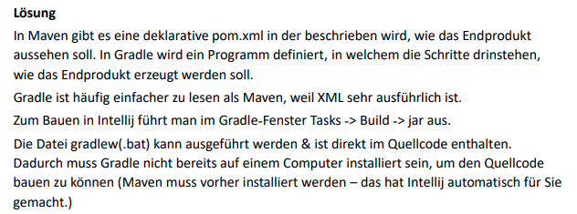
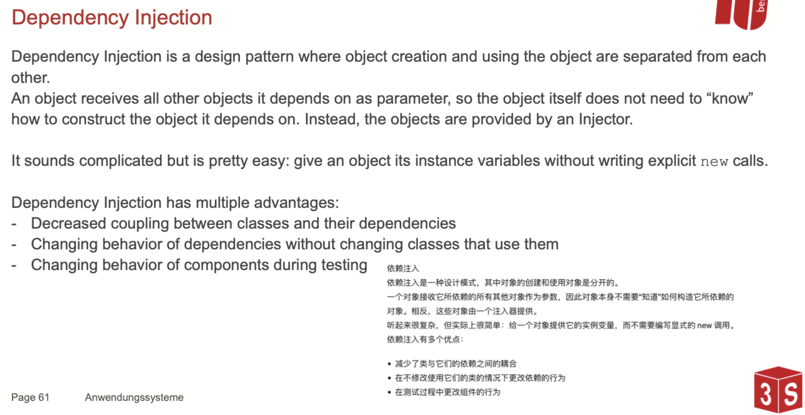

# Aufgabe 1 – Annotations Intro

Wofür können Annotations in Java (und anderen Programmiersprachen) benutzt werden?
Welche Annotations sind in Java eingebaut?
Welche Retentions und Targets können Java Annotations haben? Welche Retention und Target haben die eingebauten Annotations?

Lösung 

Annotations can provide meta-information about elements in the Java source code. This information can be used by the compiler, during deployment, or at runtime.

Annotations themselves don’t add functionality, they don’t have a “functional behavior” – annotations are essentially data containers which can be accessed by other components. We can annotate classes, methods, constructors, fields, etc. – what can be annotated depends on the respective annotation.

There are some built-in annotations which you might already have seen, e.g.: 
## @Override 
- the annotated element is meant to override element in superclass. If its not found in one of the superclasses, cause a compilation error 
## @SuppressWarnings 
- ignore compile-time warnings for this element 
## @Deprecated 
- marks a method as deprecated. Causes a compiler warning if the method is used
 

## @Target
@Target für Annotations kann man in der Documentation lesen: https://docs.oracle.com/en/java/javase/20/docs/api/java.base/java/lang/annotation/Target.html 
- ANNOTATION_TYPE : Other annotations 
- CONSTRUCTOR : Constructor declarations 
- FIELD : Variable declarations in a class or object 
- LOCAL_VARIABLE : Local variable declarations in a function 
- METHOD : Method declarations 
- PACKAGE: Package declarations 
- PARAMETER : Parameters of a function 
- TYPE : Type declarations (class, interface, enum, or annotation type declarations)
- TYPE_PARAMETER : Generic type parameter declarations (in generic classes, interfaces, methods, constructors)

## @Retention
@Retention von Annotations kann man auch in der Dokumentation lesen: https://docs.oracle.com/en/java/javase/20/docs/api/java.base/java/lang/annotation/Retention.html 
- SOURCE: the annotation should only be saved in the source level. 
- CLASS: the annotation should be retained at compile time but is ignored by the JVM.
- RUNTIME: retained by the JVM so it can be used by the runtime environment.

```java
@Target(METHOD) 
@Retention(SOURCE) 
public @interface Override 

@Retention(SOURCE) 
public @interface SuppressWarnings 

@Retention(RUNTIME) @Target({CONSTRUCTOR,FIELD,LOCAL_VARIABLE,METHOD,PACKAGE,MODUL E,PARAMETER,TYPE}) 
public @interface Deprecated
```

## @Repeatable


# Aufgabe 2 – Annotations
Schreiben Sie eine Annotation mit dem Namen „MyAnnotation“. Die Annotation soll
folgende Eigenschaften erfüllen:
- Einen String-Parameter, der übergeben werden kann, ohne dass der Name des
Parameters explizit angegeben werden muss.
- Einen Integer-Parameter mit dem Namen „count“, der standardmäßig 9001 ist.
- Einen String-Array-Parameter mit Namen „arrayParam“, der standardmäßig leer ist.

Stellen Sie sicher, dass die Annotation mit Klassen benutzt werden kann und zur Laufzeit verfügbar ist. Schreiben Sie eine neue Klasse, die Sie mit „MyAnnotation“ annotieren. Schreiben Sie eine Main Methode, die die toString-Methode der Annotation dieser Klasse auf der Konsole ausgibt.
Erweitern Sie das Programm so, dass eine Klasse mehrfach mit „MyAnnotation“ annotiert werden kann.

```java
import java.lang.annotation.*;

@MyAnnotation(value = "abc", count = 9002, arrayParam = {"a", "b", "c"})  
@MyAnnotation("def")  
public class MyAnnotationMain {  
    public static void main(String[] args) {  
        System.out.println();  
  
        MyAnnotationRepeats a  = MyAnnotationMain.class.getAnnotation(MyAnnotationRepeats.class);  
        System.out.println(a);  
    }  
}

@Retention(RetentionPolicy.RUNTIME)  
@Target(ElementType.TYPE)  
@Repeatable(MyAnnotationRepeats.class)  
public @interface MyAnnotation {  
    String value();  
    int count() default 9001;  
    String[] arrayParam() default {};  
}

@Retention(RetentionPolicy.RUNTIME)  
@Target(ElementType.TYPE)  
public @interface MyAnnotationRepeats {  
    MyAnnotation[] value();  
}
```

# Aufgabe 3 – Reflections Intro 
Was sind Reflections? Wofür können sie eingesetzt werden? Wann sollte man sie eher nicht benutzen?

Lösung 
A program can know and change its own behaviour during its own runtime. 
With object-oriented programming languages, this means that information about classes can be queried during runtime (e.g., its name), and that their behaviour can be modified (e.g., setting a field to private). 
We can also use reflections for advanced tasks such as generating a new class at runtime. 
Keep in mind: Reflective programming is usually slower than the normal program flow and implies that some bugs will only become visible at runtime (i.e., cannot be checked by the compiler). 
=> Use only when necessary.

To represent Java types within Java, there are Java classes/interfaces that represent information about classes and objects, e.g.: 
- Class: represents classes and interfaces in a running Java application 
- Constructor: provides information about and access to a single constructor of a class 
- Field: represents a field of a class or an interface. 
- Annotation: represents an 


more details in folien

# Aufgabe 4 – Reflections
Schreiben Sie ein Code-Snippet, dass in jede beliebige Methode jeder beliebigen Klasse
kopiert werden kann und wenn es aufgerufen wird, Informationen über die aktuelle Klasse
und Methode ausgibt. Zu den Informationen kann z.B. gehören:
- Der Name der Klasse
- Der Name der Methode
- Die Anzahl und Namen der Parameter der Funktion
- Der Rückgabetyp der Funktion

```java
import java.io.PrintStream;  
import java.lang.reflect.Method;  
import java.lang.reflect.Parameter;  
  
public class Snippet {  
    public Snippet() {  
    }  
  
    public static void main(String[] args) {  
        Snippet s = new Snippet();  
        s.mySnippet(12, "Hello");  
    }  
  
    public void mySnippet(int param1, String param2) {  
        Object anonymObj = new Object() {};  
        Class<?> anonymClass = anonymObj.getClass().getEnclosingClass();  
        System.out.println(anonymClass.getName());  
        Method anonymMethod = anonymObj.getClass().getEnclosingMethod();  
        System.out.println("the name of this method is: " + anonymMethod.getName());  
        Parameter[] var6 = anonymMethod.getParameters();  
        int var7 = var6.length;  
  
        for(int var8 = 0; var8 < var7; ++var8) {  
            Parameter p = var6[var8];  
            PrintStream var10000 = System.out;  
            String var10001 = p.getName();  
            var10000.println("the parameter name ist" + var10001 + " : " + String.valueOf(p.getType()));  
        }  
  
    }  
}
```

```java
import java.lang.reflect.Field;  
import java.lang.reflect.Method;  
import java.lang.reflect.Parameter;  
  
public class MetaInformationSnippet {  
  
    public String exampleField = "helloWorld";  
    public static void main(String[] args) {  
        MetaInformationSnippet m = new MetaInformationSnippet();  
        m.interestingMethod("myInterestingValue", 0);  
    }  
  
    public void interestingMethod(String myInterestingParameter, int myOtherInterestingParameter) {  
  
        // This is the start of a snippet that could be copy-pasted into multiple different methods  
        Object anonymousObject = new Object() {};  
        Class<?> classOfThisMethod = anonymousObject.getClass().getEnclosingClass();  
        String genericString = classOfThisMethod.toGenericString();  
        System.out.println("genericString: " + genericString);  
        System.out.println();  
  
        Class<?> anonymClass =  anonymousObject.getClass().getEnclosingClass();  
        System.out.println(anonymClass.getName());  
        Method anonymMethod =  anonymousObject.getClass().getEnclosingMethod();  
        System.out.println("the name of this method is: " + anonymMethod.getName());  
        System.out.println();  
  
  
        // This creates an anonymous inner class, for which we can get the "outer" method. There are other methods: https://www.baeldung.com/java-name-of-executing-method  
        Method m = new Object() {}.getClass().getEnclosingMethod();  
        System.out.println("Method.name: " + m.getName());  
        for (Parameter p: m.getParameters()) {  
            System.out.println("Parameter.getName: " + p.getName());  
            System.out.println("Parameter.getType: " + p.getType());  
            System.out.println("Parameter.toString: " + p.toString());  
        }  
  
        System.out.println("Method.getReturnType: " + m.getReturnType());  
  
        for (Field f: classOfThisMethod.getFields()) {  
            System.out.println("Field.getName: " + f.getName());  
            System.out.println("Field.getType: " + f.getType());  
        }  
  
        // This is the end of this snippet  
  
    }  
}
```


# Aufgabe 5 – Annotations + Reflections
Schreiben Sie eine Annotation mit dem Namen CallMeMaybe. Die Annotation soll zur
Laufzeit verfügbar sein, und mit ihr sollen Methoden annotiert werden können. Die
Annotation soll keine Parameter haben.
Erstellen Sie eine neue Klasse ExampleClass mit einigen Methoden, die jeweils keine
Parameter übergeben bekommen dürfen und annotieren Sie einige dieser Methoden mit
@CallMeMaybe.
Erstellen Sie jetzt eine weitere neue Klasse CallMeMaybeMain. Implementieren Sie in
dieser Klasse eine Methode maybeCallElements mit folgender Funktionalität:
- Die Methode bekommt als Parameter eine beliebige Class  < ?> übergeben.
- Zuerst wird von dieser Class eine neue Instanz erstellt.
- Dann sollen alle Methoden der Klasse analysiert werden:
	1. Wenn die Methode mit @CallMeMaybe annotiert ist, soll sie zufällig in 50%
	der Fälle aufgerufen werden
	2. Wenn sie nicht annotiert ist, soll nichts passieren (oder ein debug statement
	ausgegeben werden)
Schreiben Sie nun eine main-Methode in CallMeMaybeMain, die maybeCallElements(ExampleClass.class) aufruft.


```java
import java.lang.reflect.Method;  
import java.util.Random;  
import java.lang.annotation.ElementType;  
import java.lang.annotation.Retention;  
import java.lang.annotation.RetentionPolicy;  
import java.lang.annotation.Target;
  
public class CallMeMaybeMain {  
    static final Random r = new Random();  
    public static void main(String[] args) throws Exception {  
        maybeCallElements(ExampleClass.class);  
    }  
  
    public static void maybeCallElements(Class<?> c) throws Exception {  
        Object newInstance = c.getDeclaredConstructor().newInstance();  
        for (Method m: c.getMethods()) {  
            CallMeMaybe annotation = m.getAnnotation(CallMeMaybe.class);  
            if (annotation == null) {  
                // The annotation is not present on top of the method  
                continue;  
            }  
            if (true /**r.nextBoolean()**/) {  
                m.invoke(newInstance);  
            }  
              
        }  
    }  
}


public class ExampleClass {  
    @CallMeMaybe()  
    public static void methodA() {  
        System.out.println("Hello from Method A");  
    }  
  
    public void methodB() {  
        System.out.println("Hello from Method B");  
    }  
  
    @CallMeMaybe  
    public void methodC() {  
        System.out.println("Hello from Method C");  
    }  
}


@Retention(RetentionPolicy.RUNTIME)  
@Target(ElementType.METHOD)  
public @interface CallMeMaybe {  
}
```


# Aufgabe 6 – Build Tools

Erstellen Sie ein neues Maven Projekt (oder erweitern Sie ein bestehendes Projekt) und
fügen Sie Lombok und JUnit als Dependency in die pom.xml ein.


dependencc for lombok and junit in pom.xml
```
<dependencies>  
    <!-- https://mvnrepository.com/artifact/org.junit.jupiter/junit-jupiter-api -->  
    <dependency>  
        <groupId>org.junit.jupiter</groupId>  
        <artifactId>junit-jupiter-api</artifactId>  
        <version>5.9.2</version>  
        <scope>test</scope>  
    </dependency>  
    <dependency>  
        <groupId>org.projectlombok</groupId>  
        <artifactId>lombok</artifactId>  
        <version>1.18.26</version>  
        <scope>provided</scope>  
    </dependency>  
</dependencies>
```

# Aufgabe 7 – Build Tools II
Erstellen sie in IntelliJ ein neues Projekt und wählen Sie Gradle (mit der Kotlin als Gradle DSL)
als Build System. Schauen Sie sich die Datei build.gradle.kts an.
Wie unterscheidet sich Gradle von Maven? Was finden Sie einfacher zu lesen / benutzen?
Wie können Sie in Intellij die .jar-Datei bauen?
Wofür gibt es die Dateien gradlew & gradlew.bat?


# Aufgabe 7 – Testing Intro 
Welche Arten von Softwaretesting gibt es? 
Welche Tools gibt es dafür in Java? 
Erklären Sie die Test-Pyramide. 

Lösung 
There are different levels at which software is usually tested: 
- Unit tests: study a specific section of code, e.g., a method or class 
- Integration tests: study interaction between multiple components of the system 
- Systems tests: study the whole system


# Aufgabe 9 – Lombok & Testing
Erstellen Sie eine neue Klasse Customer mit folgenden Feldern: einem String name, einer ID, und einem statischen Feld nextId um automatisch neue IDs zu erzeugen, wie Sie es in Prog1 gelernt haben. Benutzen Sie Lombok um folgende Funktionalität zu implementieren:
- Es soll eine toString-Methode erstellt werden
- Es sollen Getter und Setter für alle Felder erstellt werden
- Das Feld name darf nicht null sein

Erstellen Sie nun eine neue Klasse im package test, in dem JUnit Tests standardmäßig
liegen. Testen Sie in dieser Klasse die Funktionalität von Lombok um sicherzustellen, dass Sie die Funktionalität richtig verstanden haben. Schreiben Sie folgende Unit-Tests:
- Überprüfen Sie, ob Sie die automatisch generierten Getter Methoden aufrufen können
- Überprüfen Sie, ob die toString Methode immer das erwartete Ergebnis liefert (lassen Sie sich dafür ein paar toString-Ausgaben auf der Konsole ausgeben)
- Überprüfen Sie, ob das nextId++-Pattern aus Prog1 die richtigen IDs generiert.

Hinweis: normalerweise ist es nicht notwendig, die Funktionalität von genutzten Libraries zu testen.

```java
import lombok.*;  
  
@Setter  
@Getter  
@ToString  
public class Customer {  
  
    @NonNull  
    public String name;  
    public int id = nextId++;  
    private static int nextId;  
  
}
```

```java
import jdk.jfr.Name;  
import org.junit.jupiter.api.BeforeEach;  
import org.junit.jupiter.api.Test;  
  
import static org.junit.jupiter.api.Assertions.*;  
  
public class TestLombokAnnotations {  
  
    Customer c;  
  
    @BeforeEach  
    void initCustomer() {  
        c =new Customer();  
        c.id = 0;  
        c.name = "Testing Tester";  
    }  
    @Test  
    @Name("Check that Getters are generated correctly")  
    void testGetters() {  
  
        assertEquals(0, c.getId());  
        assertEquals("Testing Tester", c.getName());  
    }  
  
    @Test  
    @Name("Check that the toString generated by Lombok follows the same format")  
    void testToString() {  
        assertEquals("Customer(name=Testing Tester, id=0)", c.toString());  
    }  
  
    @Test  
    @Name("Check that the nextId++ pattern automatically generates the next id")  
    void testNextIdGeneration() {  
        Customer next = new Customer();  
        assertEquals(c.id + 1, next.id, "The next customer should have the id after the current customer");  
    }  
  
    @Test  
    @Name("Check that Lombok correctly thorws an Exception if you try to set a @NonNull Variable to null")  
    void testNonNullAnnotation() {  
        assertThrows(NullPointerException.class, () -> c.setName(null));  
    }  
}
```

# Aufgabe 10 – Debugging Intro
Was ist ein Debugger und wofür kann man ihn benutzen? Debuggen Sie die in Aufgabe 2-4 entwickelten Programme, um sie besser zu verstehen.

# Aufgabe 11 – Dependency Injection


## Dependency Injection



