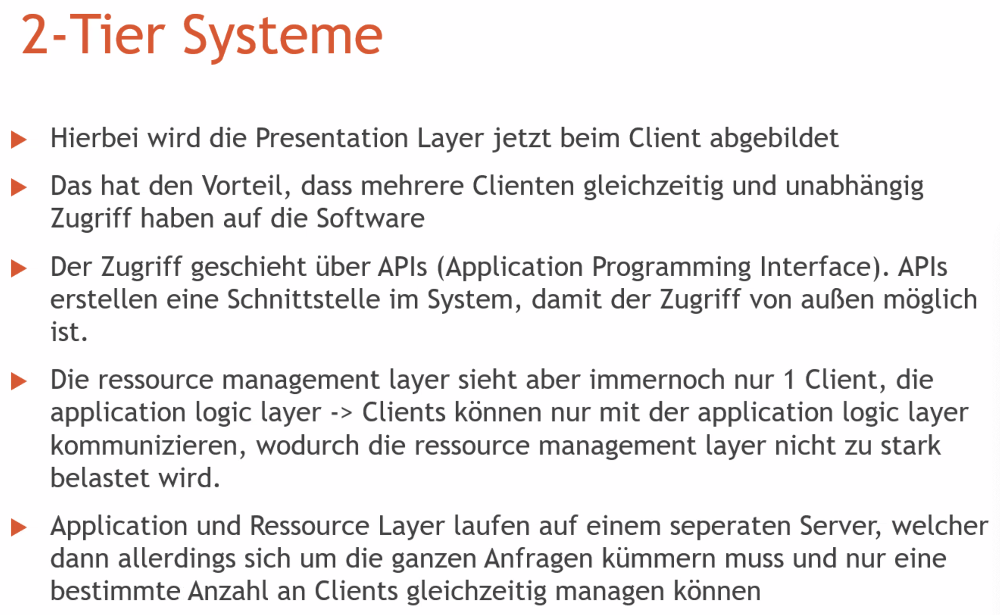
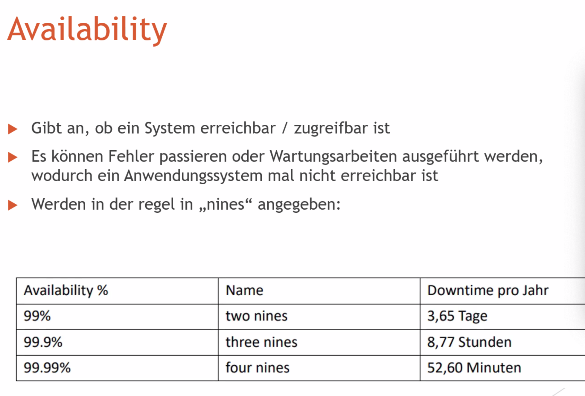

# Aufgabe 1 – Informationssysteme
Wenn Sie an die Beispiele aus der Vorlesung denken: Warum ist die Entwicklung großer Informationssysteme so herausfordernd? 

Lösung: Ein solches Informationssystem besteht i.d.R. nicht aus wenigen Klassen oder ist eine einzelne Anwendung. Vielmehr besteht ein solches Informationssystem aus sehr vielen Klassen („Programmieren im Großen“) und häufig auch mehreren Teil-Anwendungen. Auch starten Sie bei der Entwicklung eines solchen Informationssystems oft nicht „auf der grünen Wiese“. Es existieren häufig bereits bestehende Informationssysteme oder Systemkomponenten/-teile, die integriert werden müssen bzw. sollen. Dies können Informationssysteme von Partnerfirmen, z.B. Banken oder Logistik-Unternehmen, sein. Die Informationssysteme sind dabei i.d.R. heterogen. Diese Heterogenität kann sich z.B. in Form von unterschiedlichen Betriebssystemen (Linux, Windows, OS X usw.), in Form von unterschiedlichen Schnittstellen zum Informationssystem, und in Form von monolithischen oder verteilten Softwarearchitekturen usw. zeigen. Die Integration sowie die Berücksichtigung von unterschiedlichen qualitativen Anforderungen (non-functional requirements) an das Informationssystem, wie z.B. Performance, Verfügbarkeit oder Sicherheit, tragen einen großen Teil zu den Herausforderungen bei der Entwicklung solcher Systeme bei.

一个这样的信息系统通常不只是由少数几个类或单个应用程序组成。相反，这样的信息系统由非常多的类（“大规模编程”）和通常多个子应用程序组成。此外，在开发这样的信息系统时，您通常不会从“零开始”。往往已经存在需要或应该集成的现有信息系统或系统组件/部分。这些可能是合作伙伴公司的信息系统，例如银行或物流公司。通常，这些信息系统是异构的。这种异构性可能表现为不同的操作系统（如Linux、Windows、OS X等）、不同的信息系统接口形式，以及单体或分布式软件架构形式等。集成以及考虑对信息系统的不同质量要求（非功能性需求），例如性能、可用性或安全性，是开发此类系统时面临的重大挑战。

# Aufgabe 2 – Softwarearchitektur
- a) Was verstehen Sie unter dem Begriff Softwarearchitektur? 
- b) Gibt es die gute oder schlechte Softwarearchitektur? 

Lösung: 
a) “The software architecture of a system is the set of structures needed to reason about the system, which comprise software elements, relations among them, and properties of both.” (Bass and Clements and Kazman, 2012) Eine Softwarearchitektur definiert Softwarekomponenten eines Software-Systems und das Zusammenspiel dieser Komponenten untereinander. Dabei gibt es häufig nicht nur eine Sicht auf eine Softwarearchitektur eines Software-Systems. - 2 - Interessante Sichten auf das System sind neben einer organisatorischen Gliederung eines Systems (statische Sicht auf die Komponenten in Form von „Lines and Boxes“, Klassendiagrammen der Unified Modeling Language (UML) usw.) auch dynamische Aspekte eines Systems, wie z.B. das Zusammenspiel der verschiedenen Komponenten zur Laufzeit (Prozessbeschreibungen, Sequenzdiagramme der UML usw.) und nicht zuletzt die Betrachtung von Allokation von Software auf andere nicht-software Elemente (Deployment auf Infrastruktur und Ressourcenallokation, auch Entwicklerteams). Keine der unterschiedlichen Sichten auf das System ist alleine die Softwarearchitektur. Die Softwarearchitektur ergibt sich aus allen diesen Sichten und deren Informationen. Dabei hat jedes Software-System eine Softwarearchitektur. Das Verhalten jeder Komponente ist Teil der Softwarearchitektur. Denn das Verhalten einer Komponente bestimmt, wie andere Komponenten geschrieben werden müssen, um interagieren zu können. Somit sollte das Verhalten aller Komponenten in einer Softwarearchitektur – nicht unbedingt in aller Tiefe – beschrieben werden. Die Definition gibt keine Aussage, welche Softwarearchitektur gut oder schlecht ist. Somit ist es notwendig, die Softwarearchitektur zu evaluieren, um Aussagen über deren Performance, Skalierbarkeit, Verfügbarkeit, Sicherheit usw. zu machen. 

b) Es gibt keine gute oder schlechte Softwarearchitektur. Es gibt nur gute oder schlechte Softwarearchitekturen für einen definierten Zweck. Anhand von spezifizierten Zielen kann lediglich evaluiert werden, ob eine Softwarearchitektur für diesen Zweck passend oder unpassend ist.

解决方案：

a) “系统的软件架构是用于推理系统所需的一组结构，包括软件元素、它们之间的关系以及两者的属性。”（Bass 和 Clements 和 Kazman，2012）软件架构定义了软件系统的软件组件以及这些组件之间的相互作用。然而，通常对一个软件系统的软件架构不止一种视角。除了系统的组织结构（以“线和框”的形式、统一建模语言（UML）的类图等的静态视角）外，对系统的有趣视角还包括系统的动态方面，例如各种组件在运行时的交互（过程描述、UML的序列图等），以及软件在其他非软件元素上的分配（在基础设施上的部署和资源分配，包括开发团队）。系统的任何单一视角都不是完整的软件架构。软件架构是由所有这些视角及其信息组成的。每个软件系统都有一个软件架构。每个组件的行为是软件架构的一部分，因为组件的行为决定了其他组件必须如何编写才能进行交互。因此，所有组件的行为都应在软件架构中描述——尽管不一定要深入。这个定义没有说明什么样的软件架构是好是坏。因此，有必要评估软件架构，以对其性能、可扩展性、可用性、安全性等作出判断。

b) 没有好的或坏的软件架构。只有针对特定目的好的或坏的软件架构。根据指定的目标，只能评估某个软件架构是否适合该目的。

# Aufgabe 3 – Layers & Tiers
- a) Welche 4 Schichten („Layers“) gibt es üblicherweise in einem Informationssystem?  
- b) Was versteht man üblicherweise unter Layers im Gegensatz zu Tiers? (klausur)
- c) Was halten Sie von der Aussage „There is no problem in system design which cannot be solved by adding a level of indirection. There is no performance problem that cannot be solved by removing a level of indirection.”? Begründen Sie kurz Ihre Antwort.  
- d) Warum ist Top-Down-Design in den allermeisten Fällen nicht möglich?  

layers of information system

3 tier vs. 2 tier:

Lösung: 
- a) Datenhaltung/Resource Management, Anwendungslogik, Präsentation, Client 
- b) Layers = logische Schichten, Tiers = physikalische Schichten. Gliederung aber nicht immer ganz eindeutig, Bsp.: n-tier-Architektur für die Gliederung welche theoretisch (muss nicht immer sein) physikalische Verteilung ermöglicht innerhalb eines Appservers 
- c) Weitere Gliederung eines Problems bzw. Hinzufügen eines Abstraktionslevels erleichtert üblicherweise die Lösung eines Problems, da auf jedem Level nur noch  kleine Teilprobleme gelöst werden müssen. Allerdings muss ein Request dafür dann auch alle Abstraktionslevel durchlaufen. Das mindeste, was daraus resultiert, ist ein sehr hoher Call-Stack, aber evtl. sind auch Datenformatskonvertierungen o.ä. zwischen den Schichten nötig => Performance leidet. 
- d) Legacysysteme müssen aus Kosten- oder Funktionalitätsgründen weitergenutzt und integriert werden. Dadurch ist es nicht möglich, auf der „grünen Wiese“ zu bauen sondern lediglich auf bestehende Strukturen aufzubauen.

a) 数据持久化/资源管理、应用逻辑、表现层、客户端
b) 层（Layers）是逻辑分层，层级（Tiers）是物理分层。但划分并不总是完全明确。例如：n-tier 架构在应用服务器内部理论上（不一定总是这样）允许物理分布。
c) 进一步细分问题或添加抽象级别通常会简化问题解决，因为在每个级别上只需解决小的子问题。然而，请求必须通过所有抽象级别，这至少会导致非常高的调用栈，可能还需要在各层之间进行数据格式转换等，从而影响性能。
d) 由于成本或功能需求，必须继续使用并集成旧系统。因此，不可能在“空白地带”上构建，而只能在现有结构上进行构建。

# Aufgabe 4 – 2/3-Tier Architekturen 
Angenommen, Sie hätten drei (wie auch immer geartete) vorhandene IT-Systeme 𝐴, 𝐵 und 𝐶, die für diverse Business-Aufgaben zuständig sind und die keine standardisierten Schnittstellen besitzen. Ihre Aufgabe besteht darin, Clients einen einheitlichen Zugriff zu diesen Systemen zu ermöglichen. Geben Sie für diese Problemstellung skizzenhafte Architekturbilder an, aus denen der Unterschied zwischen 2- und 3-Tier Architekturen ersichtlich wird. Welche würden Sie verwenden? 

3层架构是更巧妙的选择，因为应用程序的集成是通过中间件而不是客户端应用程序进行的。这样客户端应用程序更易于维护，并且服务器系统和旧系统接口的更改可以对客户端隐藏。例如，如果将系统X更换为具有类似功能但接口不同的另一个系统，客户端将不会察觉到这种变化。

# Aufgabe 5 – N-Tier-Architekturen 
Was ist eine N-Tier Architektur? Nennen Sie einige Kriterien die für ein N-schichtiges Architekturdesign eines Informationssystems sprechen. 

Lösung: Eine N-Tier-Architektur entsteht, wenn man mehrere 3-tier Systeme miteinander verbindet. Kriterien dafür sind z.B.: 
Leistungsfähigkeit, Skalierbarkeit, Anzahl der Benutzer/Verbindungen, Integration vorhandener Systeme, Wiederverwendbarkeit, Sicherheit, Flexibilität bzgl. Erweiterbarkeit…

KLAUSUR relevent

# Aufgabe 6 – funktionale und nichtfunktionale Anforderungen
Handelt es sich bei den folgenden Aussagen um eine funktionale Anforderung, eine nichtfunktionale Anforderung, oder gar keine Anforderung? 
- a) Das System muss in der Lage sein, 1000 gleichzeitige User zu unterstützen. (Nichtfunktional) 
- b) Die Software muss den Namen der User, deren E-Mail-Adresse und Passwort speichern. (Funktional)
- c) Das System muss auf allen gängigen Browsern funktionieren. (Nichtfunktional) 
- d) Das System muss innerhalb von 5 Sekunden eine Antwort auf eine Anfrage liefern. (Nichtfunktional) 
- e) Die Software muss in der Lage sein, ein Lied zu komponieren, das auf den Stimmungen der User basiert und sie beruhigt oder motiviert. (Funktional) 
- f) Das Design des Systems sollte die Marke des Unternehmens widerspiegeln. (keine Anforderung – nur Empfehlung) 
- g) User müssen in der Lage sein, ihre gespeicherten Daten herunterzuladen. (Funktional) 
- h) Das System muss sicherstellen, dass Daten nicht während der Übertragung von Server zu User nicht verändert werden können und vor unbefugtem Zugriff sicher sind (Funktional) 
- i) Das System muss die Daten der User vor Hacking-Angriffen schützen (Nichtfunktional) 
- j) User müssen ihre bevorzugte Sprache auswählen können. (Funktional)

in den Folien stand Replication(Scaling out)

# Aufgabe 7 – Performance

延迟是指响应请求所需的时间（例如，以毫秒为单位）。吞吐量是指单位时间内可以处理的请求数（通常以每秒请求数计）。

例如，如果您想将数据从柏林工业大学发送到慕尼黑工业大学，可以通过互联网以低延迟进行：柏林到慕尼黑的延迟通过互联网电缆为≤30毫秒。但吞吐量取决于具体的起始点和目的地，可能实际上为1 Gbit/s。

然而，您也可以将数据存储到硬盘上，通过卡车运送到慕尼黑。这种方式的延迟明显更高，大约需要6小时的驾驶时间。但是，卡车的吞吐量可能远高于1 Gbit/s的互联网连接：在6小时内，互联网连接可以传输约21,600 Gbit（大约2.7TB）数据。一块10TB的硬盘重约800克。这意味着，如果卡车只载一块10TB的硬盘驶往慕尼黑，卡车的吞吐量就大于互联网连接的吞吐量。如果卡车装满硬盘，其吞吐量将是互联网连接的多倍。

正因为此，当需要运输大量数据时，例如将大数据量上传到云端，人们经常使用卡车运输数据。

# Aufgabe 8 - Availability

# Aufgabe 9 – Use Cases

