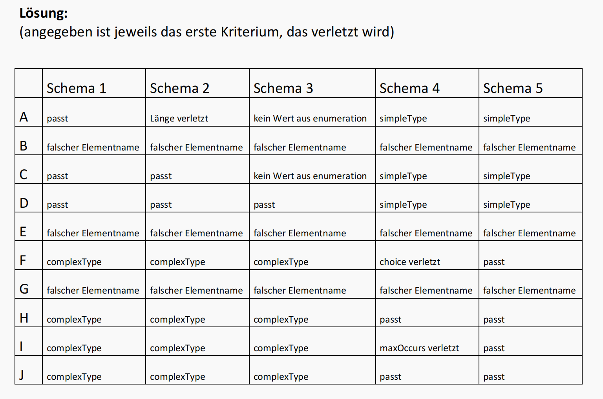
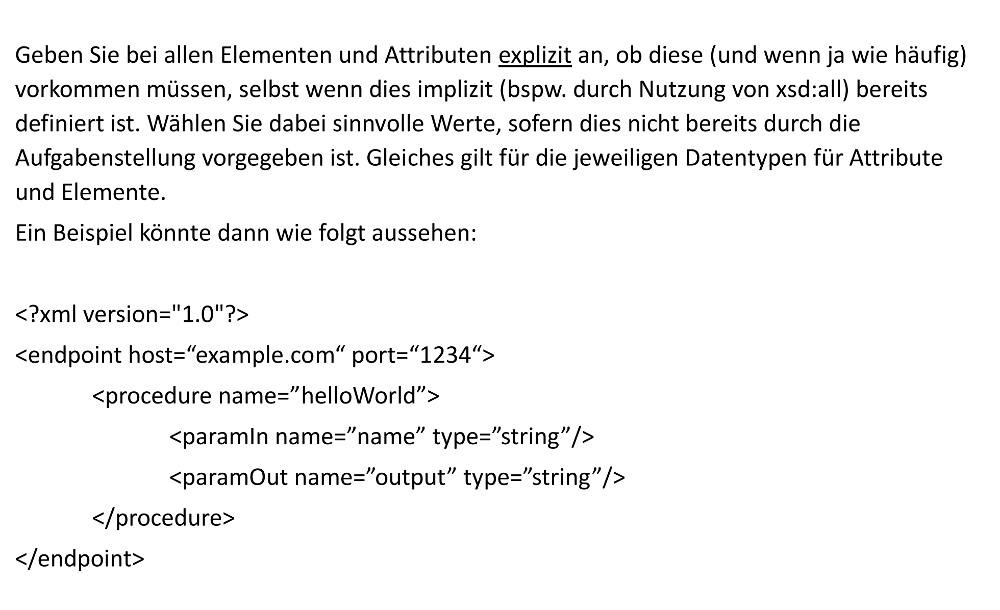
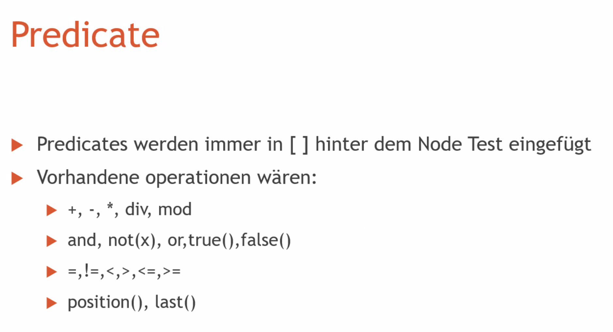
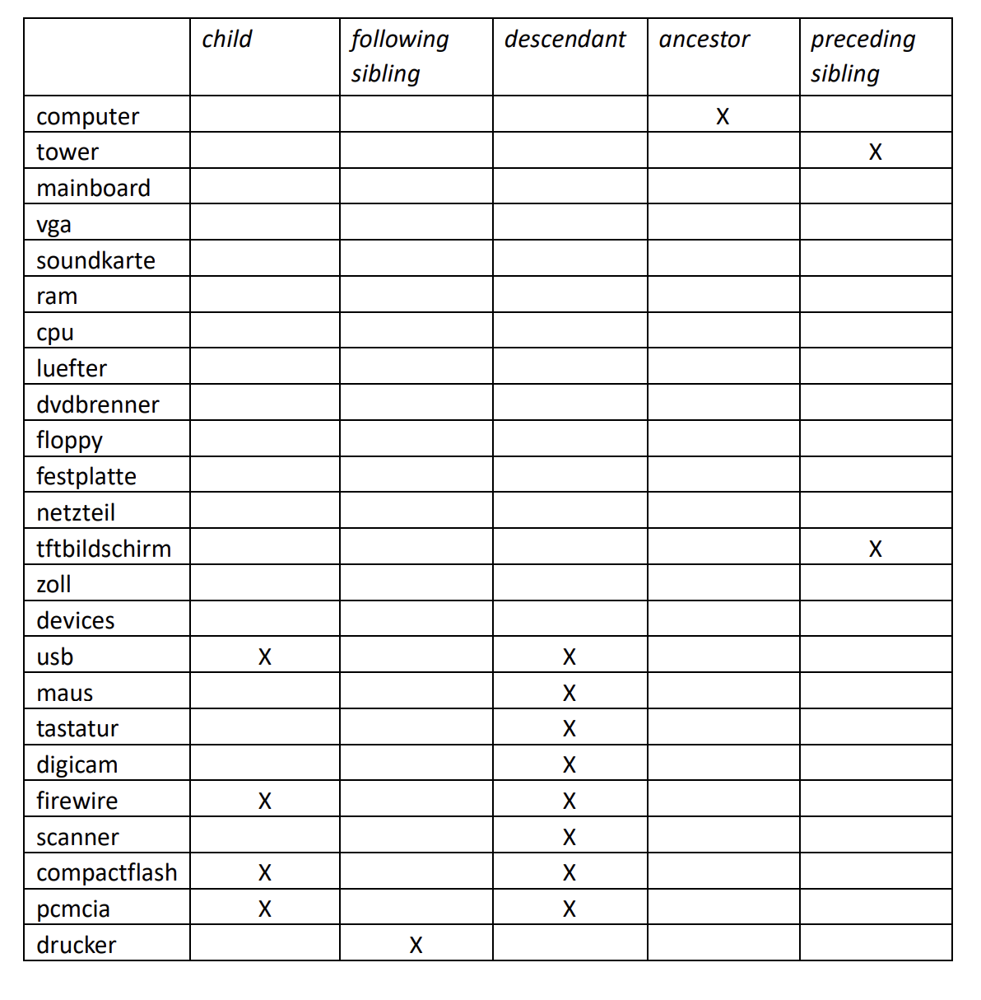
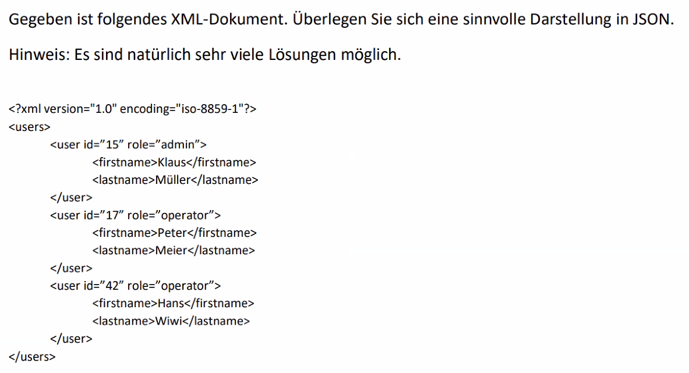
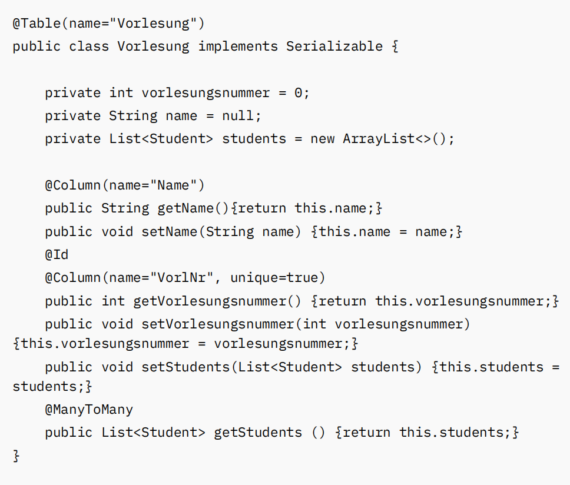

# Aufgabe 1 – XML-Wohlgeformtheit

- fahrrad 要小写
- urban arrow是字符串
- leistung那里没有结束的tag，需要/
- /motor falsch platzieren
- 2不是错误，是一个content from farrad


# Aufgabe 2 – XML Schema




# Aufgabe 3 – XML-Schema

block3

```xsd
<xsd:schema xmlns:xsd="http://www.w3.org/2001/XMLSchema">  
    <xsd:element name="Adresse" type="adresseTyp"/>  
  
    <xsd:complexType name="adresseTyp">  
        <xsd:all>  
            <xsd:element name="Firmenname" type="xsd:string"/>  
            <xsd:element name="Firmenzusatz" type="firmnenzusatzTyp" minOccurs="0"/>  
            <xsd:element name="Stresse" type="strassTyp"/>  
            <xsd:element name="Hausnummer" type="xsd:positiveInteger"/>  
            <xsd:element name="PLZ" type="plzTyp"/>  
            <xsd:element name="Stadt" type="stadtTyp"/>  
            <xsd:element name="Telefonnummer" type="telefonTyp" minOccurs="0"/>  
        </xsd:all>  
    </xsd:complexType>  
  
    <xsd:simpleType name="firmnenzusatzTyp">  
        <xsd:restriction base="xsd:string">  
            <xsd:enumeration value="GmbH"/>  
            <xsd:enumeration value="AG"/>  
        </xsd:restriction>  
    </xsd:simpleType>  
  
    <xsd:simpleType name="strassTyp">  
        <xsd:restriction base="xsd:string">  
            <xsd:pattern value="[^0-9]+"/>  
        </xsd:restriction>  
    </xsd:simpleType>  
  
    <xsd:simpleType name="plzTyp">  
        <xsd:restriction base="xsd:positiveInteger">  
            <xsd:pattern value="[0-9][0-9][0-9][0-9][0-9]"/>  
        </xsd:restriction>  
    </xsd:simpleType>  
        <xsd:simpleType name="stadtTyp">  
        <xsd:restriction base="xsd:string">  
            <xsd:pattern value="[A-Z][a-z]+(\-[A-Z][a-z]+)*"/>  
        </xsd:restriction>  
    </xsd:simpleType>  
  
    <xsd:complexType name="telefonTyp">  
        <xsd:sequence>  
            <xsd:element name="Vorwahl" type="vorwahlTyp"/>  
            <xsd:element name="Nummer" type="nummerTyp"/>  
  
        </xsd:sequence>  
    </xsd:complexType>  
  
    <xsd:simpleType name="vorwahlTyp">  
        <xsd:restriction base="xsd:string">  
            <xsd:pattern value="0[1-9][0-9]{1,3}"/>  
        </xsd:restriction>  
    </xsd:simpleType>  
  
    <xsd:simpleType name="nummerTyp">  
        <xsd:restriction base="xsd:string">  
            <xsd:pattern value="[1-9][0-9][0-9][0-9]+"/>  
        </xsd:restriction>  
    </xsd:simpleType>  
</xsd:schema>
```

```xml
<?xml version="1.0" encoding="utf-8" ?>  
<Adresse xmlns:xsi="http://www.w3.org/2001/XMLSchema-instance"  
         xsi:noNamespaceSchemaLocation="adresse.xsd">  
    <Firmenname>Wang Enterprise</Firmenname>  
    <Firmenzusatz>GmbH</Firmenzusatz>  
    <Stresse>Maxmustermannstr</Stresse>  
    <Hausnummer>12</Hausnummer>  
    <PLZ>12345</PLZ>  
    <Stadt>Berlin_Dessau</Stadt>  
    <Telefonnummer>        
	    <Vorwahl>045</Vorwahl>  
        <Nummer>2654876</Nummer>  
    </Telefonnummer>  
</Adresse>
```


等价于


## 正则表达式（Regular Expressions，简称Regex）
是一种强大的文本处理工具，可以用来匹配、搜索、替换和操作字符串。以下是一些常见的正则表达式用法及其示例：

### 1. 匹配单个字符
- `.` 匹配除换行符外的任意单个字符。
  - 示例：`a.b` 可以匹配 `aab`, `acb`, `a3b` 等。

### 2. 字符类
- `[abc]` 匹配字符 `a`, `b` 或 `c`。
  - 示例：`b[aeiou]t` 可以匹配 `bat`, `bet`, `bit`, `bot`, `but`。

- `[^abc]` 匹配除 `a`, `b`, `c` 之外的任何字符。
  - 示例：`[^0-9]` 匹配任何非数字字符。

### 3. 字符范围
- `[a-z]` 匹配任意小写字母。
  - 示例：`[a-z]` 可以匹配 `a`, `b`, `c`, ..., `z`。

- `[A-Z]` 匹配任意大写字母。
  - 示例：`[A-Z]` 可以匹配 `A`, `B`, `C`, ..., `Z`。

- `[0-9]` 匹配任意数字。
  - 示例：`[0-9]` 可以匹配 `0`, `1`, `2`, ..., `9`。

### 4. 预定义字符类
- `\d` 匹配任意数字，相当于 `[0-9]`。
  - 示例：`\d{2}` 可以匹配 `23`, `45`, `67` 等。

- `\D` 匹配任意非数字字符，相当于 `[^0-9]`。
  - 示例：`\D` 可以匹配 `a`, `B`, `!` 等。

- `\w` 匹配任意字母、数字或下划线，相当于 `[a-zA-Z0-9_]`。
  - 示例：`\w+` 可以匹配 `hello`, `world_123` 等。

- `\W` 匹配任意非字母、数字或下划线的字符，相当于 `[^a-zA-Z0-9_]`。
  - 示例：`\W` 可以匹配 `!`, `@`, `#` 等。

- `\s` 匹配任意空白字符（空格、制表符、换行符等）。
  - 示例：`\s` 可以匹配空格，制表符，换行符等。

- `\S` 匹配任意非空白字符。
  - 示例：`\S` 可以匹配 `a`, `1`, `!` 等。

### 5. 数量词
- `*` 匹配前面的字符0次或多次。
  - 示例：`a*` 可以匹配空字符串, `a`, `aa`, `aaa` 等。

- `+` 匹配前面的字符1次或多次。
  - 示例：`a+` 可以匹配 `a`, `aa`, `aaa` 等，但不匹配空字符串。

- `?` 匹配前面的字符0次或1次。
  - 示例：`a?` 可以匹配空字符串, `a`。

- `{n}` 精确匹配前面的字符n次。
  - 示例：`a{3}` 只能匹配 `aaa`。

- `{n,}` 匹配前面的字符至少n次。
  - 示例：`a{2,}` 可以匹配 `aa`, `aaa`, `aaaa` 等。

- `{n,m}` 匹配前面的字符至少n次，至多m次。
  - 示例：`a{2,4}` 可以匹配 `aa`, `aaa`, `aaaa`。

### 6. 边界匹配
- `^` 匹配字符串的开头。
  - 示例：`^hello` 匹配以 `hello` 开头的字符串。

- `$` 匹配字符串的结尾。
  - 示例：`world$` 匹配以 `world` 结尾的字符串。

### 7. 分组和反向引用
- `()` 用于分组。
  - 示例：`(abc)+` 可以匹配 `abc`, `abcabc`, `abcabcabc` 等。

- `\1`, `\2`, ... 反向引用，用于引用前面的分组。
  - 示例：`(\d)\1` 可以匹配 `00`, `11`, `22` 等。

### 8. 选择
- `|` 表示选择，匹配左边或右边的表达式。
  - 示例：`abc|def` 可以匹配 `abc` 或 `def`。

### 9. 转义字符
- `\` 用于转义字符，使其具有字面意义。
  - 示例：`\.` 可以匹配 `.` 字符，`\\` 可以匹配 `\` 字符。

这些只是正则表达式的一些常见用法。正则表达式非常强大，可以用于复杂的文本匹配和处理任务。根据实际需要，可以组合和嵌套使用这些模式来构建更复杂的正则表达式。

# Aufgabe 4 – XML-Schema


```xml
<?xml version="1.0" encoding="UTF-8"?>  
<xs:schema xmlns:xs="http://www.w3.org/2001/XMLSchema">  
  
    <xs:element name="endpoint" type="endpointType"/>  
  
    <xs:complexType name="endpointType">  
        <xs:sequence>  
            <xs:element name="procedure" type="procedureType" minOccurs="0" maxOccurs="unbounded"/>  
        </xs:sequence>  
        <xs:attribute name="host" type="xs:string" use="required"/>  
        <xs:attribute name="port" type="xs:integer" use="required"/>  
    </xs:complexType>  
  
    <xs:complexType name="procedureType">  
        <xs:sequence>  
            <xs:element name="paramIn" type="paramType" minOccurs="1" maxOccurs="unbounded"/>  
            <xs:element name="paramOut" type="paramType" minOccurs="1" maxOccurs="unbounded"/>  
        </xs:sequence>  
        <xs:attribute name="name" type="xs:string" use="required"/>  
    </xs:complexType>  
  
    <xs:complexType name="paramType">  
        <xs:attribute name="name" type="xs:string" use="required"/>  
        <xs:attribute name="type" type="typeType" use="required"/>  
    </xs:complexType>  
  
    <xs:simpleType name="typeType">  
        <xs:restriction base="xs:string">  
            <xs:enumeration value="string"/>  
            <xs:enumeration value="integer"/>  
            <xs:enumeration value="double"/>  
            <xs:enumeration value="empty"/>  
        </xs:restriction>  
    </xs:simpleType>  
  
</xs:schema>
```


# Aufgabe 5 – XPath





## XPath

- 为了处理XML，我们必须访问单个元素及其内容，并在必要时读取其属性。
- 要访问特定元素，取决于名称、过滤条件或层级关系，可以使用XPath。
- XPath需要一个表达式，该表达式由到存储位置的跳转组成。
- 这些跳转每个由3部分组成：
  - **Axis**：从当前节点出发的方向（如果没有指定，则默认指向子节点）
  - **Node Test**：指定我们要选择的节点
  - **Predicate**：根据指定的条件过滤节点（可选）

## Node Test

- 要指定在哪个节点执行下一个跳转，可以：
  - 指定元素的名称
  - 使用 `*` 来获取所有元素，取决于Axis
  - 使用 `@` 来指定属性名称
- 除此之外，还有一些函数，使我们可以访问XML的各种元素或其他组件：
  - `text()`：从当前节点获取内容（不包括嵌套元素）
  - `node()`：获取当前节点中的所有元素


# Aufgabe 6 – XPath


# Aufgabe 7 – XPath 
Gegeben sei der folgende Aufbau eines XML-Dokumentes

Lösung:



# Aufgabe 8 – XPath


# Aufgabe 9 – Diverses zu XML


# Aufgabe 10 – JSON


# Aufgabe 11 – JSON




# Aufgabe 12 – Protobuf


之后通过maven编译，如图
之后会生成target文件夹，接下来再将dir标记为root，这样main/java里的java文件就可以识别到生成的代码了


```java
import java.io.FileInputStream;  
import java.io.FileNotFoundException;  
import java.io.FileOutputStream;  
import java.io.IOException;  
import java.util.Arrays;  
  
public class ProtoUser {  
    public static void main(String[] args) throws IOException {  
       /*  
       // 注释部分为数据构建和序列化代码
        UsersOuterClass.User user1 = buildUser(15, UsersOuterClass.User.Role.ADMIN, "Klaus","Mueller");  
        UsersOuterClass.User user2 = buildUser(17, UsersOuterClass.User.Role.OPERATOR, "Peter","Meier");        
        UsersOuterClass.User user3 = buildUser(42, UsersOuterClass.User.Role.OPERATOR, "Hans","Wiwi");  
        UsersOuterClass.User[] userArray = {user1,user2,user3};  
        UsersOuterClass.Users users = buildUsers(userArray);  
        users.writeTo(new FileOutputStream("user.bin"));  
        */  

		// 反序列化从文件中读取数据并输出
        UsersOuterClass.Users users = UsersOuterClass.Users.parseFrom(new FileInputStream("user.bin"));  
  
        System.out.println(users);  
  
    }  
  
    public static UsersOuterClass.User buildUser(int id, UsersOuterClass.User.Role role, String firstname, String lastname){  
        return UsersOuterClass.User.newBuilder()  
                .setId(id)  
                .setRole(role)  
                .setFirstname(firstname)  
                .setLastname(lastname)  
                .build();  
    }  
  
    public static UsersOuterClass.Users buildUsers(UsersOuterClass.User[] users){  
        UsersOuterClass.Users.Builder usersBuilder = UsersOuterClass.Users.newBuilder();  
  
        for(UsersOuterClass.User user : users){  
            usersBuilder.addUsers(user);  
        }  
        return usersBuilder.build();  
    }  
}
```


z.b mongoDB


# Aufgabe 13 – Datenbanken


Key value kann nicht gejoint werden und suche der values nach keys und bei relationale nicht der fall

1. **为每个用户存储一个Web应用程序的当前状态（Key-Value）**：
   - **解释**：Key-Value数据库适合存储简单的键值对数据，如用户状态，查询速度快。
  
2. **存储一个流媒体服务的电影元数据（Document Store）**：
   - **解释**：Document Store（文档存储）数据库适合存储半结构化数据，例如电影元数据，可以灵活地处理各种数据格式。

3. **IoT传感器定期生成数据，需存储这些数据（Time Series Database）**：
   - **解释**：时间序列数据库专门用于处理和存储时间序列数据，适合存储传感器定期生成的连续数据。

4. **分析自行车骑行以识别不安全的地点（Geographic Database）**：
   - **解释**：地理数据库能够有效处理和分析地理空间数据，适合进行地理位置相关的分析。

5. **分析交易以识别欺诈行为（Graph Database）**：
   - **解释**：图数据库可以高效地处理和分析复杂的关系网络，适合用于识别交易中的欺诈行为。

6. **银行存储客户的账户和交易（Relational Database）**：
   - **解释**：关系数据库擅长处理结构化数据，能够支持复杂的查询和事务处理，是金融数据存储的理想选择。

7. **实时分析大量来自Web应用程序和社交媒体的数据以识别趋势（Column Store）**：
   - **解释**：列存储数据库能够高效地处理大规模数据分析，适合实时数据处理，并支持复杂查询，是大数据分析的理想选择。

8. **医院存储关于患者的数据，如他们以前的诊断、测试结果等。这些数据必须能被员工实时调用（Relational Database）**：
   - **解释**：关系数据库适合存储结构化数据，并且支持复杂查询和事务处理，能够确保数据的一致性和实时性，是医疗数据存储的理想选择。

9. **在一个网站前需要配置一个缓存数据库，用于存储每个用户的重要数据以便快速访问（Key-Value Store）**：
   - **解释**：键值存储数据库能够快速读写数据，适合用于缓存机制，可以显著提高网站的响应速度和用户体验。

10. **“购买了此产品的客户还购买了以下产品”在一个网上商店中（Graph Database）**：
   - **解释**：图数据库擅长处理和分析复杂的关系网络，适合用于推荐系统，可以高效地关联和查询产品与客户之间的关系，提升推荐的准确性和相关性。


后续folien见vl （jpa）
# Aufgabe 14 – SQL

solution:


# Aufgabe 15 - Object-Relational Mapping




# Aufgabe 16 – ACID


### ACID属性

#### 原子性 (Atomicity):
事务要么完全执行，要么完全不执行。执行程序对数据的影响只有在事务达到“提交”点后才会变得可见。如果执行程序未能达到这一点，事务将回滚系统到事务开始时的状态。

**例子**: 设想一个银行转账操作，从账户A转账100元到账户B。在原子性下，转账要么全部完成，即100元从A账户扣除并加到B账户，要么完全不执行，A和B账户的余额保持不变。

#### 一致性 (Consistency):
事务将系统从一个一致状态转变为另一个一致状态。

**例子**: 银行账户的余额在转账前后保持一致。例如，如果账户A和账户B在转账前的总余额是1000元，那么无论怎样转账，总余额在转账后仍然是1000元。

#### 隔离性 (Isolation):
事务与其他事务隔离进行，意味着每个事务都像在独占资源的环境中操作一样。每个事务将“看到”的只有一致的数据（只包含已提交事务的修改）。

**例子**: 如果两个用户同时尝试从同一个账户转账钱，隔离性确保每个转账操作不会相互影响，最终的余额会反映两个转账的独立结果。

#### 持久性 (Durability):
当执行程序被通知事务已成功完成（事务提交）时，该事务对数据的所有更新都将被永久保存，并且能在系统故障/错误后存活下来。更新的数据是持久的。

**例子**: 在银行系统中，一旦转账操作完成并确认，即使系统随后发生崩溃，转账记录也会永久保存在数据库中。

