RPC
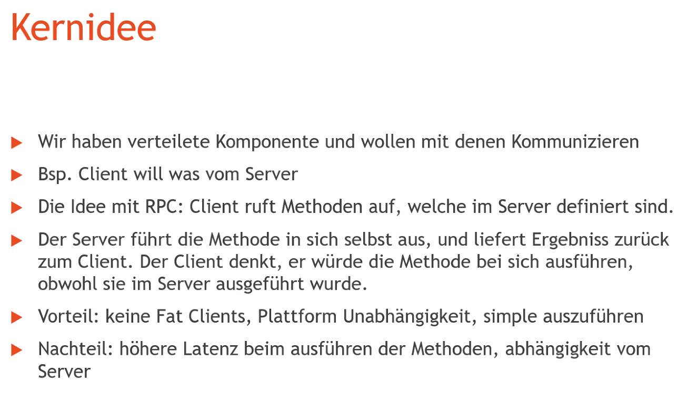
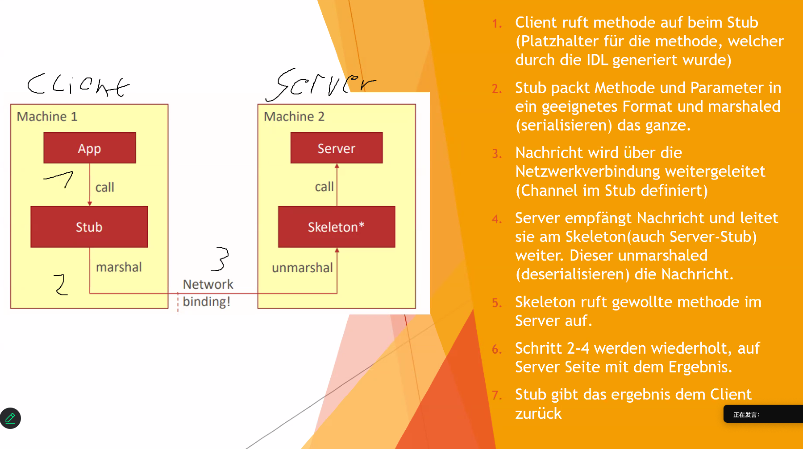
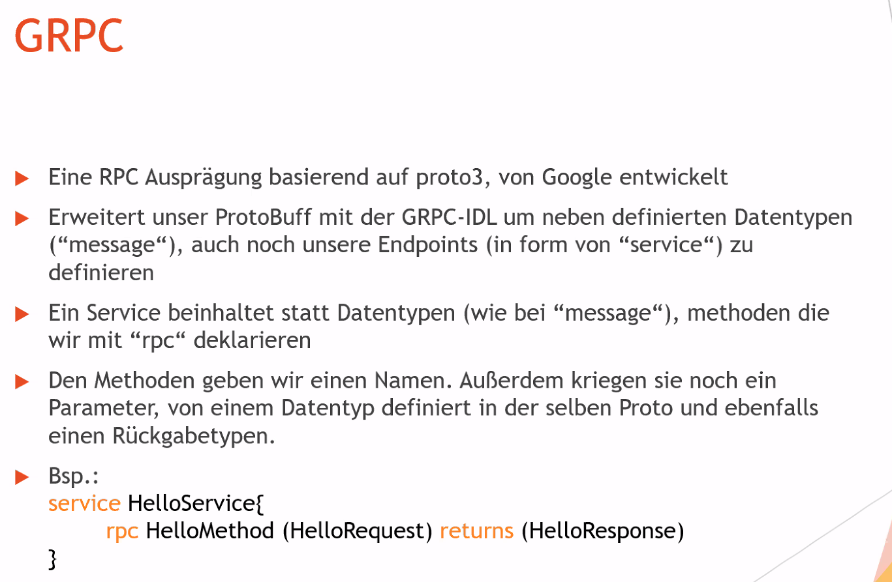

# Aufgabe 6 – GRPC
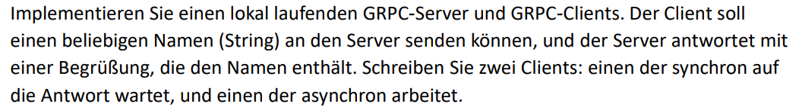

rpc是同步通信

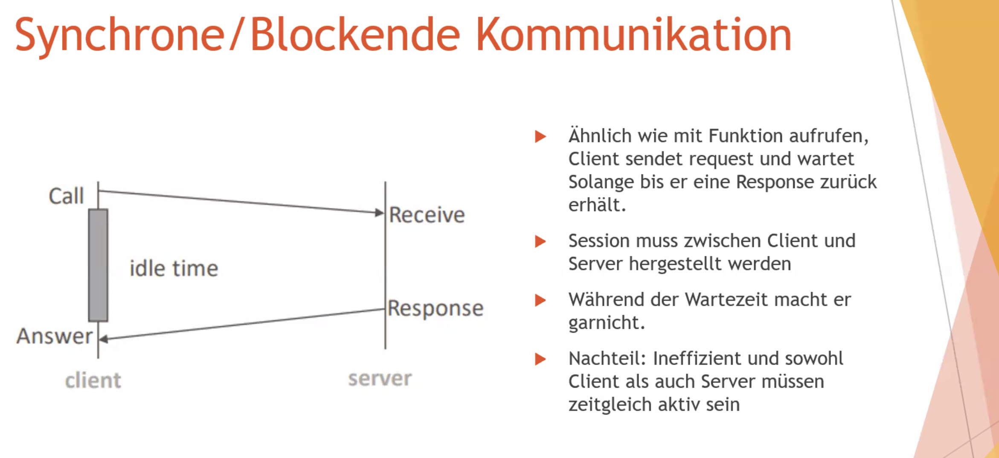
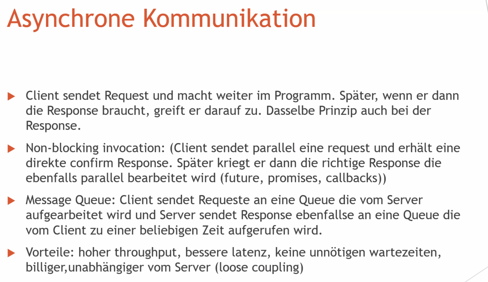
hier kann eine Fehler sein. Bei Asynchrone Kommunikation soll höhere latenz haben -> schlechte latenz anstatt bessere latenz
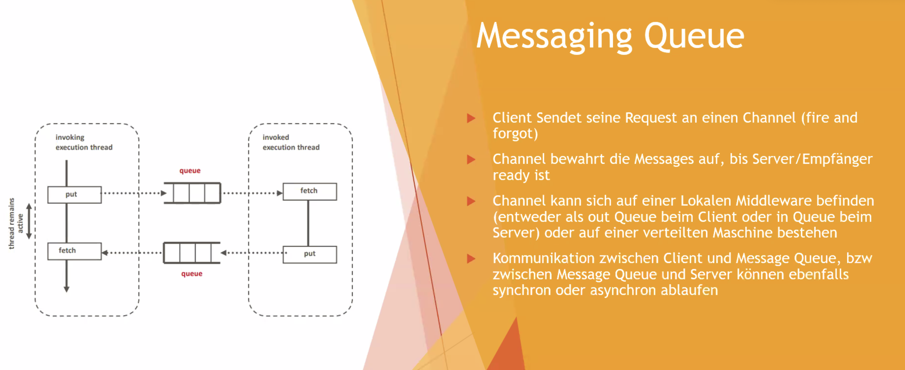
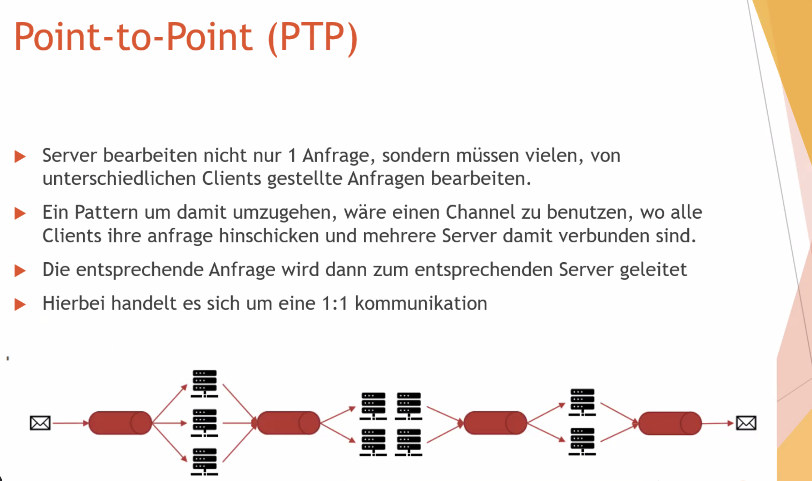
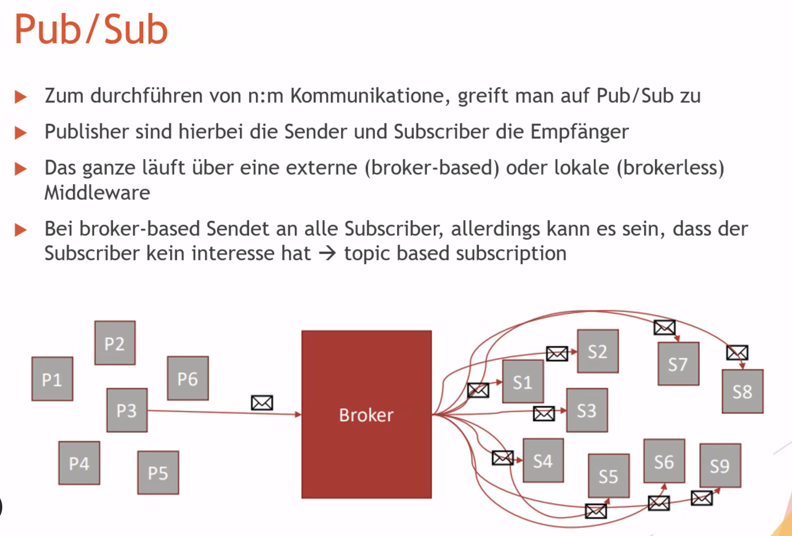
# Aufgabe 1 – Middleware
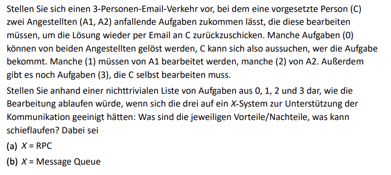
请设想一个由3人组成的电子邮件交流场景，其中一位上级（C）将任务分配给两名员工（A1，A2），由他们处理后再通过电子邮件发送回C。一些任务（0）可以由两名员工中的任何一个完成，C可以选择将任务交给谁。一些任务（1）必须由A1处理，一些任务（2）必须由A2处理。此外，还有一些任务（3）需要由C自己处理。

请根据一个非严格优先级的任务列表从0，1，2和3中，说明如果他们三人同意使用X系统来支持他们的通信，处理过程会是怎样的：各自的优点/缺点是什么，会出现什么问题？其中：

(a) X = RPC（远程过程调用）
(b) X = 消息队列

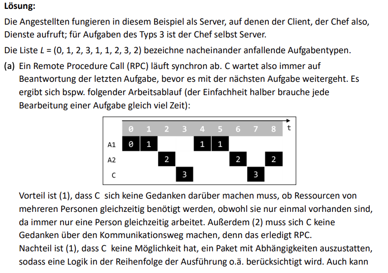
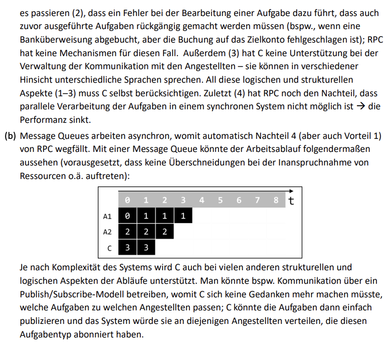

在这个例子中，员工作为服务器，客户即老板从他们那里调用服务；对于类型3的任务，老板自己是服务器。

列表 \( L = (0, 1, 2, 3, 1, 1, 2, 3, 2) \) 依次标示了任务类型。

(a) 远程过程调用（RPC）是同步进行的。C总是等待最后一个任务完成后才继续下一个任务。例如，以下是工作流程（为了简化，每个任务的处理时间相同）：

优点是：
1. C不必担心资源是否同时被多个人需要，即使它们只存在一次，因为总是只有一个人同时工作。
2. C不需要担心通信机制，因为RPC会处理。

缺点是：
1. C没有办法处理一个具有依赖关系的任务包，因为RPC不考虑执行顺序中的逻辑。
2. 如果一个任务处理错误，需要回滚先前的任务（例如，银行转账失败），RPC没有机制处理。
3. C无法管理与员工的通信，例如不同语言的问题。
4. 同步系统中任务的并行处理不可能，导致性能下降。

(b) ****消息队列是异步工作的，**** 因此自动消除了RPC的缺点4（但也消除了优点1）。使用消息队列，工作流程可能如下（假设没有资源冲突等情况）：

工作流程图：

根据系统的复杂性，C在许多其他结构和逻辑方面也能得到支持。例如，可以使用发布/订阅模型，C不再需要考虑将任务分配给哪个员工；C可以简单地发布任务，系统会将其分配给订阅了相应任务类型的员工。

## RPC

Vorteile:
- Verwenden von Remote-Code ist so leicht, wie lokalen Code verwenden
- Fokus auf Core-Functionality
- Platformunabhängig

Nachteile:
- Hohe Latenz,
- obwohl es wie ein lokaler Aufruf wirkt

# Aufgabe 2 – 2PC
Erläutern Sie, wie auf Basis eines 2-Phase-Commit Protokolls entschieden werden kann, ob eine Transaktion in einer verteilten Datenbank committed oder abgebrochen wird.

任务 2 – 两阶段提交协议（2PC）
解释如何基于两阶段提交协议决定在分布式数据库中提交或中止一个事务。
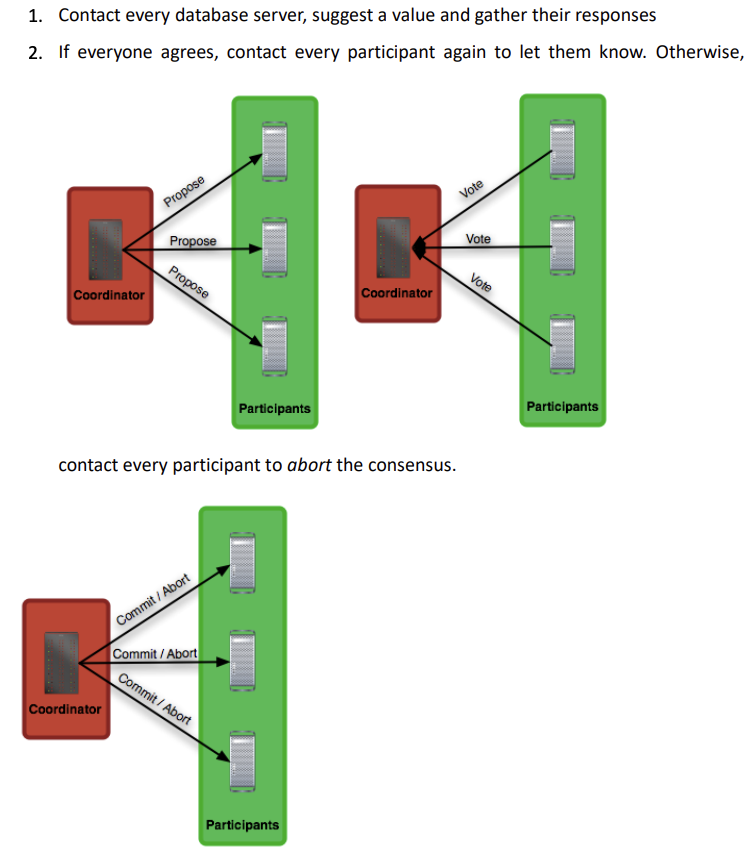

# Aufgabe 3 – RPC
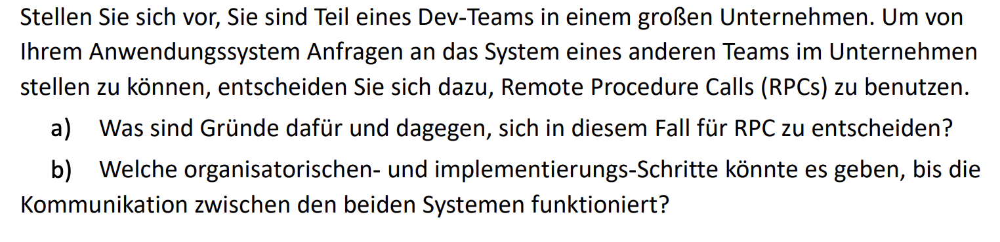

**Lösung**

**a)**

Dafür:
- Vereinfachte Implementierung im Vergleich zu manueller Implementierung mit Sockets
- Andere Teams können die gleichen RPC Calls einfach auch benutzen
- Plattformunabhängig. Wenn sich ein Team spontan dazu entscheidet, alles in einer anderen Programmiersprache neu zu implementieren, ist das für das andere Team egal.

Dagegen:
- Nur synchrone Kommunikation (meistens)
- Die Calls "wirken" im Code so, als ob sie lokal wären, sind es aber nicht. Das kann zu unerwartet langsamem Code führen.

**b)**

Beispielsweise:
1. Zuerst müssen sich die Teams ***auf eine RPC-Technologie einigen***, die die jeweils benutzten Programmiersprachen unterstützt (z.B. GRPC)
2. Dann müssen sich die Teams ***auf ein Interface einigen, dass sie in einer IDL (Interface Definition Language) beschreiben***. Wie genau dieses Interface aussieht hängt von den bereits bestehenden Systemen und dem aktuellen Use-Case ab.
3. Dann erstellen beide Teams anhand ***der IDL den Programmiersprachen-spezifischen Code***. Das aufrufende Team kann diesen Code als Client benutzen, das aufgerufene Team implementiert der Server-Code.
4. Schließlich muss sichergestellt werden, dass die beiden Systeme ***über das Netzwerk*** miteinander kommunizieren können.

**解决方案**

**a)**

优点：
- 与手动实现Sockets相比，实现更简便
- 其他团队也可以轻松使用相同的RPC调用
- 平台无关。如果一个团队临时决定用另一种编程语言重新实现一切，对另一个团队没有影响。

缺点：
- 仅同步通信（大多数情况下）
- 调用在代码中“看起来”像是本地调用，但实际上不是。这可能导致代码意外变慢。

**b)**

例如：
1. 首先，团队需要就一种RPC技术达成一致，该技术支持各自使用的编程语言（例如，GRPC）
2. 然后，团队需要就一个接口达成一致，并用接口定义语言（IDL）描述它。具体的接口外观取决于现有系统和当前的用例。
3. 然后，两个团队根据IDL创建特定编程语言的代码。调用团队可以将此代码用作客户端，被调用团队实现服务器代码。
4. 最后，必须确保两个系统可以通过网络进行通信。

# **Aufgabe 4 – Queues**

Wofür können Queues in komplexen System eingesetzt werden? Erklären Sie die Unterschiede, Nachrichten synchron oder asynchron in die Queue einzuliefern und abzuholen.

**Lösung**

Queues können unter anderem eingesetzt werden, ***um Komponenten voneinander zu entkoppeln***. Damit können diese Komponenten z.B. unterschiedliche Technologien verwenden. Außerdem kann das empfangende System ***die Anfragen zu einem späteren Zeitpunkt bearbeiten***. Damit kann die ***Reliability*** erhöht werden.

Die Kommunikation insgesamt ist ***asynchron***, aber einzelne Teile der Kommunikation mit der Queue können trotzdem synchron sein, woraus sich folgende Matrix ergibt:

|               | Sender                                                                       | Empfänger                                                                                                                                                                                                                             |
| ------------- | ---------------------------------------------------------------------------- | ------------------------------------------------------------------------------------------------------------------------------------------------------------------------------------------------------------------------------------- |
| **Synchron**  | Sender kann sich sicher sein, dass Nachricht angekommen ist. Aber: Blocking  | ***Empfänger ruft Queue auf und wartet explizit auf Nachrichten***. Damit kann Empfänger steuern wie viele Nachrichten ankommen (=***wird nicht überlaste***t). Aber: das konstante Anfragen an die Queue verbraucht auch Ressourcen. |
| **Asynchron** | Minimale Latenz, aber Sender weiß nicht sicher, ob Nachricht angekommen ist. | Queue ruft Empfänger mit Nachrichten auf, normalerweise ***über Callback***. Das blockiert den Empfänger nicht, aber der Empfänger ***könnte überlastet werden.***                                                                    |

folien 47

**任务 4 – 队列**

队列可以用于复杂系统中的哪些方面？请解释同步和异步将消息放入队列和取出队列的区别。

**解决方案**

队列可以用于将组件彼此解耦。因此，这些组件可以使用不同的技术。此外，接收系统可以在稍后的时间处理请求，从而提高可靠性。

总体通信是异步的，但与队列的通信部分可以是同步的，因此形成以下矩阵：

|          | 发送方                                                                                             | 接收方                                                                                                               |
|----------|----------------------------------------------------------------------------------------------------|----------------------------------------------------------------------------------------------------------------------|
| **同步** | 发送方可以确保消息已经到达。但：阻塞                                                                    | 接收方调用队列并显式等待消息。这样接收方可以控制有多少消息到达（不会过载）。但：不断请求队列也会消耗资源。             |
| **异步** | 最低延迟，但发送方不确定消息是否到达。                                                                | 队列通过回调方式调用接收方。这样不会阻塞接收方，但接收方可能会过载。                                               |

# Aufgabe 5 – Pub/Sub
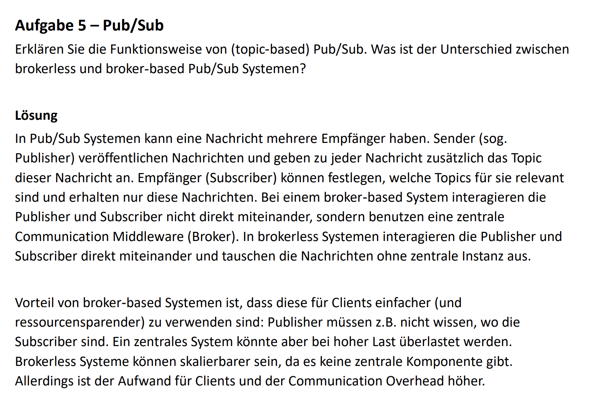
见folien 56

# Aufgabe 7 – RPC Data Flow
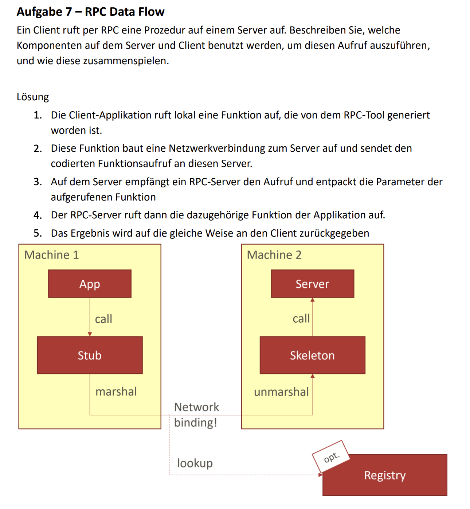

# Aufgabe 8 – Anwendungsszenarien
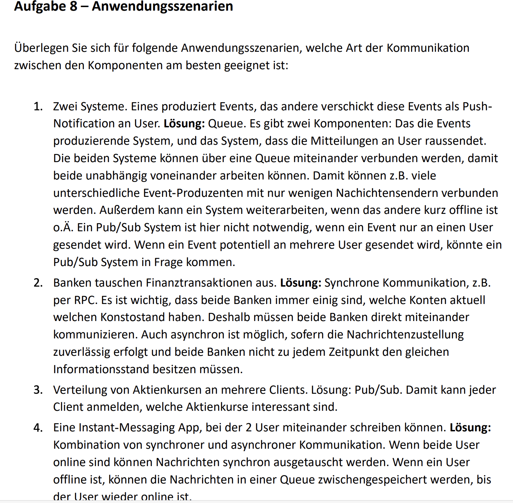
queue就是channel

# Aufgabe 9 – Loose Coupling
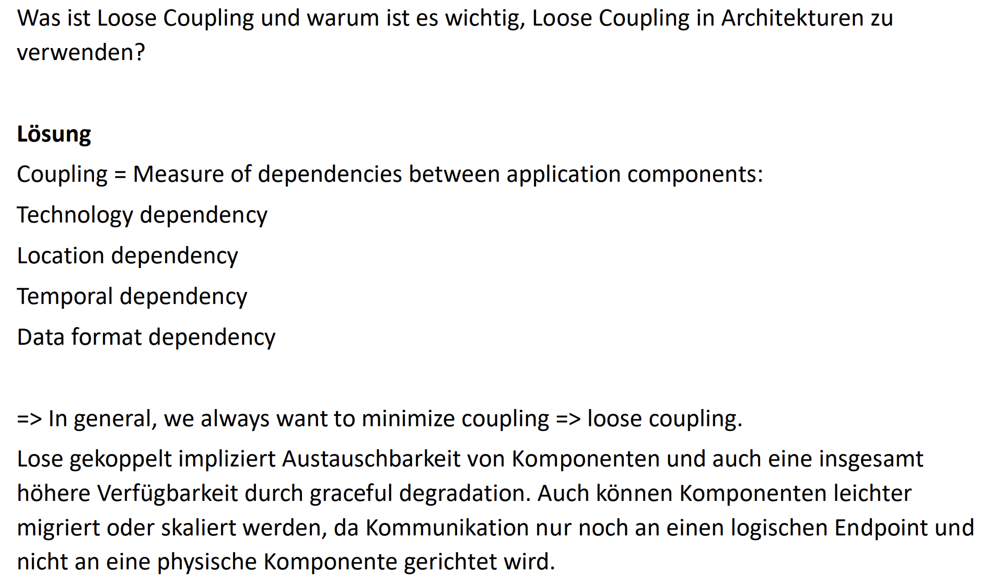
