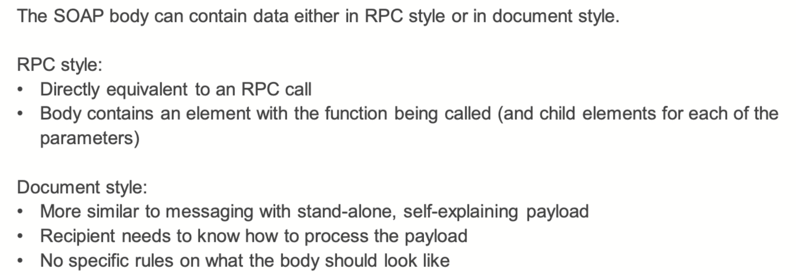

# Aufgabe 10 – Java Web API


[Swagger UI (bundestag.de)](https://search.dip.bundestag.de/api/v1/swagger-ui/#/Vorg%C3%A4nge/getVorgangList)


aus mo:
```java
import org.apache.hc.core5.net.URIBuilder;  
  
import org.json.JSONArray;  
import org.json.JSONObject;  
import java.io.IOException;  
import java.net.URI;  
import java.net.URISyntaxException;  
import java.net.http.HttpClient;  
import java.net.http.HttpRequest;  
import java.net.http.HttpResponse;  
  
public class BundesApi {  
  
    public static void main(String[] args) throws URISyntaxException, IOException, InterruptedException {  
  
        URI uri = new URIBuilder()  
                .setScheme("https")  
                .setHost("search.dip.bundestag.de")  
                .setPath("api/v1/drucksache")  
                .addParameter("f.datum.start","2000-01-01")  
                .addParameter("f.datum.end","2000-01-31")  
                .addParameter("apikey","I9FKdCn.hbfefNWCY336dL6x62vfwNKpoN2RZ1gp21")  
                .build();  
  
        HttpRequest request = HttpRequest  
                .newBuilder(uri)  
                .GET()  
                .header("accept","application/json")  
                .build();  
  
        HttpClient client = HttpClient.newHttpClient();  
  
        HttpResponse<String> response = client.send(request, HttpResponse.BodyHandlers.ofString());  
  
  
  
        JSONObject root = new JSONObject(response.body());  
  
        JSONArray documents = root.getJSONArray("documents");  
  
        for ( Object d : documents){  
            JSONObject documentsJSON = (JSONObject) d;  
            JSONObject fundstelle = documentsJSON.getJSONObject("fundstelle");  
            JSONArray urheber = fundstelle.getJSONArray("urheber");  
            for (Object u : urheber){  
                String urheberString = (String) u;  
                if (urheberString.equals("Finanzausschuss")){  
                    System.out.println(documentsJSON);  
                }  
            }  
        }  
  
    }  
}
```
ausgaben:
```json
/Users/yilongwang/Library/Java/JavaVirtualMachines/corretto-17.0.11/Contents/Home/bin/java -javaagent:/Applications/IntelliJ IDEA.app/Contents/lib/idea_rt.jar=62783:/Applications/IntelliJ IDEA.app/Contents/bin -Dfile.encoding=UTF-8 -classpath /Users/yilongwang/Desktop/anwendunssystem/tutor/TheWebTemplate/target/classes:/Users/yilongwang/.m2/repository/org/apache/httpcomponents/client5/httpclient5/5.2.1/httpclient5-5.2.1.jar:/Users/yilongwang/.m2/repository/org/apache/httpcomponents/core5/httpcore5/5.2/httpcore5-5.2.jar:/Users/yilongwang/.m2/repository/org/apache/httpcomponents/core5/httpcore5-h2/5.2/httpcore5-h2-5.2.jar:/Users/yilongwang/.m2/repository/org/slf4j/slf4j-api/1.7.36/slf4j-api-1.7.36.jar:/Users/yilongwang/.m2/repository/org/json/json/20230227/json-20230227.jar BundesApi
{"datum":"2000-01-26","aktualisiert":"2022-07-26T19:57:15+02:00","drucksachetyp":"Empfehlungen","dokumentart":"Drucksache","typ":"Dokument","wahlperiode":14,"autoren_anzahl":0,"dokumentnummer":"695/2/99","fundstelle":{"datum":"2000-01-26","drucksachetyp":"Empfehlungen","dokumentart":"Drucksache","herausgeber":"BR","pdf_url":"https://dserver.bundestag.de/brd/1999/D695+2+99.pdf","id":"87632","dokumentnummer":"695/2/99","urheber":["Ausschuss für Arbeit und Sozialpolitik","Ausschuss für Innere Angelegenheiten","Finanzausschuss","Wirtschaftsausschuss"]},"vorgangsbezug_anzahl":1,"vorgangsbezug":[{"titel":"Entschließung des Bundesrates zur Einsparung von Statistiken (G-SIG: 14021402)","vorgangstyp":"Selbständiger Antrag von Ländern auf Entschließung","id":"104837"}],"titel":"Entschließung des Bundesrates zur Einsparung von Statistiken","pdf_hash":"8509c50f0c6ce960ed03634b5b7b765f","herausgeber":"BR","id":"87632","urheber":[{"titel":"Ausschuss für Arbeit und Sozialpolitik","bezeichnung":"AS","einbringer":false},{"titel":"Ausschuss für Innere Angelegenheiten","bezeichnung":"In","einbringer":false},{"titel":"Finanzausschuss","bezeichnung":"Fz","einbringer":false},{"titel":"Wirtschaftsausschuss","bezeichnung":"Wi","einbringer":false}]}

,,,,,,

Process finished with exit code 0
```

aus prof:
```java
import org.apache.hc.core5.net.URIBuilder;  
import org.json.JSONArray;  
import org.json.JSONObject;  
  
import java.net.URI;  
import java.net.http.HttpClient;  
import java.net.http.HttpRequest;  
import java.net.http.HttpResponse;  
  
public class BundestagAPIExample {  
  
    public static void main(String[] args) throws Exception{  
        URI uri = new URIBuilder()  
                .setScheme("https")  
                .setHost("search.dip.bundestag.de")  
                .setPath("api/v1/drucksache")  
                .addParameter("f.aktualisiert.start", "2000-01-01T00:00:00+01:00")  
                .addParameter("f.datum.start", "2000-01-01")  
                .addParameter("f.datum.end", "2000-01-31")  
                .addParameter("format", "json")  
                //.addParameter("apikey", "rgsaY4U.oZRQKUHdJhF9qguHMkwCGIoLaqEcaHjYLF")// This is from https://dip.bundestag.de/%C3%BCber-dip/hilfe/api and might change in the future  
                .addParameter("apikey","I9FKdCn.hbfefNWCY336dL6x62vfwNKpoN2RZ1gp21")  
                .build();  
  
        HttpRequest r = HttpRequest.newBuilder(uri)  
                .GET()  
                .header("accept", "application/json")  
                //.header("Authorization", "rgsaY4U.oZRQKUHdJhF9qguHMkwCGIoLaqEcaHjYLF") // This is from https://dip.bundestag.de/%C3%BCber-dip/hilfe/api and might change in the future  
                .header("Authorization", "I9FKdCn.hbfefNWCY336dL6x62vfwNKpoN2RZ1gp21") // This is from https://dip.bundestag.de/%C3%BCber-dip/hilfe/api and might change in the future  
                .build();  
  
        HttpClient c = HttpClient.newHttpClient();  
  
        HttpResponse<String> response = c.send(r, HttpResponse.BodyHandlers.ofString());  
  
        System.out.println(response.toString());  
        System.out.println(".........................................");  
  
        JSONObject o = new JSONObject(response.body());  
  
        // Note: to debug, print out the whole JSON here and then build the call chain to get to the value you actually want  
  
        String firstDocument = o.getJSONArray("documents").getJSONObject(0).toString();  
  
        System.out.println("First Document:");  
        System.out.println(firstDocument);  
  
        for (Object documentO : o.getJSONArray("documents")) {  
            // We know they are all JSONObjects  
            JSONObject document = (JSONObject) documentO;  
            JSONArray urheber = document.getJSONObject("fundstelle").getJSONArray("urheber");  
            for (Object singleUrheber :urheber) {  
                // We know that they are all Strings  
                String uString = (String) singleUrheber;  
                if (uString.contains("Finanzausschuss")) {  
                    System.out.println(document.getJSONObject("fundstelle")/*.getString("pdf_url")*/);  
                    break;  
                }  
            }  
        }  
    }  
}
```
ausgaben:
```json
/Users/yilongwang/Library/Java/JavaVirtualMachines/corretto-17.0.11/Contents/Home/bin/java -javaagent:/Applications/IntelliJ IDEA.app/Contents/lib/idea_rt.jar=63258:/Applications/IntelliJ IDEA.app/Contents/bin -Dfile.encoding=UTF-8 -classpath /Users/yilongwang/Desktop/anwendunssystem/loesung/Block 5 - The Web - Lösung-20240415/TheWebSolution/target/classes:/Users/yilongwang/.m2/repository/org/apache/httpcomponents/client5/httpclient5/5.2.1/httpclient5-5.2.1.jar:/Users/yilongwang/.m2/repository/org/apache/httpcomponents/core5/httpcore5/5.2/httpcore5-5.2.jar:/Users/yilongwang/.m2/repository/org/apache/httpcomponents/core5/httpcore5-h2/5.2/httpcore5-h2-5.2.jar:/Users/yilongwang/.m2/repository/org/slf4j/slf4j-api/1.7.36/slf4j-api-1.7.36.jar:/Users/yilongwang/.m2/repository/org/json/json/20230227/json-20230227.jar BundestagAPIExample
(GET https://search.dip.bundestag.de/api/v1/drucksache?f.aktualisiert.start=2000-01-01T00%3A00%3A00%2B01%3A00&f.datum.start=2000-01-01&f.datum.end=2000-01-31&format=json&apikey=I9FKdCn.hbfefNWCY336dL6x62vfwNKpoN2RZ1gp21) 200
.........................................
First Document:
{"datum":"2000-01-31","aktualisiert":"2022-07-26T19:57:15+02:00","drucksachetyp":"Beschlussempfehlung und Bericht","dokumentart":"Drucksache","typ":"Dokument","wahlperiode":14,"autoren_anzahl":2,"dokumentnummer":"14/2625","fundstelle":{"datum":"2000-01-31","drucksachetyp":"Beschlussempfehlung und Bericht","dokumentart":"Drucksache","herausgeber":"BT","pdf_url":"https://dserver.bundestag.de/btd/14/026/1402625.pdf","id":"88411","dokumentnummer":"14/2625","urheber":["Verteidigungsausschuss"]},"vorgangsbezug_anzahl":1,"vorgangsbezug":[{"titel":"Fünfzehntes Gesetz zur Änderung des Wehrsoldgesetzes (15.WSGÄndG) (G-SIG: 14019274)","vorgangstyp":"Gesetzgebung","id":"111581"}],"titel":"zu dem GE der BReg 14/2498 Entwurf eines Fünfzehnten Gesetzes zur Änderung des Wehrsoldgesetzes (15. WSGÄndG)","pdf_hash":"b7dfd846d72307a3d3be5e3169d4e46b","herausgeber":"BT","autoren_anzeige":[{"titel":"Uwe Göllner, MdB, SPD","id":"2384","autor_titel":"Uwe Göllner, Berichterstattung"},{"titel":"Helmut Rauber, MdB, CDU/CSU","id":"2351","autor_titel":"Helmut Rauber, Berichterstattung"}],"id":"88411","urheber":[{"titel":"Verteidigungsausschuss","bezeichnung":"VgA","einbringer":false}]}
{"datum":"2000-01-26","drucksachetyp":"Empfehlungen","dokumentart":"Drucksache","herausgeber":"BR","pdf_url":"https://dserver.bundestag.de/brd/1999/D695+2+99.pdf","id":"87632","dokumentnummer":"695/2/99","urheber":["Ausschuss für Arbeit und Sozialpolitik","Ausschuss für Innere Angelegenheiten","Finanzausschuss","Wirtschaftsausschuss"]}
```


see tutor-the web template

# Aufgabe 1 – HTTP und HTML


| 请求方法 | 安全性 | 幂等性 |
|---------|-------|-------|
| POST    | 否    | 否    |
| GET     | 是    | 是    |
| PUT     | 否    | 是    |
| DELETE  | 否    | 是    |


# Aufgabe 2 – HTML

```html
<!DOCTYPE html>  
<html>  
    <head>  
        <meta charset="UTF-8">  
        <title>Anwedungssysteme</title>  
        <style>            h1 {  
                color:red;  
                background-color: green;  
                font-family: Arial, Helvetica, sans-serif;  
            }  
        </style>  
    </head>  
    <body>    <h1>Anwendungssysteme</h1>  
    <p>Diese Veranstaltung wird an der TU Berlin vom Fachgebiet 3S im Sommer angeboten</p>  
        <p>Inhalte sind unter anderem:</p>  
  
        <ul> <!--Unorderd List-->  
            <li>Anwedungsarchitekturen</li>  
            <li>RESTful Webseites</li>  
            <li>Anwedungsarchitekturen</li>  
        </ul>  
        <p>Html sollen die <strong>Studierenden</strong> aus 2 Gründen beherrschen:</p>  
        <ol>            <li>Grundlage dür das heutige Web</li>  
            <li>Anschauliches BSP für eine <em>Markup-Language</em></li>  
        </ol>  
  
        <a href="https://tu.berlin/3s">TU Berlin</a>  
  
        <script>            setTimeout( () => {  
                console.log("Hallo Welt")  
            }  
            ,10_000)  
        </script>  
    </body>  
</html>
```


bei mo
```html
<!DOCTYPE html>  
  
<html title="Mo">  
<head>  
    <title>Mo's Anw HTML AUfgabe</title>  
    <meta charset="UTF-8">  
    <link rel="stylesheet" href="app.css">  
</head>  
<body>  
<div class="container">  
    <div class="inner-container">  
        <h1>Anwendungssysteme</h1>  
        <p>Die Veranstaltung Anw wird an der TUB ...</p>  
        <p>Inhalte sind unter anderem: </p>  
        <ul>            <li>Anwsys Architektur</li>  
            <li>Kommunikationsmethoden</li>  
            <li>RESTful Webservice</li>  
        </ul>  
        <p>HTML sollten die <b>Studierenden</b> aus 2 Gründen beherschen</p>  
        <ol>            <li>Grundlage für das heutige Web</li>  
            <li>Anschaulisches Beispiel für eine <i>Markup-Language</i></li>  
        </ol>  
    </div>  
    <button>Click</button>  
    <script src="app.js"></script>  
</div>  
  
</body>  
</html>
```
app.js
```js
const btn = document.querySelector("button")  
btn.addEventListener("click",()=> btn.textContent = "Klicked")
```
app.css
```css
p {  
    color : red;  
    border: solid 2px black;  
}  
.container{  
    position: absolute  
}  
.inner-container{  
    transformation: latx(50%)  
}
```

# **Aufgabe 3 – HTML5**

Nehmen Sie an, Sie besuchen mit Ihrem Browser die Seite tu.berlin, die, um zukünftige Zugriffe zu beschleunigen, alle Ihre Benutzerdaten (Noten, Adressdaten, Matrikelnummer, Kontodaten, ...) im Web Storage ablegt. Als nächstes besuchen Sie chat.openai.com, um die Lösung für diese HTML5-Aufgabe herauszufinden. Müssen Sie befürchten, dass OpenAI nun Ihre persönlichen Daten kennt? Begründen Sie kurz Ihre Antwort und gehen Sie dabei auch darauf ein, warum wohl dieses Design gewählt wurde.

**Lösung:**

Die Gefahr besteht nicht, da das same-origin-Prinzip greift und jede Seite nur auf die selbst angelegten Daten zugreifen kann (abgesehen von Sicherheitslücken u.ä.). Gründe hierfür sind offensichtlich Privacy aber auch das Problem von inkonsistenten Daten (wenn bspw. mehrere Seiten den Schlüssel userID verwenden).

### 中文翻译

**任务 3 – HTML5**

假设您使用浏览器访问tu.berlin网站，该网站为了加速未来的访问，将您的所有用户数据（成绩、地址数据、学号、账户数据等）存储在Web存储中。接下来，您访问chat.openai.com以找到这个HTML5任务的解决方案。您是否需要担心OpenAI现在知道您的个人数据？请简要说明您的回答，并解释为什么选择这种设计。

**解决方案：**

没有这种危险，因为同源策略（same-origin principle）生效，每个网站只能访问自己存储的数据（除非存在安全漏洞等）。原因显而易见是为了隐私保护，同时也为了避免数据不一致的问题（例如，如果多个网站使用相同的userID键）。


# Aufgabe 4 – HTTP


**d)** 情景分析：

1. 请求已经到达服务器，但响应尚未返回：最后一个HTTP动词会被重复执行，结果可能会有所不同，例如，多次POST请求会创建多个资源（返回201，已创建），而GET请求则会返回状态码200（OK）。客户端对第一个请求的结果仍然不清楚。
2. 请求没有到达服务器： 您的浏览器会再次发送相同的请求，具体取决于请求的类型和范围，可能已经完全到达服务器或者没有。结果与情景1相似，但对于请求成功完成的确定性更低。许多浏览器不会“盲目”地重复每个动作，例如，通常只有缓存内容发生变化时才会重新加载。在网上银行中也通过代码确保调用不会“重复”发生。

# Aufgabe 5 – JavaScript Intro


# Aufgabe 6 – JavaScript Code


demo.js
```js
// a)  
let variableWithLet = 10; // Variables declared with let are scoped to their current block. They can be updated, but not re-declared  
// see https://developer.mozilla.org/en-US/docs/Web/JavaScript/Reference/Statements/let  
const variableWithConst = 10; // Essentially as let, but can not be updated  
  
// b)  
for (let i = 0; i < 10; i++) {  
    console.log(i)  
}  
  
// c)  
class Person { // see https://developer.mozilla.org/en-US/docs/Web/JavaScript/Reference/Classes?retiredLocale=de for more information  
  
    species = "Homo sapiens" // This is a property not dependent on the constructor  
    constructor(name, age) {  
        this.name = name // This is a property created in the constructor  
        this.age = age  
    }  
}  
  
let p = new Person("JavaScript Person", "We would expect this to be an integer, but without types it can be a string as well!")  
  
console.log(p.name)  
  
// d)  
function printOutNumber(number) {  
    if (number === 2) {  
        console.log("two")  
    } else {  
        throw new Error("This function is not advanced enough to print the passed number")  
    }    // https://developer.mozilla.org/en-US/docs/Web/JavaScript/Reference/Statements/throw  
}  
  
printOutNumber(2)  
try {  
    printOutNumber(3)  
} catch (e) {  
    console.error(e)  
}  
  
  
// e)  
// The setTimeout function expects a function as its first parameter. There are multiple different ways to define functions, this is one of the less elegant ones, but it might be easier to understand  
setTimeout(function () {  
    console.log("Hallo Welt!")  
}  
, 2_000)  
  
// This is an alternative way to write it:  
let functionToCallWhenTimoutIsOver = function () {  
    console.log("Hello from a function that is saved as a variable")  
}  
  
setTimeout(functionToCallWhenTimoutIsOver, 3_000)
```

```
(base) yilongwang@eduroam-141-23-174-83 TheWebSolution % npm i            

up to date, audited 61 packages in 453ms

15 packages are looking for funding
  run `npm fund` for details

found 0 vulnerabilities
(base) yilongwang@eduroam-141-23-174-83 TheWebSolution % node ./js/demo.js

0
1
2
3
4
5
6
7
8
9
JavaScript Person
two
Error: This function is not advanced enough to print the passed number
    at printOutNumber (/Users/yilongwang/Desktop/anwendunssystem/loesung/Block 5 - The Web - Lösung-20240415/TheWebSolution/js/demo.js:31:15)
    at Object.<anonymous> (/Users/yilongwang/Desktop/anwendunssystem/loesung/Block 5 - The Web - Lösung-20240415/TheWebSolution/js/demo.js:38:5)
    at Module._compile (node:internal/modules/cjs/loader:1254:14)
    at Module._extensions..js (node:internal/modules/cjs/loader:1308:10)
    at Module.load (node:internal/modules/cjs/loader:1117:32)
    at Module._load (node:internal/modules/cjs/loader:958:12)
    at Function.executeUserEntryPoint [as runMain] (node:internal/modules/run_main:81:12)
    at node:internal/main/run_main_module:23:47
Hallo Welt!
Hello from a function that is saved as a variable

```


AJAX（Asynchronous JavaScript and XML）是一种用于创建动态和交互式网页应用的技术。它允许网页在不重新加载整个页面的情况下，与服务器进行异步通信。这意味着用户可以在不打断他们的浏览体验的情况下，从服务器请求和接收数据，并相应地更新网页的一部分内容。
**AJAX的工作原理：**

1. **创建XMLHttpRequest对象**：这是与服务器进行通信的核心对象。
2. **发送请求到服务器**：通过XMLHttpRequest对象发送HTTP请求到服务器，通常是GET或POST请求。
3. **服务器处理请求**：服务器处理请求并返回响应数据，通常是XML或JSON格式的数据。
4. **接收响应**：AJAX引擎接收服务器的响应。
5. **更新网页内容**：使用JavaScript和DOM操作来更新网页内容，而无需刷新整个页面。


# Aufgabe 7 AJAX


# Aufgabe 8 REST


# Aufgabe 9 – RESTful Shoppingcart





# Aufgabe 11 – SOAP / WSDL

loesung:

以下是图片中内容的中文翻译：

(a) Web服务描述语言

(b) 平台、编程语言和协议无关的XML规范，用于描述用于消息交换的网络服务（Web Services）。WSDL通常与SOAP和XML Schema结合使用，以便在互联网上提供Web服务。调用Web服务的客户端可以读取WSDL，以确定服务器上可用的功能。所有使用的特定数据类型都以XML格式嵌入在WSDL文件中。客户端无需使用SOAP就可以调用WSDL中列出的功能。

(c) 网络协议，借助它可以在系统之间交换数据并执行远程过程调用（RPC）。

特点：
- 用于在计算机网络上交换基于XML的消息的轻量级协议。SOAP定义了消息设计的规则，
- 规定了消息中的数据应如何映射和解释，
- 为远程过程调用提供了一个约定。
- SOAP不对传输的应用程序特定数据的语义做规定，而是提供了一个框架，允许传输任何应用程序特定的信息。
- SOAP不仅用于远程过程调用，也用于简单的消息传递或数据交换。

(d) XML用于数据表示
网络协议：HTTP/TCP（但也包括FTP，SMTP）

# Aufgabe 12 – REST vs. SOAP/WSDL

REST仅仅是一种架构风格，通常使用标准的HTTP。然而，也可以轻松地将REST用作一种传统编程语言中的编程模型。相比之下，SOAP/WSDL则是专为Web服务设计的具体技术/协议。不过，两种方式都可以实现Web服务。有些服务同时提供基于REST和SOAP的接口。


# Aufgabe 13 – Webservices 
Es sei die folgende WSDL-Beschreibung eines Webservice gegeben:
```xml
<?xml version="1.0" encoding="utf-8"?>
<wsdl:definitions name="AnwSysServiceDefinition" targetNamespace="http://tu-berlin.de/mcc/anwsys/"
 xmlns:soap="http://schemas.xmlsoap.org/wsdl/soap/"
 xmlns:s="http://www.w3.org/2001/XMLSchema"
 xmlns:s1="http://microsoft.com/wsdl/types/"
 xmlns:tns="http://tu-berlin.de/mcc/anwsys/"
 xmlns:wsdl="http://schemas.xmlsoap.org/wsdl/">
    <wsdl:types>
        <s:schema elementFormDefault="qualified" targetNamespace="http://tu-berlin.de/mcc/anwsys/">
            <s:import namespace="http://microsoft.com/wsdl/types/"/>
            <s:element name="GetPositionsOfSymbolInText">
                <s:complexType>
                    <s:sequence>
                        <s:element minOccurs="0" maxOccurs="1" name="text" type="s:string"/>
                        <s:element minOccurs="1" maxOccurs="1" name="symbol" type="s1:char"/>
                    </s:sequence>
                </s:complexType>
            </s:element>
            <s:element name="GetPositionsOfSymbolInTextResponse">
                <s:complexType>
                    <s:sequence>
                        <s:element minOccurs="0" maxOccurs="1" name="GetPositionsOfSymbolInTextResult" type="tns:ArrayOfInt"/>
                    </s:sequence>
                </s:complexType>
            </s:element>
            <s:complexType name="ArrayOfInt">
                <s:sequence>
                    <s:element minOccurs="0" maxOccurs="unbounded" name="int" type="s:int"/>
                </s:sequence>
            </s:complexType>
        </s:schema>
        <s:schema elementFormDefault="qualified" targetNamespace="http://microsoft.com/wsdl/types/">
            <s:simpleType name="char">
                <s:restriction base="s:unsignedShort"/>
            </s:simpleType>
        </s:schema>
    </wsdl:types>
    <wsdl:interface name="AnwSysServiceInterface">
        <wsdl:operation name="GetPositionsOfSymbolInText">
            <documentation xmlns="http://schemas.xmlsoap.org/wsdl/"> Liefert Positionen eines Zeichens in einem Text </documentation>
            <wsdl:input element="tns:GetPositionsOfSymbolInText"/>
            <wsdl:output element="tns:GetPositionsOfSymbolInTextResponse"/>
        </wsdl:operation>
    </wsdl:interface>
    <wsdl:binding name="AnwSysServiceSoapBinding" interface="tns:AnwSysServiceInterface">
        <soap:binding transport="http://schemas.xmlsoap.org/soap/http" style="document"/>
        <wsdl:operation name="GetPositionsOfSymbolInText" ref="GetPositionsOfSymbolInText">
            <soap:operation soapAction="http://tu-berlin.de/mcc/anwsys/GetPositionsOfSymbolInText" style="document"/>
        </wsdl:operation>
    </wsdl:binding>
    <wsdl:service name="AnwSysService">
        <documentation xmlns="http://schemas.xmlsoap.org/wsdl/"> Dieser Dienst dient dazu, den Studis der Vorlesung AnwSys die Protokolle WSDL und SOAP näherzubringen </documentation>
        <wsdl:endpoint name="AnwSysServiceSoap" binding="tns:AnwSysServiceSoapBinding">
            <soap:address location="http://ws-server.de/AnwSysService/UebungsService.asmx"/>
        </wsdl:endpoint>
    </wsdl:service>
</wsdl:definitions>
```


```
syntax = "proto3";

package anwsys;

// The request message containing the text and symbol.
message GetPositionsOfSymbolInTextRequest {
  string text = 1;   // The text in which to find the symbol.
  uint32 symbol = 2; // The symbol to find in the text (represented as unsigned 16-bit integer).
}

// The response message containing the positions of the symbol in the text.
message GetPositionsOfSymbolInTextResponse {
  repeated int32 positions = 1; // The list of positions where the symbol appears in the text.
}

// The service definition.
service AnwSysService {
  // Sends a request to get positions of a symbol in the text.
  rpc GetPositionsOfSymbolInText (GetPositionsOfSymbolInTextRequest) returns (GetPositionsOfSymbolInTextResponse);
}
```
