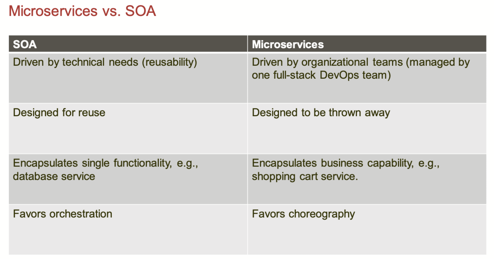
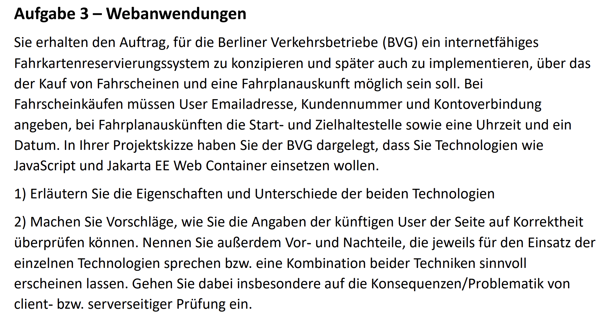
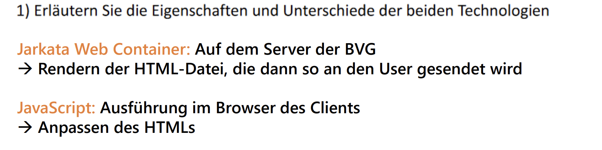

# Aufgabe 1 – Cloud Messaging und Microservices

Amazon Web Services 提供了一种基于云的消息服务 “简单队列服务” (SQS)，具有以下操作：发送消息、接收消息、删除消息。

a) 描述当客户端需要返回结果时，通过SQS队列，客户端与服务器之间的典型交互。
b) 假设您是一家公司的软件架构师，该公司使用微服务。您会使用SQS来使所有服务之间的通信更加可靠吗？请列出优缺点。

1. 客户端将请求（Req，可能是同步或异步的，取决于实现方式）发送到Q1。

2. 服务器从Q1接收消息并处理。

3. 服务器将响应（Res）放入Q2。

4. 客户端从Q2接收消息（并通过消息中的字段（例如ID、请求）对消息进行匹配）。

**优点：**

• **容错能力**：服务被解耦。通过队列中的冗余可以防止传输错误，并保证消息的传递。

• **松耦合**：服务器和客户端可以独立启动/停止/扩展。

• **松耦合 II**：组件之间的接口是标准化的，可以用任何编程语言。

• **低运营成本**

**缺点：**

• **缺乏内聚性**（智能端点和哑管道）：使用非常简单的接口在（潜在的非常复杂的）服务之间会失去接口的强大功能。例如，无法在SQS中实现优先级。此外，所有业务逻辑必须适应这种模式，这可能是一项巨大的改变。

• **供应商锁定**：更换供应商会产生高成本。

| 功能/特点          | 虚拟机 (VM)                           | 容器 (Container)                        |
|------------------|-------------------------------------|---------------------------------------|
| 目的 (Zweck)     | 运行多个操作系统实例 (Mehrere Betriebssystem-Instanzen ausführen) | 轻量级应用隔离 (Leichte Anwendungstrennung) |
| 开销 (Overhead)  | 高 (Hoch)                            | 低 (Niedrig)                           |
| 启动时间 (Startzeit) | 慢 (Langsam)                         | 快 (Schnell)                            |
| 性能 (Leistung)   | 较低 (Relativ niedrig)               | 较高 (Relativ hoch)                     |
| 隔离性 (Isolation) | 完全隔离 (Vollständig isoliert)         | 进程级别隔离 (Prozessisolierung)          |
| 资源利用率 (Ressourcennutzung) | 低 (Niedrig)                         | 高 (Hoch)                             |
| 兼容性 (Kompatibilität) | 完整OS (Vollständiges Betriebssystem) | 共享主机OS (Teilt Host-Betriebssystem)  |

# Aufgabe 2 – Virtuelle Ausführungsumgebungen

您的公司采用了现代的混合云和基于DevOps的方法使用Docker。您运行了39个不同的服务在容器中，平均每天有三分之一的服务进行小更新。平均每个服务有7个运行实例。Docker运行在虚拟机中，您可以使用Google Cloud的一些公共镜像。公司的CIO希望改善您云端部署的安全性，并提出以下规定：

1. 将来，无论是虚拟机还是Docker容器，都必须使用公司预先定义的镜像。这些镜像由公司内部的安全团队提供和维护。目前，VM镜像大小为900MB，Docker镜像大小为380MB。

2. 为防止安全漏洞在生产系统中长期存在，所有在Docker容器或VM中的服务必须每月至少完全停止并删除一次，然后启动新的实例。

您怎么看这些建议？为什么？您认为这些规定能提高安全性吗？

1. 为虚拟机使用基础镜像可能是有意义的：

 例如，可以在整个公司范围内引入统一的监控，并集中推送安全更新。然而，通过使用云提供商提供的集中化VM镜像，系统的安全性可能会进一步提高。VM镜像的大小表明基础镜像上已经安装了一些程序和运行时环境，从安全角度来看这是值得怀疑的（因为攻击面更大）。一个最小化的Linux镜像通常在100MB-200MB之间。此外，如果所有服务都在Docker中运行，那么在VM镜像中安装多个程序的原因尚不明确。

对于Docker镜像，使用基础镜像意义不大。Docker镜像应尽可能轻量化并只包含必要的内容，因此380MB的基础镜像明显过大（相比之下，一个简单的二进制文件的Docker镜像可以小于10MB）。在这种情况下，基础镜像只会增加安全漏洞的攻击面，并增加启动镜像时需要传输的数据量。

2. 重新启动虚拟机通常是有意义的：

- 有些安全漏洞不是持久性的，也就是说，这些漏洞只能在系统重启之前被利用。这些漏洞虽然不多见，但因此重新启动虚拟机是不值得的。
- 出于操作上的原因，重新启动虚拟机可能是有意义的：如果虚拟机或物理服务器出现故障，需要重新启动虚拟机。在这种特殊情况下，拥有重新启动经验是有益的。

然而，虚拟机的重新启动可能需要很长时间，这可能会导致操作上的限制。

Docker容器应该设计成可以很容易地启动和停止。通过定期重新启动，可以再次测试系统的鲁棒性。然而，根据架构的不同，某些Docker容器可能是单点故障（例如数据库）。

总体来说，如果不是停止整个服务，而是只重新启动各个服务器，也可以达到预期的目标。

---
在计算机科学中，“镜像”是指一种预配置的环境，它包含了操作系统、应用程序、以及所有必要的配置文件和依赖项。镜像用于快速部署和复制相同的计算环境。虚拟机和Docker容器的镜像有一些相似之处，但它们也有显著的不同。

### 虚拟机镜像

1. **包含内容**：
   - 虚拟机镜像包含完整的操作系统以及所有必要的应用程序和库。
   - 还包含了虚拟化软件所需的配置文件和驱动程序。

2. **大小**：
   - 通常比较大，因为它需要包括整个操作系统及其内核。

3. **隔离性**：
   - 提供强隔离，每个虚拟机都有自己的操作系统内核，这意味着它们可以运行完全不同的操作系统版本。

4. **启动时间**：
   - 启动较慢，因为需要加载整个操作系统。

5. **资源开销**：
   - 资源开销较大，因为每个虚拟机需要自己的操作系统和内存分配。

### Docker镜像

1. **包含内容**：
   - Docker镜像只包含应用程序及其依赖项，而不包含完整的操作系统内核。
   - 依赖于主机操作系统的内核，共享内核资源。

2. **大小**：
   - 通常较小，因为它们只包含必要的应用程序和库，而不包含操作系统内核。

3. **隔离性**：
   - 提供进程级隔离，所有容器共享主机的操作系统内核。

4. **启动时间**：
   - 启动速度非常快，因为它不需要加载操作系统，只需启动应用程序。

5. **资源开销**：
   - 资源开销较小，因为它们共享主机的操作系统内核和资源。

### 总结

- **虚拟机镜像**：包括完整的操作系统，较大，启动慢，提供强隔离，资源开销大。
- **Docker镜像**：只包含应用程序和依赖项，较小，启动快，提供进程级隔离，资源开销小。

虚拟机适用于需要运行不同操作系统或需要强隔离的场景，而Docker更适用于需要快速启动和高效利用资源的场景。

# Aufgabe 3 Webanwendungen

**任务3 – Web应用程序**

您接到任务，为柏林交通公司（BVG）设计并实施一个支持互联网的车票预订系统，该系统能够购买车票和查询时刻表。在购买车票时，用户需要提供电子邮件地址、客户编号和银行账户信息；在查询时刻表时，用户需要提供起始站和目的站以及时间和日期。在您的项目提案中，您向BVG展示了您打算使用JavaScript和Jakarta EE Web容器等技术。

1. 解释这两种技术的特点和区别。

2. 提出建议，如何验证未来用户输入的准确性。请列出各技术或技术组合的优缺点，并特别关注客户端和服务器端验证的影响和问题。

# Aufgabe 4 Serverless

| 架构/特点                | 优点 (Vorteile)                                           | 缺点 (Nachteile)                                     |
|-------------------------|----------------------------------------------------------|------------------------------------------------------|
| 单体架构 (Monolith)     | **简易开发和测试 (Einfache Entwicklung und Testen)**         | **难以扩展 (Schwer skalierbar)**                     |
|                         | **单一代码库 (Einzelnes Code-Repository)**                    | **部署风险大 (Hohe Einsatzrisiken)**                 |
|                         | **性能优化容易 (Einfache Leistungsoptimierung)**              | **更新困难 (Schwierige Aktualisierungen)**           |
| 函数即服务 (FaaS)       | **按需扩展 (Skalierung auf Anfrage)**                       | **冷启动延迟 (Kaltstartverzögerung)**                |
|                         | **成本效益高 (Kostenwirksam)**                              | **状态管理复杂 (Komplizierte Zustandsverwaltung)**   |
|                         | **快速开发和部署 (Schnelle Entwicklung und Bereitstellung)**  | **供应商锁定 (Anbieterabhängigkeit)**                |
| 面向服务架构 (SOA)      | **模块化 (Modularität)**                                    | **复杂性高 (Hohe Komplexität)**                      |
|                         | **灵活性 (Flexibilität)**                                   | **通信开销大 (Hohe Kommunikationskosten)**           |
|                         | **可重用性 (Wiederverwendbarkeit)**                          | **治理困难 (Schwierige Verwaltung)**                 |
| 微服务架构 (Microservices) | **独立部署 (Unabhängige Bereitstellung)**                     | **架构复杂 (Komplexe Architektur)**                  |
|                         | **按需扩展 (Skalierung auf Anfrage)**                       | **分布式系统挑战 (Herausforderungen bei verteilten Systemen)** |
|                         | **技术多样性 (Technologische Vielfalt)**                      | **通信开销大 (Hohe Kommunikationskosten)**           |

# Aufgabe 5 – SOA & Microservices

