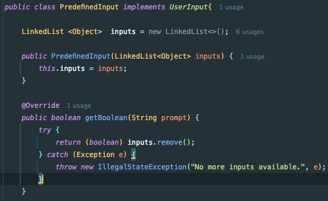
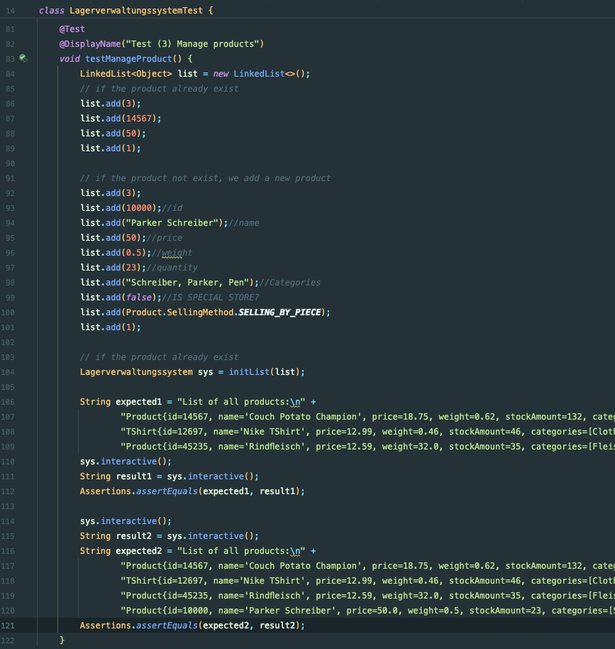

Name: Yilong Wang
Matriknummer: 0483728
Fach: Wirtschaftsingenieurwesen


|  |     |
| ------------------------------ | --- |
*Ich habe auch das Dokument im md-Format in der ZIP-Datei platziert. Sie können die README.md im Stammverzeichnis finden, und im  "README-media" Ordner sind die entsprechenden Bilder.*

# UML Diageamm
Das UML Diagramm zeigt die Attribute und Methoden der Klassen:(diese UML Diagramm uml.puml und uml.png können Sie in Stammverzeichnis der Source-Code finden)

Zuerst sehen wir uns die verschiedenen Funktionen an und erläutern einige wichtige Informationen.

# Product Klasse: 
## categories 
- speichere ich in einem HashSet, um die Einzigartigkeit des Inhalts sicherzustellen
## isSpecialStore 
- gibt an, ob die Lagereinheitskosten höher sind
## sellingMethod 
- ist eine Enum-Variable
## lagerkostenwert 
- ist die Einheitskosten eines Produkt-Instanz, die entweder durch den Konstruktor oder durch Aufrufen von calculateCost() berechnet werden

|  |  |
| ------------------------------ | ------------------------------ |
# TShirt Klasse:
- ist Kinderklasse von Product Klasse

# UserInput Interface
- definiert die Methoden, die in PredefineInput und ConsoleUserInput implementiert werden sollen.
# ConsoleUserInput
- um im Terminal mit dem User zu interagieren. 
- Die internen Funktionen dienen dazu, eine String als prompt zu akzeptieren und den vom User eingegebenen Inhalt je nach Funktion in verschiedene Datenstrukturen umzuwandeln und zurückzugeben.
- z.b
 
# PredefineInput
- für Testcode in Junit
-  enthält eine verlinkte Liste, die dazu dient, Benutzeraktionen im Terminal zu simulieren
- zum Beispiel: das Hinzufügen des Integer-Wertes 1 zur Liste, ähnlich wie wenn ein Benutzer die 1 im Terminal eingibt.

|  |
| ------------------------------ |
|  |
|  |
# Lagerverwaltungssystem Klasse
- wird verwendet, um im Terminal mit dem Benutzer zu interagieren
- wobei die internen Funktionen spezifische Geschäftsfunktionen implementieren:
- (1) List all products, (2) Search for products, (3) Manage products, (4) Calculate the monthly cost
# SystemMain Klasse
- User können in Terminal interagieren

# LagerverwaltungssystemTest Klasse
- Testcode über Lagerverwaltungssystem, um die Verhaltung zu simulieren

|  |  |
| ------------------------------ | ------------------------------ |
# Ergebnisse Zeigen
## Aufgabe 1: Sich alle gelagerten Produkte anzeigen zu  lassen.
### Code über Geschäftsfunktione

### Testcode für Junit

### User-Perspektive (in SystemMain  interagieren)

## Aufgabe 2: Nach Produkten und Produktkategorien zu suchen.
### Code über Geschäftsfunktione

|    |     |     |     |
| -------------------------------- | --- | --- | --- |
|  |     |     |     |
### Testcode für Junit
```java
@Test  
@DisplayName("Test (2) Search for products")  
void testSearchProduct() {  
    LinkedList<Object> list = new LinkedList<>();  
    list.add(2);  
    list.add("Nike");  
    list.add(2);  
    list.add("10000");   
    // we have found the product  
    Lagerverwaltungssystem sys = initList(list);  
    String expected1 = "Here are all Nike products:\n" +  
            "TShirt{id=12697, name='Nike TShirt', price=12.99, weight=0.46, stockAmount=46, categories=[Clothing, T-Shirt, Cotton], isSpecialStore=false, sellingMethod=SELLING_BY_PIECE}\n";  
    String result1 = sys.interactive();  
    Assertions.assertEquals(expected1, result1);  
    // we didn't find the product  
    String expected2 = "Here are all 10000 products:\n";  
    String result2 = sys.interactive();  
    Assertions.assertEquals(expected2, result2);  
}
```
### User-Perspektive (in SystemMain  interagieren)

## Aufgabe 3: Produkte im System anzulegen und die gelagerte Menge zu ändern.
### Code über Geschäftsfunktione
### Testcode für Junit

### User-Perspektive (in SystemMain  interagieren)
Falls die gesuchte Produkt nicht in die Lagerverwaltungssystem existiert:

Falls die gesuchte Produkt in die Lagerverwaltungssystem existiert:
## Aufgabe 4: Die monatlichen Kosten für die Lagerung aller Produkte ausgeben.
### Code über Geschäftsfunktione
```java
case 4:  
    double allCost = 0;  
    for (Product product : allProducts) {  
        product.calculateCost();
        allCost += product.getLagerkostenwert();  
    }  
    log.info("The monthly cost for storing all products is "+allCost+"€.");  
    break;
```
### Testcode für Junit
```java
@Test  
@DisplayName("Test (4) Calculate the monthly cost")  
void testCalculateCost(){  
    LinkedList<Object> list = new LinkedList<>();  
    list.add(4);  
  
    Lagerverwaltungssystem sys = initList(list);  
  
    String expected1 = "The monthly cost for storing all products is 9.878000000000002€.";  
    String result1 = sys.interactive();  
    Assertions.assertEquals(expected1, result1);  
}
```
### User-Perspektive (in SystemMain  interagieren)

## Aufgabe 5: 
Im Lagersystem sollen sowohl Produkte die nach Gewicht verkauft werden (Schüttgut
wie z. B. Erde, Beton) als auch einzeln verkaufte Produkte (Stückgut) gelagert werden.

- Wir können anhand sellingMethodeiner Product-Instanz feststellen, welche Produkte nach Gewicht verkauft werden und welche als Einzelprodukte (Stückgut) verkauft werden. (private SellingMethod sellingMethod;) 
```java
public enum SellingMethod {  
    SELLING_BY_WEIGHT,  
    SELLING_BY_PIECE  
}
```

## Alle Ergebnisse JUnit

## Coverage der Test
