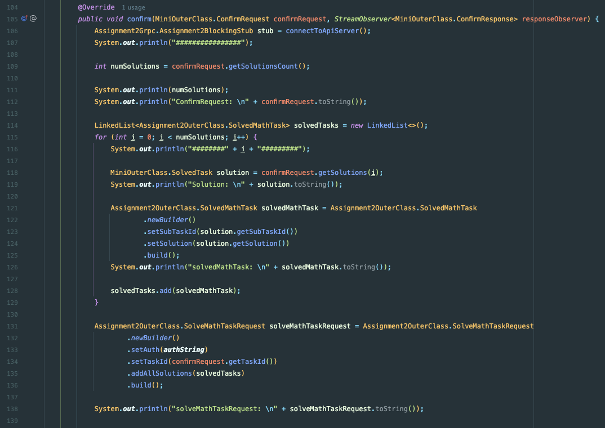
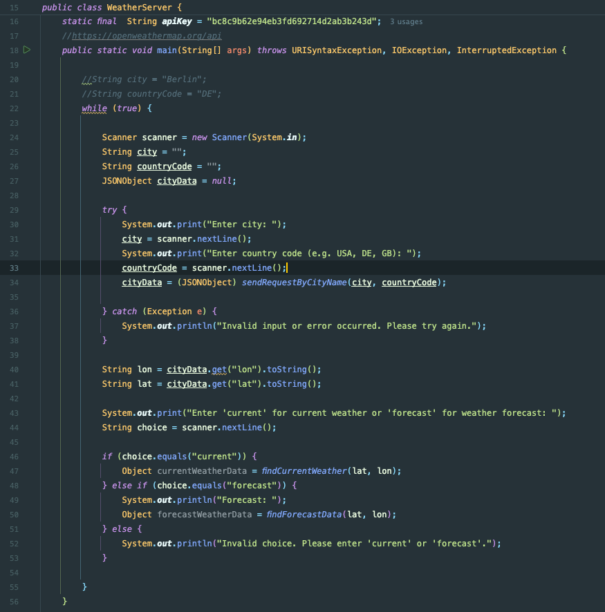

Name: Yilong Wang
Matriknummer: 0483728
Fach: Wirtschaftsingenieurwesen

# Project Structure:
```
├── Assignment2Template.iml
├── Readme.md
├── pom.xml
├── src
│   ├── main
│   │   ├── java
│   │   │   └── de
│   │   │       └── tub
│   │   │           ├── grpc
│   │   │           │   ├── MiniClient.java         <-  Aufgabe 1
│   │   │           │   ├── MiniServer.java         <-  Aufgabe 1
│   │   │           │   ├── SimpleClient.java
│   │   │           │   └── auth
│   │   │           │       └── AuthEncoder.java
│   │   │           ├── weather
│   │   │           │   └── WeatherServer.java      <-  Aufgabe 2
│   │   │           └── web
│   │   │               └── SimpleAPICall.java
│   │   ├── proto
│   │   │   ├── assignment2.proto
│   │   │   └── mini.proto                          <-  Aufgabe 1
│   │   └── resources
│   └── test
│       └── java
└── target
    ├── ,,,
    ├── ,,,
```

# Aufgabe 1
## Overall Architecture

The architecture of the project involves three main components: 
- MINI-CLIENT
- MINI-SERVER
- API SERVER. 

These components interact with each other using gRPC. The MiniClient interacts directly with the user, collecting input and displaying results. The MiniServer handles the core logic and acts as an intermediary between the MiniClient and the API Server. The API Server provides the necessary data or services.

For communication between these components, two protocol buffer files are used:

- Mini.proto is used for communication between the MiniClient and MiniServer.
- assignment2.proto is used for communication between the MiniServer and the API Server.

Below is the examples of some relevant functions call for MathTask:


## Overview of the Three Main Features
The application allows users to interact through a command-line interface, offering three main features: 
- Math Task 
- Zombie Apocalypse
- Fortune Telling

Users start by entering their name and choosing one of the options.


For Math Task Handling, they can either solve tasks manually or have them solved automatically, with solutions validated by the server. 


- In the Zombie Apocalypse Simulation, users input their strength and abilities, and the server evaluates their survival chances. 


- For Fortune Telling, users provide personal details, and the server generates a personalized fortune based on these inputs. 


## Code Implementation
### Mini.proto
The Mini.proto file used for MiniClient and MiniServer communication. 

See the source file for more details.
### Client Implementation (MiniClient.java)

#### main

-  this is the entry point of the application, handling the overall flow and user interaction. 
- it prompts the user to enter their name and establishes a connection to the server.
-  the user can choose between three options: math tasks, zombie apocalypse, and fortuneteller.
- calls the corresponding function based on the user's choice.


#### handleMathTask

- This function manages the process of fetching and solving math tasks.
- It prompts the user to solve the tasks manually or automatically.


handleMathTask has use 3 Helper Functions:
- solveTasksManually()
- solveTasksAutomatically()
- calculateSolution()


### Server Implementation (MiniServer.java)

#### main

- It initializes a gRPC server and adds service to handle incoming requests.
- starts the server and waits for it to be terminated.


#### MiniImplementation
Implements the service methods defined in the `Mini.proto` file.
- Methods:
	- connectToApiServer()
	- connecting()
	- getTask()
	- confirm()
	- zombie()
	- fortune()


- getTask()


- confirm()



- zombie()


- fortune()


# Aufgabe 2


## Overall Architecture

The project architecture involves **three** APIs to fetch and process weather data based on user input. Here is an overview of the workflow:

1. User Input Handling: The application prompts the user to input a city name and the corresponding country code.
   
2. Geolocation API: 
   - The application uses the first API to convert the city and country code into geographical coordinates (latitude and longitude).
   - This API returns the latitude and longitude of the specified location.

3. Weather Data APIs:
   - Current Weather API: The second API uses the latitude and longitude to fetch the current weather data.
   - Weather Forecast API: The third API also uses the latitude and longitude to retrieve the weather forecast.
   - ***This means that the input of the second and the third API is derived from the output of the first API***

After each call to the Current Weather API and Weather Forecast API, users must input the city name and country code again to continue querying.  ***This means the APIs can be called multiple times.***


## User Perspective Workflow

- user input a city name and the corresponding country code
- this is the current weather


- users must input the city name and country code again to continue querying.  
- ***This means the APIs can be called multiple times.***
- this is weather forecast


## Code Implementation
### main
- Prompts user for city and country code.
- Calls sendRequestByCityName() to get latitude and longitude.
- Prompts user to choose 'current' weather or 'forecast'.
- Calls findCurrentWeather() for current weather data.
- Calls findForecastData() for weather forecast data.



### Helper Functions

- sendRequestByCityName():
    - Sends an API request to get result containing latitude and longitude.


- findCurrentWeather():
    - Sends an API request using latitude and longitude to get current weather data.


-  findForecastData():
    - Sends an API request using latitude and longitude to get weather forecast data.
    - findForecastData() is very similar to findCurrentWeather(). So the code will not be shown here


