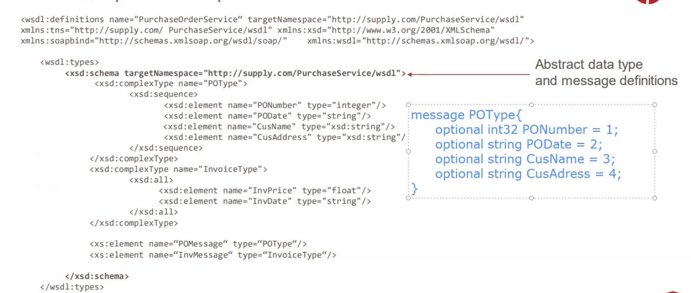
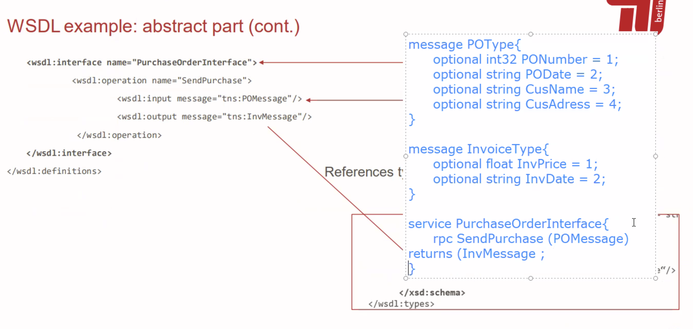

First question was writing an annotation class for given example 

Another question was, which testing would you use if you start working as developer in a company who has system that never tested. You have 1 month.

Then some fill in the blanks about testing etc.

There were diagram of n tier architecture with missing name. You need to match.
Also it was asked, if the client was thin and thick.
And another fill in the blanks aufgabe, which I find unnecessary. For me it’s like having a german exam :D

A code snippet with constructor, getter and setter. You needed to simplify with lombok.

Writing a SQL query (just 1 point)

XML Schema and xsd, like in tut aufgabe.

Dead queue and its affect on QoS.

Which communication for given cases like in tut aufgaben

Choosing which ACID property for given cases

Pub/sub without callback

For small IoT, broker or brokerless 

2 scenario where they add queue and rpc in communication , and its effects on scalability, availability etc (increase , decreased, doesnt change etc)

Microservices etc. which one is better for reusability

XPath with multiple choice. But for me it was unnecessarily complex. I’d rather write the xpaths by myself but it wasn’t the case. In total 10-12 points I guess and all correct answers were needed

From WSDL to gRPC (10-12 points)

Last question was (2.5 + 2.5 Punkte)
HTTP Verbs (GET … /movies/{id})
HTTP Errors (1xx , 2xx usw)

That’s all I remember.
Probably these were 60%-70% of the exam. Sorry for the mistakes in advance

---

Wsdl lesen und daraus rpc in protobuf schreiben

Aus einem Ausschnitt einer benutzen annotation eine annotation schreiben

Verschiedene XML Ausschnitte lesend und ankreuzen ob eine XML Instanz damit valid ist 

Theoriefrage Vorteil von Container gegenüber Virtual Machine 2P glaub ich

Befehle in (aktualisiere x,y, lösche , trage ein) in Post etc. aufschreiben

Sagen ob eine gegebene Architektur bottom up oder top down ist und warum 

Das war was ich noch im Kopf hatte. Ist nicht viel aber vielleicht können die anderen ergänzen

---

Thin Client: Thin Clients benutzen eine externe Netzwerkverbindung, womit viel Verarbeitung von Ressourcen erspart wird. 

Vor- und Nachteile von vielen Tiers:

Vorteile: 
- Wiederverwendbarkeit durch Modularität
- Skalierbarkeit, da Modularität eine lose Kupplung ermöglicht
- Wartbarkeit, da Modularität eine lose Kupplung ermöglicht, die es leichter macht, Änderungen vorzunehmen

Nachteile: 
- Komplexität, da der Aufbau mit mehr Schichten, Pfeilen und Boxen logischerweise nicht einfacher wird
- Overhead, was die Leistung negativ beeinflusst
- Höhere Latenz bzw. generell langsamere Kommunikation

jakarta ee nicht relevant

