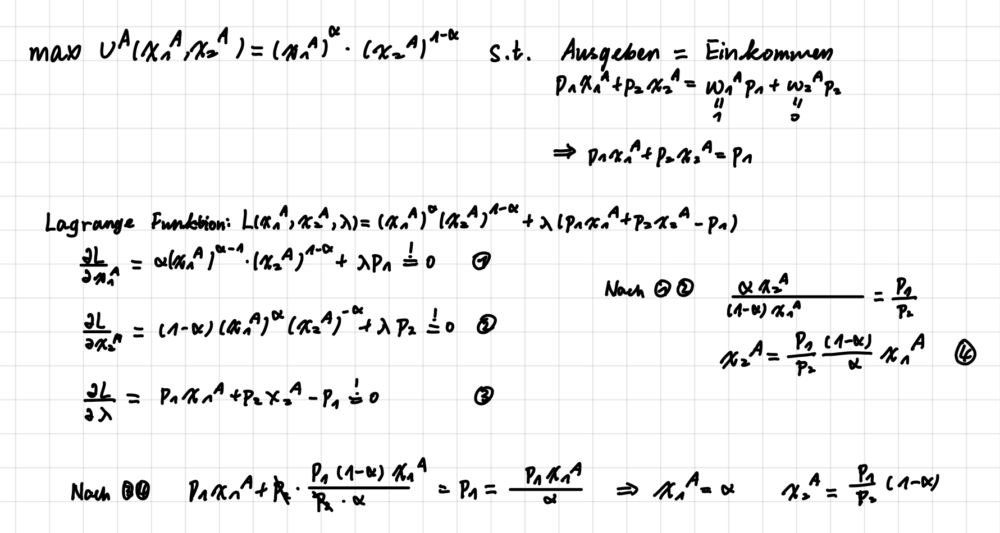
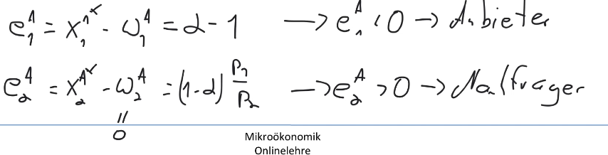

## Mikroökonomik VL12

### Konkurrenzgleichgewicht
Bestimmung des Konkurrenzgleichgewichtes für 2 Güt, 2 Konsumenten, allg. Cobb-Douglas Präferenzen
  
  
  

#### Brutto- und Nettonachfrage Haushalt A
- $x_{1}^{A*}=\alpha\qquad x_{2}^{A*}=\frac{p_{1}}{p_{2}}(1-\alpha)\qquad\rightarrow Bruttonachfrage$
- Nettonachfrage = Bruttonachfrage - Erstausstattung
- wenn Nettonachfrage > 0, Nachfrager
- wenn Nettonachfrage < 0, Anbieter

  
#### Nutzenmaximierung, Nachfrage Haushalt B
  
#### Marktraeumungsbedingung

#### Allokation im allgemeinen Gleichgewicht
  