## Produktionsökonimie - Allgemeines Gleichgewicht in einer Produktionsökonomie bei vollkommenem Wettbewerb
***Lösungsweg***
Nicht Vergessen!!
### Beispiel 1: Ein Unternehmen, zwei Konsumenten, zwei Güter
- Güter: Konsum C und Arbeit L (bzw. Freizeit R) mit Preisen p bzw. w 
- Unternehmen: 
  1. Outputgut: Konsumgut (C) 
  2. Inputgut: Arbeit (L) (bzw. Freizeit, $R=\overline{L}-L$ ) 
  3. $\overline{L}$ ist das maximal mögliche Arbeitsangebot (bzw. maximale mögliche Freizeit), z.B. 24 Stunden pro Tag 
  4. Produktionsfunktion: $C = f (L)$
- Zwei Konsumenten: A, B
    - Nutzenfunktion: $u_{i}(C, R)$,$i=A,B$
    - Anfangsausstattungen: $\omega_{i}=(\omega_{iC},\omega_{iR}=(0,\overline{L_{i}}))$
    - Unternehmensanteile: 
        - Konsument A:$0≤\theta≤1$
        - Konsument B:$1-\theta$

- Konsumenten: 
    - Nutzenfunktion: $u(C, R)$
    - Anfangsausstattungen: $\omega=(\omega_{C},\omega_{R}=(0,\overline{L_{i}}))$
    - Unternehmensanteile: 
        - Konsument : $\theta =1$

### Unternehmen: Gewinnmaximierung
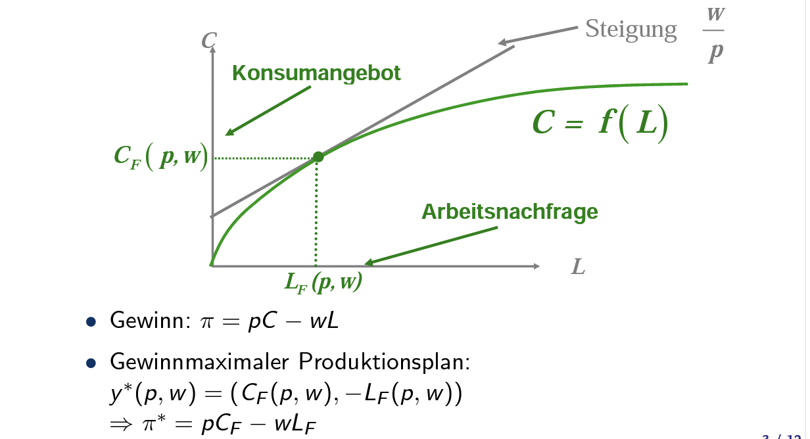  
于c轴相交点为$(0,\pi /p)$
### Konsumenten: Nutzenmaximierung
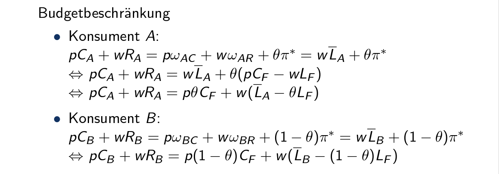  
### Gleichgewicht: Markträumungsbedingung
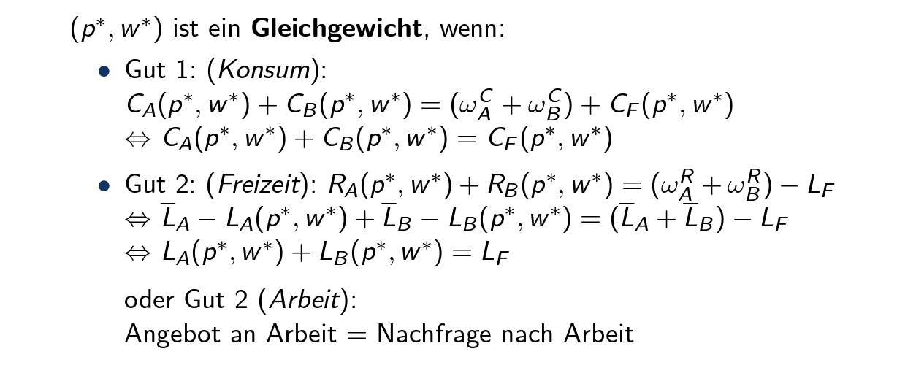  
### Edgeworthbox
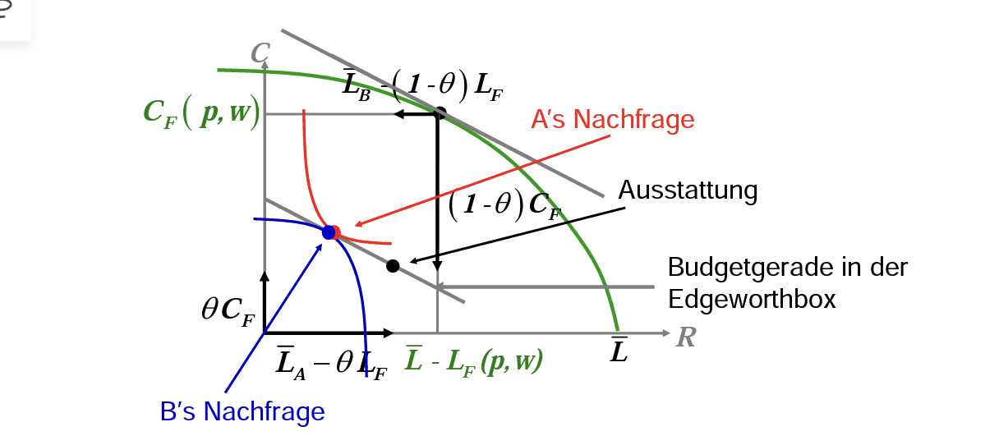  
### Gleichgewicht und Effizienz
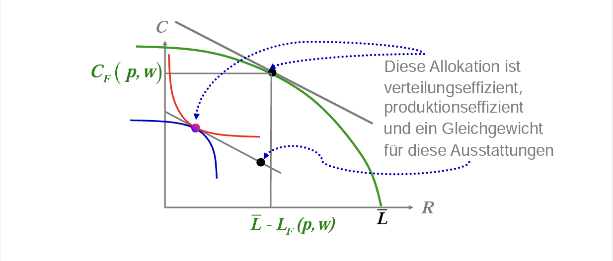  
- **Erstes Theorem der Wohlfahrtsökonomie**: Das Konkurrenzgleichgewicht ist Pareto-effizient
- **Zweites Theorem der Wohlfahrtsökonomie**: Wenn alle Präferenzen konvex sind, dann ist jede Pareto-effiziente Allokation ein Gleichgewicht für eine entsprechende Ausstattung
#### Beispiel 2: Zwei Unternehmen, zwei Konsumenten, drei Güter
sieht Video 17: Produktionsökomomie
### Allgemein: Produktionsökonomie
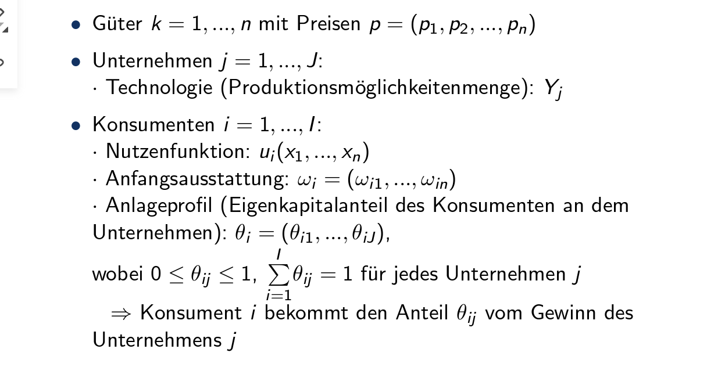  
- Ein allgemeines Gleichgewicht liegt vor, wenn die Preise genau so sind, dass die Märkte für alle Güter geräumt sind, d.h. die Summe der Nettonachfragen aller Konsumenten nach jedem Gut ist gleich der Summe des Nettoangebots an diesem Gut
#### Bestimmung des allgemeinen Gleichgewichts
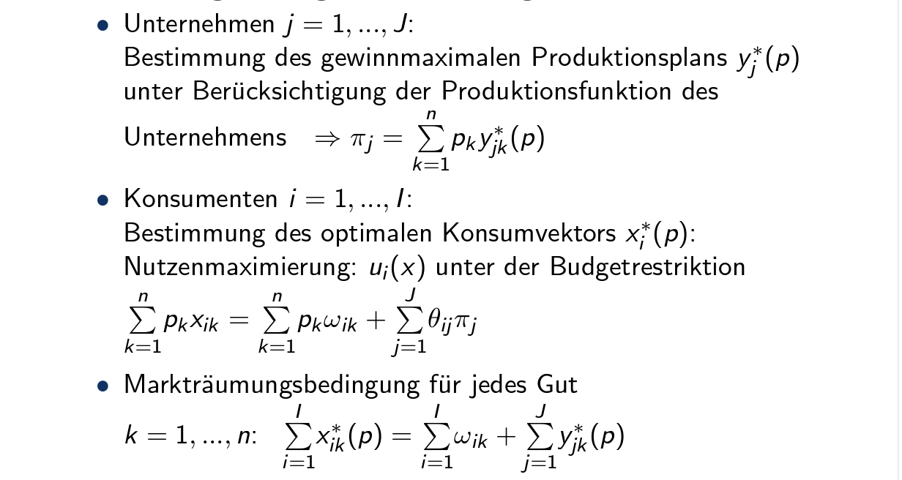  

## Produktionsökonomie_Teil 1
### Beispiel
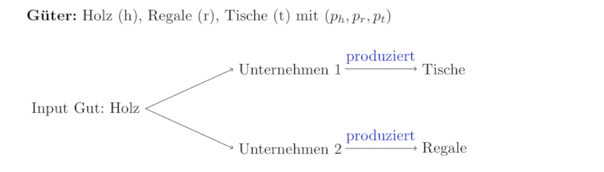  
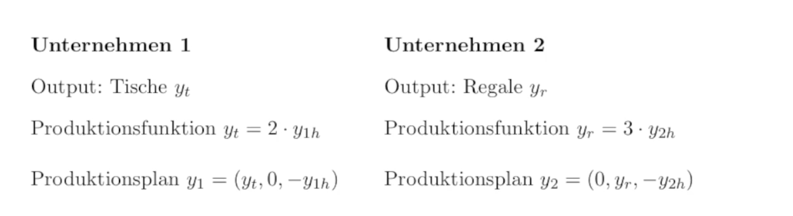 
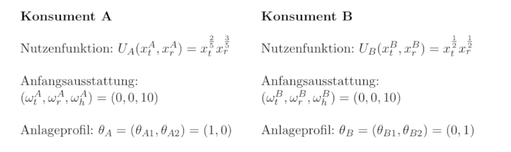  
#### Bedingung allg. Gleichgewicht
$$Nettoangebot = Nettonachfrage$$ für alle Güter
#### Unternehmen: Gewinnmaximierung

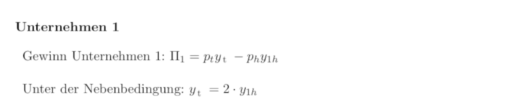  
> $\pi _{1}=p_{t}*2y_{1h}-p_{h}y_{1h}$
> $\frac{\varphi_{1}}{y_{1h}}=2p_{t}-p_{h}\doteq 0$
> $\frac{p_{h}}{p_{t}}=2$

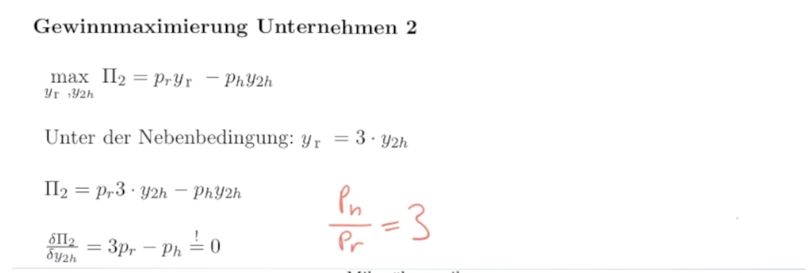  
#### Zusammenfassung Gewinnmaximierung
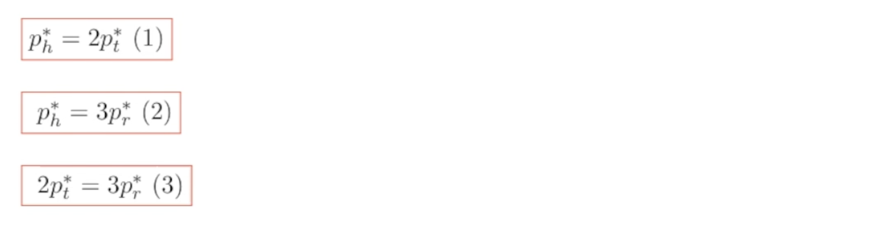  

## Produktionsökonomie_Teil 2
### Konsumenten: Nutzenmaximierung
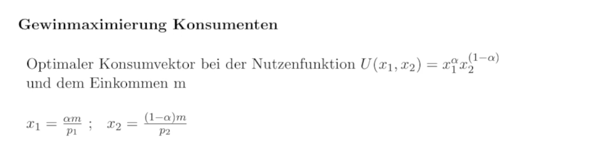  
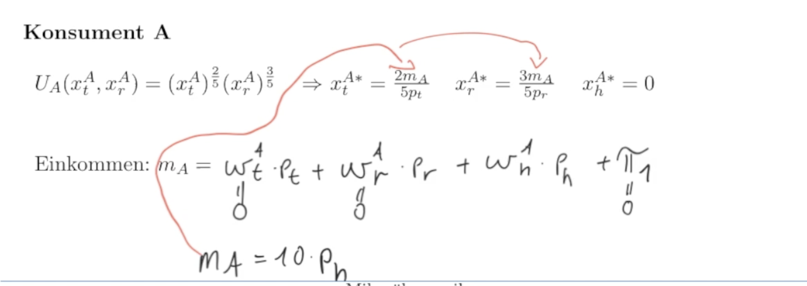 
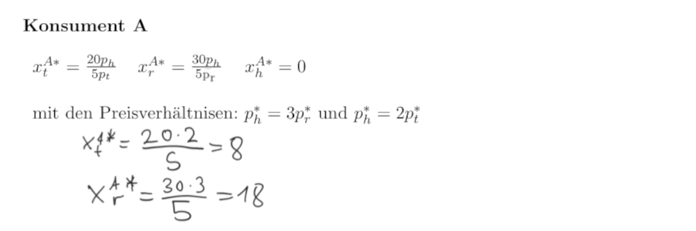   
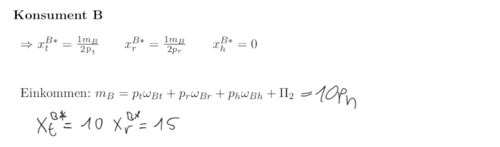  
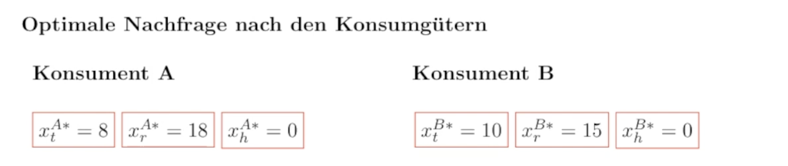  
### Markträumungsbedingung
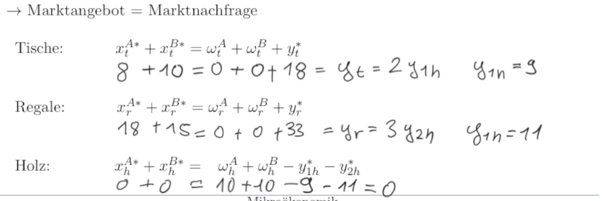  
### Allgemeined Gleichgewicht
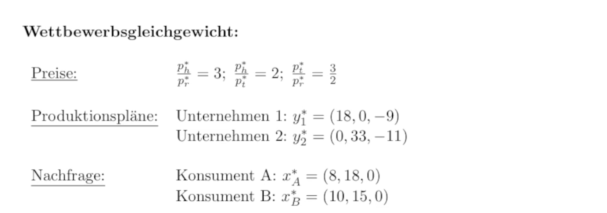  

