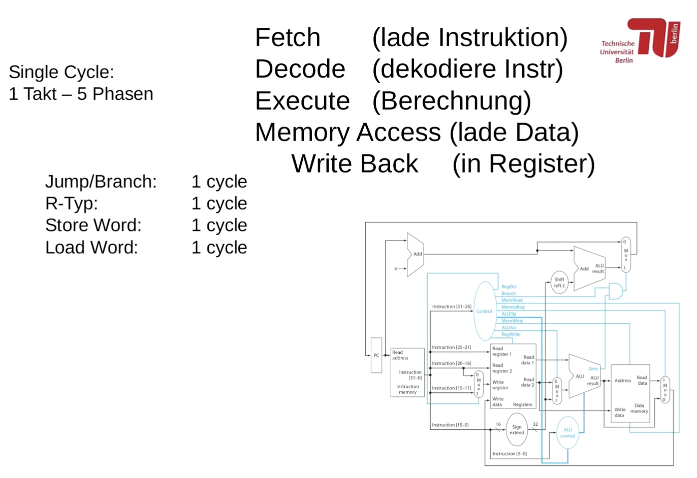
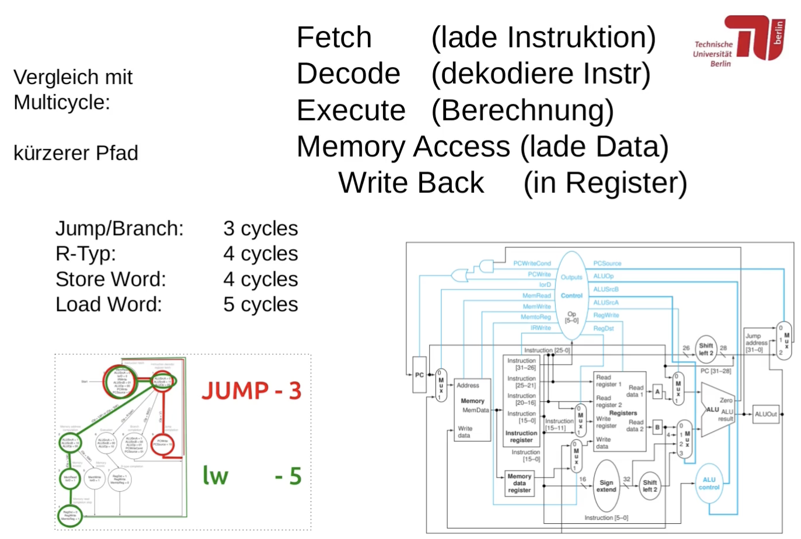
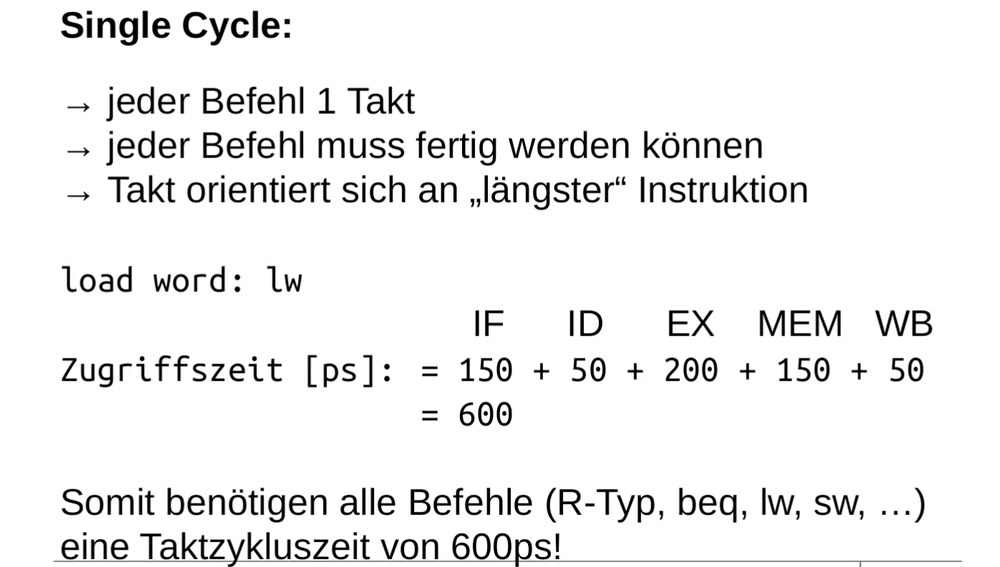
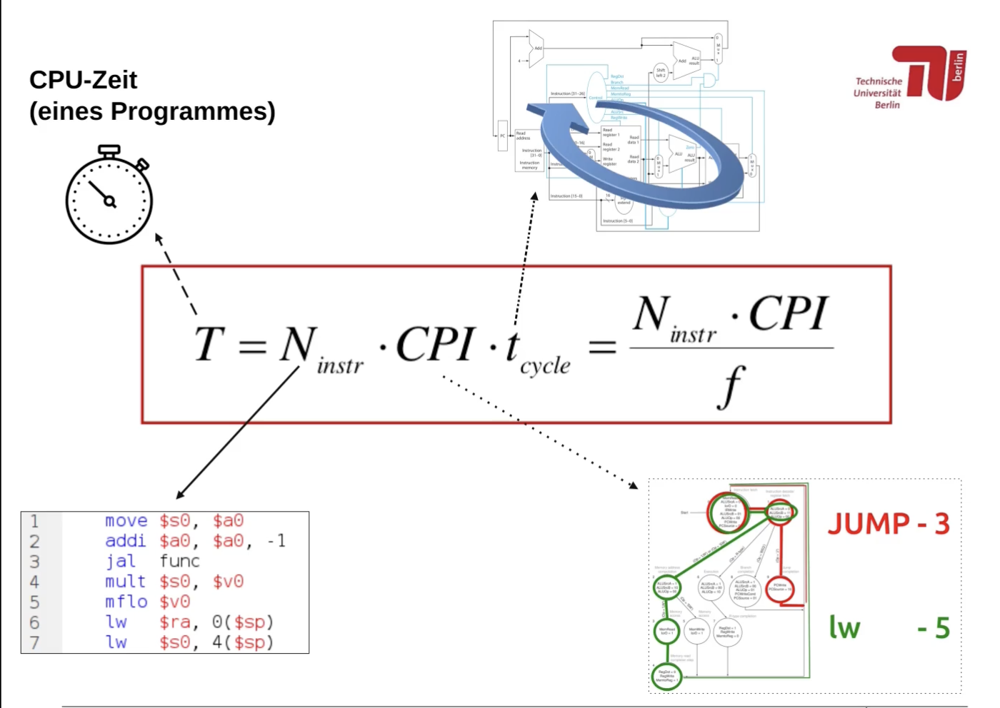
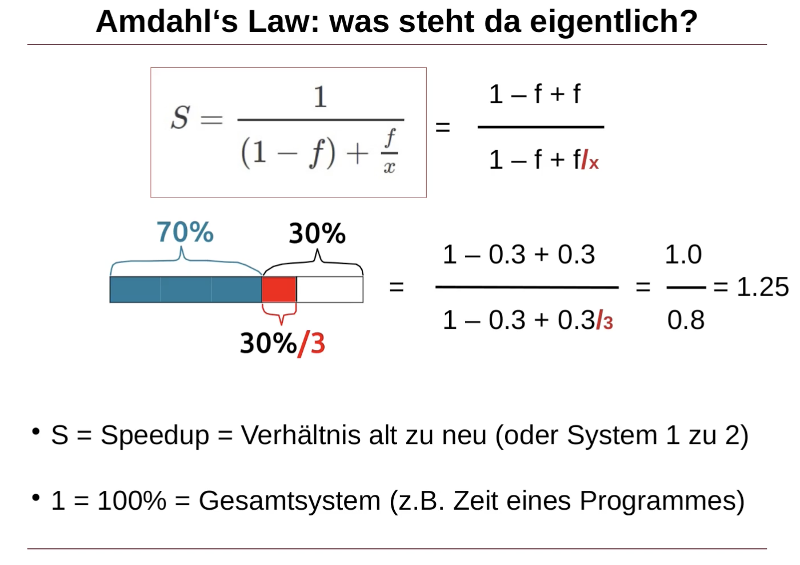
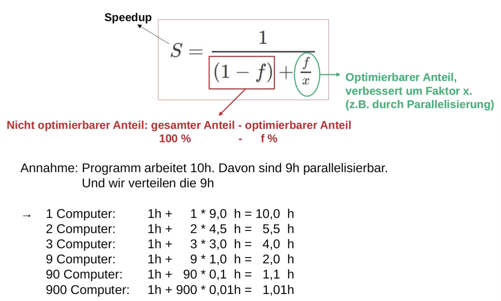
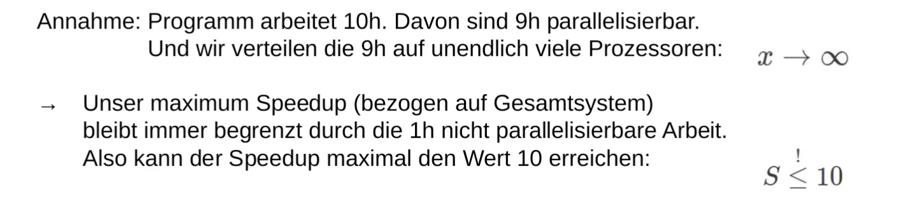

## Rechnerorganisasion TUT 09_Single_Cycle
### Zusatzvideo_09
#### Welche Phasen durchläuft ein Befehl im Eintaktprozessor?


  

#### Wie berechnet sich die Taktzykluszeit eines Eintaktprozessors?
  

#### Was besagt die CPU-Leistuungsgleichung?
  
右下图:Wie viele Takte benötigt eine Instruktion?(CPI)

#### Was besagt Amdahls Law?
  
  
  

#### Steuersignale setzen
- R-Typ-Befehl (ALUSrc = 0, RegDst = 1)
- I-Typ-Befehl (ALUSrc = 1 (meistens), RegDst = 0)
- J-Typ-Befehl (haben wir nicht im Datenpfad)
- Speicherbefehle (lw, sw)
  - MemToReg = 1, MemWrite, MemRead, RegWrite
  - Branch = 0
- Rechenbefehle (add, sub, and, or, sll, …)
  - MemToReg = 0, RegWrite = 1
  - MemRead = 0!!, MemWrite = 0, Branch = 0
- Sprungbefehle
  - Branch = 1 (bzw. Jump = 1)
  - RegWrite = 0, MemRead = 0!!, MemWrite = 0

#### Befehle im Datenpfad hinzufuegen
- Schritt 1: Befehlsverhalten definieren
- Schritt 2: Funktion als Schaltnetz entwerfen
  - Eingabe:
    - ≤ 2 Register-Werte, ≤ 1 16-Bit-Konstanten, 32-Bit-Befehl
  - Ausgabe:
    - nächste Befehlsadresse (PC)
    - Ergebniswert(e) (optional)
    -  Zieladresse (Register und/oder RAM, optional)
- Schritt 3: Schaltnetz auf bestehenden Datenpfad abbilden
  - alle nutzbaren Elemente im Datenpfad wiederverwenden
- Schritt 4: Steuersignale/Muxe hinzufügen (um Befehl zu aktivieren)


### TUT
#### Aufgabe 1

a) was beeinflusst die Veränderung des Registerinhalts in einem Befehl?

direkten Einfluss:
- RegDst: R-Typ und I-Typ-Befehle -> RT = Instruction[16 bis 20] und RD = Instruction[11 bis 15] (als Bitfelder im Befehl)
  - RegDst = 0  => RT ausgewählt (immer für I-Typ), RegDst = 1  => RD ausgewählt (immer für R-Typ)
  - R-Typ [ Opcode, RS, RT, RD, shift amount, Func ]  => RD = ...
  - I-Typ [ Opcode, RS, RT,  imm16 ]  => RT = ...
- RegWrite: Bestimmt, ob die Daten am Write-Data-Port in das Zielregister geschrieben werden sollen
- MemToReg: gibt an, von wo die Daten zum Schreiben kommen. MemToReg = 1 heißt, dass die Daten vom "Memory" kommen.

indirekten Einflus:
- MemRead: wenn = 1, kann es Daten für die Register aus dem Hauptspeicher lesen
- ALUOp: bestimmt, wie mögliche Daten zum Schreiben berechnet werden
- ALUSrc: bestimmt, wie mögliche Daten zum Schreiben berechnet werden (meistens: I-Typ => ALUSrc = 1, immer: R-Typ => ALUSrc = 0)

keinen Einfluss:
- Branch (beeinflusst nur PC)
- MemWrite: das Schreiben vom Hauptspeicher verändert die möglichen geschriebenen Registerdaten nicht

b) welche Steuersignale beeinflussen das Beschreiben des Hauptspeicher (RAM – Random Access Memory)
- MemWrite
- MemRead (es gibt eine Optimierung des Speicherzugriffs, die nennt sich Cache, und dort werden Lesezugriffe gemerkt. Dieser Cache verändert sich, wenn man liest, was zwar keine funktionale aber einen Performance-Unterschied macht. Zusätzlich kann man beim Lesen auf bestimmte Speicheraddressen Register von Hardware außerhalb des Prozessors verändern, weil diese so funktioniert. Deshalb sollte führt das Lesen zu einer Zustandsänderung des Computers bzw. des Speichers.)

Andere Steuersignale nicht, denn diese beschreiben nur Veränderungen in den Prozessorregistern.


#### Aufgabe 2

a) welche Steuersignale dürfen niemals (bei keinem Befehl) einen nicht-definierten (beliebigen) Wert annehmen?
- Branch:
  - weil Branch das Überschreiben des Programm-Counters direkt beeinflusst und der nächste Wert des PCs für jeden Befehl fest definiert ist
- RegWrite, MemWrite:
  - es ist für jeden fest definiert, ob und welche Register wir schreiben und welche Speicheradresse
- MemRead:
  - nur = 1, wenn wir wirklich lesen wollen
  - weil: das Lesen von Hauptspeicher beeinflusst den Cache (eine Hardware-Optimierung), die sich Lesezugriffe merkt, um diese zu beschleunigen

b) welche Steuersignale sind egal, wenn RegWrite = 0?
- in dem Fall: Write-Data und Write-Register-Ports (vom Register File) sind dann egal, sodass
  - RegDst beliebig sein kann
  - MemToReg beliebig sein kann
- NICHT EGAL! ist
  - ALUSrc
  - ALUOp
  - weil ist möglich, dass wir einen Schreibbefehl ausführen (sw, sb)
    - in dem Fall nutzen wird die ALU, um die Speicheradresse zu berechnen

c) welche Funktionalität (oder welcher Befehl) passiert (wohl), wenn RegWrite = 1, MemRead = 1, MemToReg = 1 ist?
- MemRead = 1 liest Daten aus dem Speicher,
- MemToReg = 1 leitet gelesene Daten aus Hauptspeicher zu Register-File (Registersatz) weiter
- anliegende Daten am Register-File werden mit RegWrite = 1 in ein Register geschrieben

naheliegender Befehl: load word (lw)
Berechnung der Speicheradresse nicht vorgegeben (könnte beliebig sein)


#### Aufgabe 3

ADDI:
- RegDst: wegen I-Typ wollen wir nach RT schreiben, das machen wir mit RegDst = 0
- Branch = 0, da wir nach dem Befehl den nachfolgenden Befehl ausführen
- MemRead = 0, da wir nur ein Registerwert berechnen wollen, keine Speicherveränderung
- MemToReg = 0, damit wir das ALU-Ergebnis an das Register weiterleiten können
- ALUOp = 00; die linke 0 sagt, dass es keinen Func-Code gibt und das rechte Bit bestimmt, ob Addition (= 0) oder Subtraktion (= 1) ist
- MemWrite = 0, weil wir den Hauptspeicher nicht verändern wollen
- ALUSrc = 1, da wir einen I-Typ-Befehl haben und mit der Immediate rechnen wollen
- RegWrite = 1, damit wir unser Additionsergebnis in das Register reinschreiben können


#### Aufgabe 4

a) BGTZ zum Datenpfad hinzufügen.

Schritt 1: Verhalten definieren.
  BGTZ   $rs,  Label   (Label = PC + 4 + imm*4 )
  PC = PC + 4 + ( RS > 0 ? immediate * 4 : 0)    // a ? b : c  ===  if a then b else c

Schritt 2:
  - Eingabe: PC, RS, imm = (Label - 4)/4  => RT = $0 (weil nicht angegeben)
  - Ausgabe: PC
 
  Schaltnetz:
    PC = PC + 4 + X  -> 2-mal Addition
    X = ( RS > 0 ? immediate * 4 : 0)

    PC = ( RS > 0 ? PC + 4 + immediate * 4 : PC + 4 )  => nur noch 2 Additionen

  Nebenbemerkung: $rs > 0  <==>  $rs[31] = 0 (d.h. $rs ≥ 0)  und  $rs ≠ 0

```
  PC ---+---+
        | + |--+-----------------+---+
  4 ----+---+  |                 |MUX|----- PC
               |              +--+---+
               |              |    |
               +------+---+   |    |
                      | + |---+    |
  imm --- (<< 2) -----+---+        |
                                   |
  $rs[31] -----------------o+---+  |
                            | & |--+
  $rs --------(NOR32)------o+---+
```

Schritt 3: Schaltung in Datenpfad einfügen und möglichst viele Komponenten wiederverwenden
  - Zero-Signal gibt an, ob das ALU-Ergebnis = 0 ist! NOR32 kann durch zero-Signal ersetzt werden.
  - Addierer und Multiplexer sind schon vorhanden, Befehle und Operanden (Register) laden ist auch vollständig vorhanden.
  => $rs[31] können wir durch das oberste Bit des ALU-Ergebnisses (oder des oberen ALU-Eingangs) erhalten

  - Zusätzlich brauchen wir ein OR-Gatter zwischen dem AND und dem Multiplexer, um die Möglichkeit für andere Branch-Befehle offen zu halten.

Schritt 4: ein Steuersignal (und gegebenenfalls ein zusätzlicher Multiplexer) hinzufügen, um unseren Befehl zu de-/aktiveren

  - `bgtz`-Steuersignal ausgehend von der Control Unit bis zu dem neu eingefügten AND-Gatter einzeichnen. Dieses schaltet das UND-Gatter an/aus und damit auch den Befehl.

b) Steuersignale setzen, um den Befehl auszuführen.
- neues Steuersignal: BGTZ muss = 1 sein
- Branch = 0, das ist zwingend notwendig, den Branch = 1 bedeutet, dass BEQ ausgeführt wird.
- RegWrite = 0  =>  RegDst = X, MemToReg = X
- MemRead = MemWrite = 0
- Rechenoperation auswählen (Addition)
  - ALUOp = 00
  - ALUSrc = 0!! obwohl I-Typ-Befehl (weil wir die Immediate nicht für ALU sondern PC-Berechnung nutzen)
    - das können wir machen, weil $rt = $0 ist