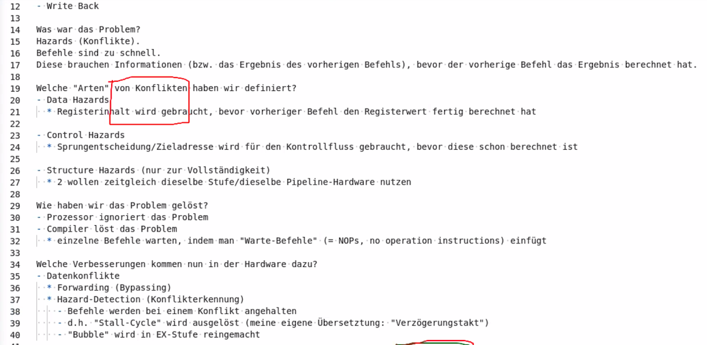
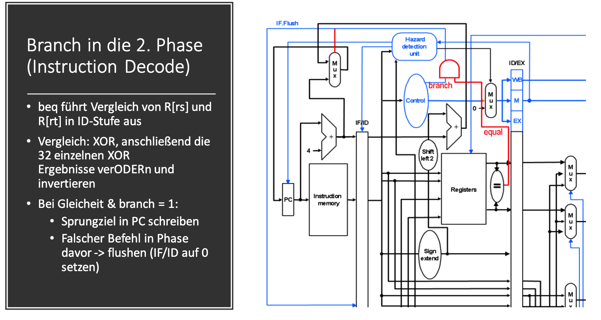
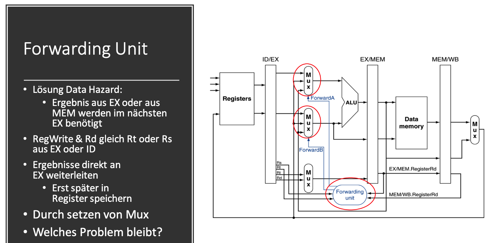
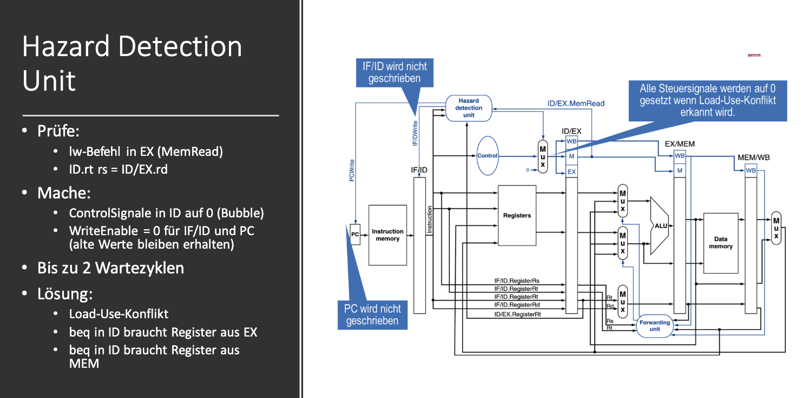

# Rechnerorganisasion TUT 11 
## Pipelining - 1 Teil
## Zusatzvideos
**was ist ein nop-Befehl**
- No Operation
- Befehl der nichts ausführt(keinen Zustand verändert)
- gewöhnlich Befehl dessen 32 Bit auf 0 gesetzt sind
- in MIPS: sll $zero, \$zero, 0
**Auflösung von Datenkonflikten in Pipelined-Prozessoren:**
- nop-Befehle
  - simpleres Design(weniger Baauteile/kostengünstig)
  - Compiler/Programmierer muss manuell nop's einfügen
- alternativ: Hardware-Forwarding

## Was macht der Pipeline-Prozessor anders als der Eintakt-Prozessor

- ursprüngliches Proplem bei Eintaktprozessor: Abschnitten im Eintaktprozessor werden nicht vollständig ausgenutzt.
- Idee: wir fangen an, Befehle auszuführen, bevor der vorherige Befehl fertig ist.

  * damit die Datenpfad-Abschnitte mehr genutzt werden (mehr Arbeit ausführen)
  * sobald der Befehl zu den Registern geht, wird schon ein neuer Befehl aus dem Speicher geladen
- wir haben 5 Abschnitte: Instruction Fetch, Instruction Decode, Execute, Memory (Read/Write), Write Back

  - sobald ein Befehl in Instruction Decode ist, wird der nächste Befehl angefangen

## Unterschied zwischen dem Pipeline-Prozessor und Eintakt-Prozessor

1. manche Bestandteile aus dem Eintaktprozessor wurden "bewegt" an andere Stelle
2. es gibt solche "Balken" (zusätzlichen Rechtecke) = Pipeline-Register

## Wozu sind diese neuen "Balken" (Pipeline-Register) überhaupt da?

- diese trennen die verschiedenen Stufen
- aber warum brauchen wir diese Register wirklich?

  - weil wir jede Stufe in der gleichen Zeit ausführen wollen
  - wir wissen aus letzter Woche: die Stufen sind unterschiedlich schnell
    (z.B. Instruction Fetch = Speicherzugriff 150ps, Register-Lesen = 50 ps, ALU = 100ps)
  - wir wollen nicht, dass eine frühere Stufe die nächste vorzeitig unterbricht

  => die Pipeline-Register halten die Eingangsdaten (für eine Stufe) und warten, bis der nächste Takt anfängt (Synchronisation)

## Aufgabe 1: Toll! Aber, gibt es da nicht ein Problem??

- Datenkonflikte (Data Hazard)

  - Register-Werte fehlen, wenn diese gebraucht werden
  - wenn ein Befehl das Ergebnis von dem vorherigen Befehl braucht, dann ist der vorherige Befehl noch nicht fertig!!
    Die Daten des vorherigen Befehls sind nicht da
    Die gelesen Register vom nächsten Befehl (weiter links in der Pipeline) sind noch nicht upgedatet, also falsch
  - wir können das richtige Ergebnis erst aus dem Register laden, **während** das Ergebnis geschrieben wird
    warum?

    - Idee: wir können den Takt in zwei Hälften unterteilen
    - erste Hälfte: schreibe das Ergebnis in Register in Write Back
    - zweite Hälfte: Register werden gelesen in Instruction Decode
  - wie kann machen, damit Data Hazards weniger Zeit verschwenden?

    - Forwarding Unit + Hazard Detection (Ergebnis wird weitergereicht, sobald das Ergebnis berechnet wurde, also schon vor Write-Back)
- Steuerkonflikte (Control Hazard)

  - die Sprungentscheidung, Sprungadresse fehlt, wenn wir diese bereits brauchen
  - der Kontrollfluss (also die Befehlsausführung) ist verzögert (ist noch nicht entschieden)
  - wir können Befehle ausführen, die eigentlich nicht ausgeführt werden sollen
  - wie schneller machen?

    - "Branch Prediction" (siehe unten)
      - wenn wir häufig richtig raten, sind wir schneller
    - Sprungentscheidung viel früher berechnen (z.B. in Instruction-Decode, dafür Extra-Hardware nötig)
- Strukturelle Konflikte (Structural Hazard) (nennen wir nur wegen der Vollständigkeit)

  - wenn zwei Befehle dieselbe Pipeline-Stufe gleichzeitig nutzen wollen
  - z.B. wenn es zwei Pipelines gibt (2K-Zahlen und Floating-Point-Zahlen) und diese zusammenlaufen (zusammengeführt werden)
    - Advanced Computer Architectures
  - kommen bei uns nicht vor
- wie verhindern (entschärfen) wir die Hazards?

  - "Stall Cycles" (Takte wo angehalten wird), "der Prozessor hält die vordere Pipeline an (Instruction Fetch und Instruction Decode)
  - wir ignorieren das Problem, Compiler soll das Problem lösen
    - Compiler fügt "Wartebefehle" ein, "NOP"s = No operation
    - Delay Slot (= Takte die gewartet werden müssen, bis das richtige Ergebnis da ist) = Latenz ("Bearbeitungszeit")
      - wir können auch andere Befehle statt NOPs nutzen, die fehlende Ergebnis nicht brauchen
  - "Flushing" ("herunterspülen")
    - die Pipeline bis zu Instruction Decode wird geleert (d.h. das wir die Befehle später nochmal laden)
  - für Control Hazards: wir können raten (Spekulation, "Branch Prediction"), welche Sprungentscheidung genommen wird
    - wenn wir falsch raten, dann werden wir bestraft, indem wir alle falsch ausgeführten Befehle rückgängig machen müssen ("Flushing" + andere Sachen)
    - wenn wir richtig raten, dann sind wir richtig schnell 😀

## Aufgabe 2:

a)

- ohne Optimierung:
  - wenn ein Register-Ergebnis berechnet wird, dann ist das Ergebnis die nächsten zwei Takte nicht verfügbar
  - siehe Bild

```
0    addi  *$t0* ,$a0 ,4
1    addi  *$t1* ,$a1 ,4
2    sub  $t2 ,*$t0* ,*$t1*
3    sll  *$t3* ,$a2 ,2
4    add  *$t4* ,$t0 ,*$t3*
5    add  $t5 ,$t1 ,*$t3*
6    sw  $t2 ,0( *$t4* )
```

b)

- keine Reihenfolge ändern, nur Wartebefehle (NOPs) einfügen


```
0    addi  $t0 ,$a0 ,4

1    addi  $t1 ,$a1 ,4

1.2  nop
1.3  nop

2    sub  $t2 , $t0 , $t1

3    sll  $t3 ,$a2 ,2

3.1  nop
3.2  nop

4    add  $t4 ,$t0 , $t3

5    add  $t5 ,$t1 , $t3

5.1  nop

6    sw  $t2 ,0( $t4 )
```

c)

- noch besser machen: jetzt so wenig wie möglich NOPs brauchen, Befehle umordnen
- wie vorgehen ? wir gucken, welche Befehle brauchen das Ergebnis von welchen anderen Befehlen? => grafisch aufzeichnen
  - List Scheduling (siehe Internet? → Compiler Design Kurs. Statt "Aufträge" "Maschinen" zuzuweisen, weisen wir der Pipeline neue Befehle zu)

## Aufgabe 3 – Geschwindigkeitsvergleich zwischen Pipelineprozessor und Eintaktprozessor

a)

- Speicherzugriff = 200ps, ALU-Operation = 100ps, Registerzugriff = 50ps
- Benchmark (Programm, um die Ausführungszeit zu messen)
  - Annahmen: gleiche Anzahl an Befehle für beide Prozessoren
  - Jeder Prozessor hat eine (eigene) konstante Taktzeit, T_SC = Taktdauer des Eintaktprozessor (Single Cycle), T_PP = Taktdauer für Pipeline-Prozessor
  - es gibt keine Data Hazards mehr (wurden entfernt durch Umordnung)
  - es gibt aber alle Control-Hazards noch!  -> jeder Sprungbefehl dauert 4 Takte! Der Prozessor hält bei Sprungbefehlen einfach an!

  - Speicherbefehle -> 12%  (1 Takt pro Speicherbefehl weil keine Datenkonflikte Data Hazards)
  - ALU-Befehle -> 72%   (1 Takt pro Speicherbefehl weil keine Datenkonflikte)
  - Sprung-Befehle -> 16%   (4 Takte pro Sprungbefehl, wegen den Steuerkonflikten Control Hazards)
  - wozu die Informationen? Damit wir die Schnelligkeit des Pipeline-Prozessors berechnen können. Eintaktprozessor führt jeden Befehl gleichschnell aus

  - unbekannte Anzahl N an Befehlen
  - Pipeline ist zu Beginn der Benchmark gefüllt

- Speedup berechnen, S = Vergleichszeit t_SC / (betrachtete Zeit) t_PP  -> wie viel Faktor schneller ist der betrachtete Prozessor
- t_SC = Ausführungszeit Eintaktprozessor   = (Anzahl an Takte) · (Taktdauer) = (N · CPI_SC) · T_SC
- t_PP = Ausführungszeit Pipelineprozessor  = (Anzahl an Takte) · (Taktdauer) = (N · CPI_PP) · T_PP
- CPI = Befehlsdauer in Takten = wie lange braucht ein Befehl an Takten zur Ausführung
  - CPI_SC = 1 da jeder Befehl einen Takt braucht
  - CPI_PP = jeder Befehl braucht unterschiedlich viele Takte (hängt ab von den Hazards)
    - gewichteter Mittelwert: 12% * 1 + 72% * 1 + 16% * 4  = 1.48
- T = Taktdauer, wie viel Sekunden braucht ein Takt
  - T_SC = 600ps = 2·200ps + 100ps + 2·50ps  (2-mal Speicherzugriff, 2-mal Registerzugriff, 1-mal ALU)
  - T_PP = maximale Dauer einer Stufe = 200ps (wir brauchen eine Taktdauer in der jede Stufe ausgeführt wird)

- S = (N · CPI_SC) · T_SC / ((N · CPI_PP) · T_PP)  = 600ps / (1.48 * 200ps) = 2,027027027… = 2 + 27/999

b) wie können wir den Pipeline-Prozessor schneller machen? siehe Aufgabe 1

c) Was ist, wenn wir nur die ALU schneller machen, um 25% ?

ALU-Operation braucht nur 75ps

-> T_SC = 2·200ps + 75ps + 2·50ps = 575ps

T_PP ändert sich nicht!! Immernoch die gleichen Hazards, und Speicherbefehle dauern immernoch 200ps

=> der Speedup wird schlechter, weil der Pipeline-Prozessor nicht profitiert

=> Pipeline wird nur schneller, wenn man die am längsten dauernde Stufe optimiert.
## Pipelining - 2 Teil
  


**Aufgabe 3**

a) Verbesserung ist, dass man die EX und MEM-Stufe zusammenlegen kann. Die Pipeline wird kürzer. Load-Use-Konflikte sind einen Takt schneller (0 statt 1 Takte Verzögerung).

b)

Verbesserungen gibt es, wenn Speicherfefehle keinen Offset brauchen

das ist der Fall bei Array-Zugriffen in Schleifen oder Integer-Pointer

alle anderen Zugriffe brauchen einen Offset

wenn man einen konstanten Offset braucht, wird man verlangsamt

der Offset muss in Extra-Befehl berechnet werden

der zusätzliche Befehl wird nur durch kürzere Load-Use-Hazards kompensiert

verbraucht ein Register (erhöht den Registerdruck), sowie zusätzlichen Platz im Befehlsspeicher (Cache-Verschmutzung)

in Praxis brauchen wahrscheinlich mehr Befehle einen konstanten Offset als keinen

alle struct-, Objekt-Zugriffe brauchen einen; häufiger Spezialfall: Stack-Frames

häufig in Praxis, vor allem Stack Frames, da es viel mehr innere Funktionsaufrufe mit Stack als Blatt-Funktionsaufrufe ohne Stack gibt.

  
  
  