## Rechnerorganisasion TUT 12_Cache
### Zusatz_video_12
#### V12.1 Cache-Eigenschaften
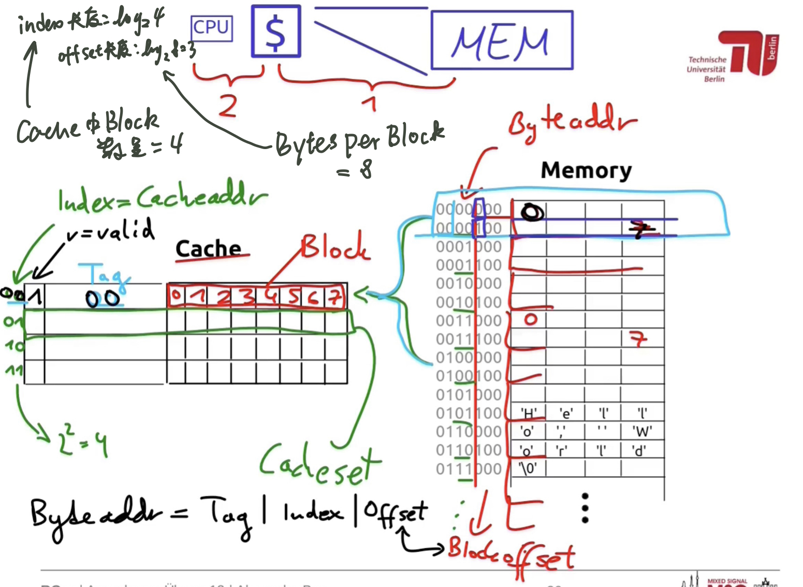
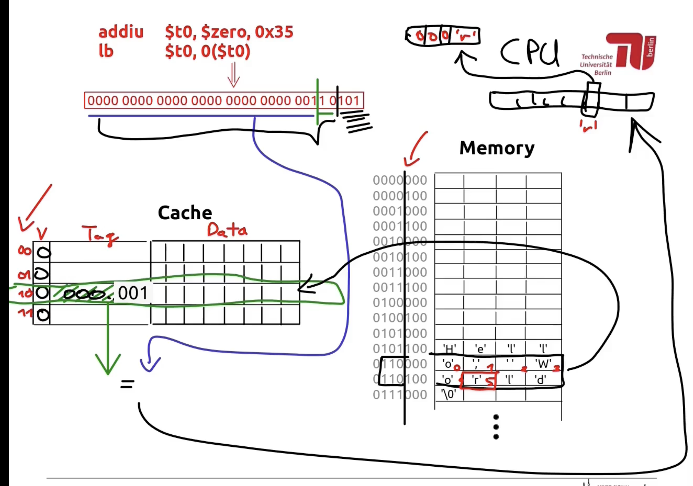  
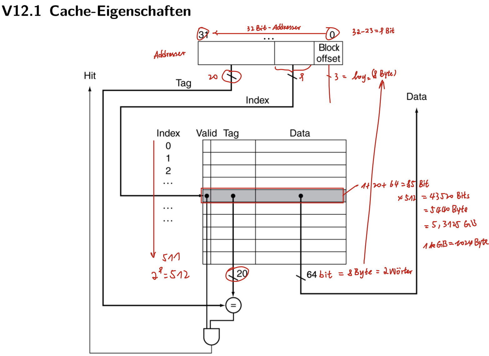
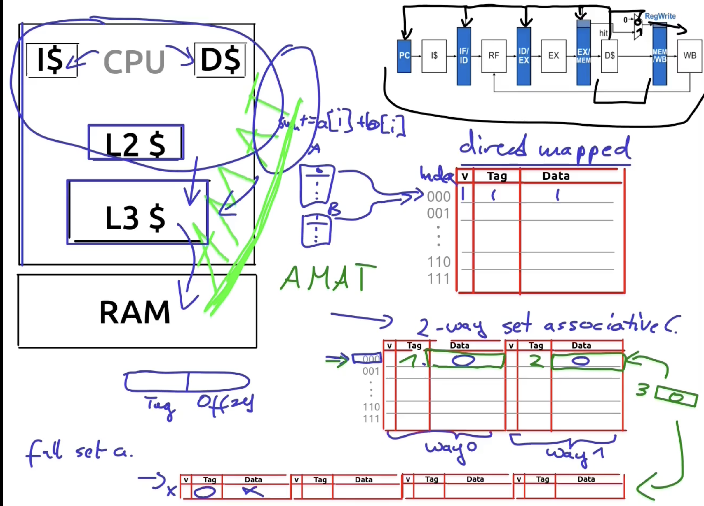  
ps 本图主要看ppt
#### V12.2 Tauschverfahren
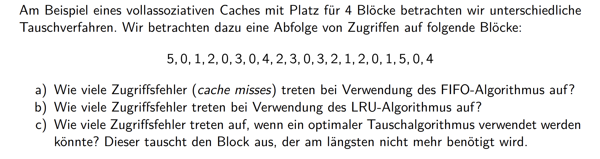  
##### a. Wie viele Zugriffsfehler (cache misses) treten bei Verwendung des FIFO-Algorithmus auf?
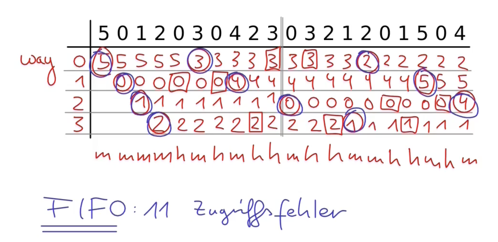  
**先进先出的算法（FIFO）**：选择在内存中驻留时间最久的页面予以替换。
##### b. Wie viele Zugriffsfehler treten bei Verwendung des LRU-Algorithmus auf?
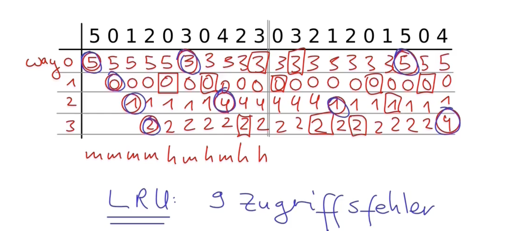  
**最近最久未使用算法（LRU）**：选择过去最长时间未被访问的页面予以替换。
##### c. Wie viele Zugriffsfehler treten auf, wenn ein optimaler Tauschalgorithmus verwendet werden könnte? Dieser tauscht den Block aus, der am längsten nicht mehr benötigt wird.
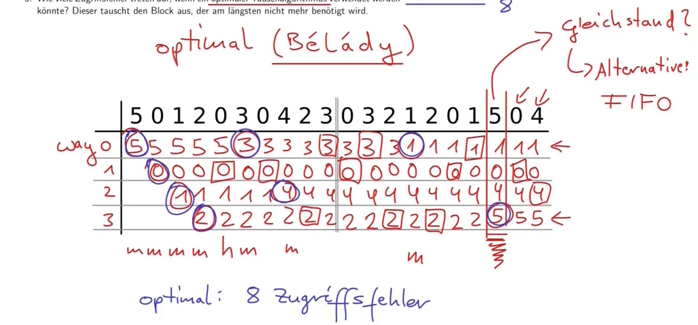  

**最佳淘汰算法（OPT）**：选择永不使用或在未来最长时间内不再被访问的页面予以替换。
在tag=4时出现miss的情况:
- way 0: 3在未来出现了2次
- way 1: 0在未来出现了3次
- way 2: 1在未来出现了2次
- way 3: 2在未来出现了2次

替换way2的理由：因为way 0，2，3的值在未来出现的次数相等，根据fifo,way 2最久没有被访问

## Tutorium
TU CLOUD: bit.lz/ROrgTUT

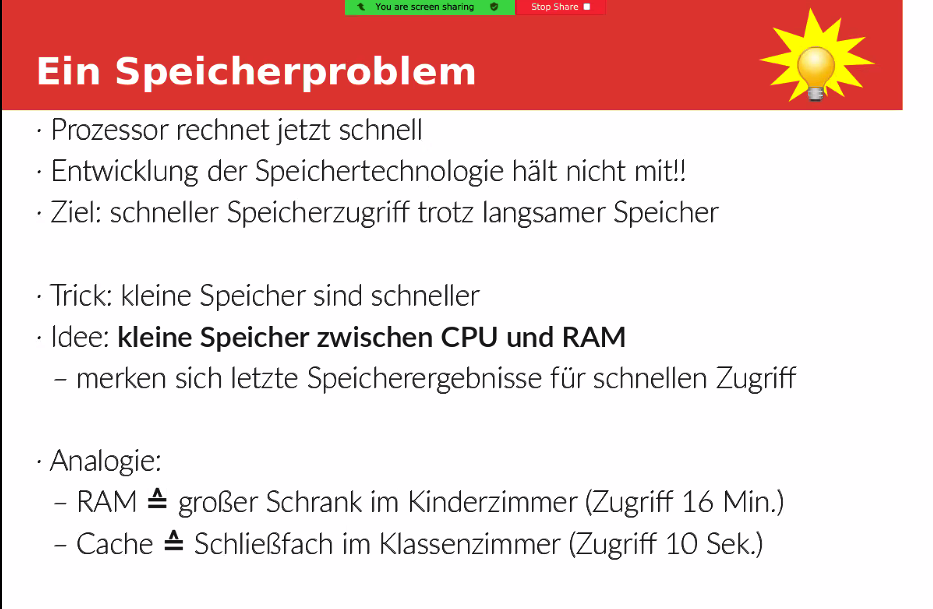  
### Herleitung des Konzepts
- Problem1
  - wie findet die Seite("Cache-Block")ins Archiv zurueck?
  - "Tag": merkt sich Herkunftsort("Blockadress")einer Seite
- Problem 2
  - Wo legen wir die Seite in die Ablage("Cache"
  )?
  - z.B beliebige Stelle, wo nach Platz ist("vollassoziativ")
- Problem 3
  - Sortierung der Seiten in Ablage?(um Seiten schneller zu finden)
  - "Cache-Sets": Faecher fuer Seiten mit gleichen "Anfangsbuchstaben"
- Problem 4
  - was machen, wenn die Ablage voll ist?
  - "Ersetzungsstragie": alte Seite ausstauchen und zurueckbringen

### Cache-Zugriff

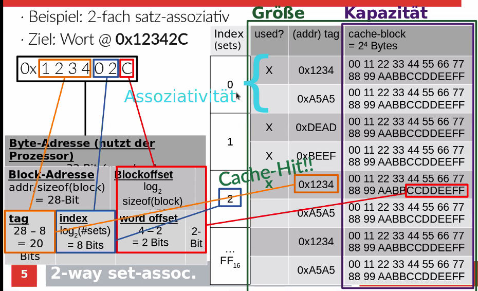  

### Aufgabe1
cache-Typen:
- vollassoziati("fully associative"):
  - 1.Satz ("Stapel"),wo alle Cache-Block
- direkt abgebildet("Direct Mapped"):
  - assoziativitaet = 1. jeder Satz enthaelt maximal einen Cache-Block
- n-fach satz assoziativ:
  - Assoziativtaet = n

### Aufgabe 2
- direkt abgebildet -> Assoziativitaet = 1
- Kapazitaet = 8 KiB = 8 * 1024 Bytes = 2^13 Bytes (und nicht 8000 Byte!!)
- Cacheblock-Groesse = 2^5 Bytes

32, 8192, 48, 8208, 32, 8224, 48, 8240, 32, 8256
Simulation: • Index, • Tag 

**Wie viele Bits hat der Blockoffset? (die Adresse innerhalb des Blocks)**
- $log_{2}(sizeof(Cacheblock)) = log_{2}(2^5) =5 Bits$:

**Wie viele Bits hat der Index?**
- Zuerst: wie viele Sätze gibt es im Cache?
- Satzgröße = (Cacheblock-Größe • Assoziativität) = 2^5 Bytes
- $(Kapazität / Satzgröße) = 2^{13} / 2^{5}=2^{13 - 5}=2^8=256$
- $log_{2} (Anzahl An Sätzen) Bit = log_{2} (2^8) Bit = 8 Bit$

**wie viele Bits hat der Tag?**
- Das wissen wir nicht, müssen wir nicht wissen (sagen wir, es sind genug Bits;-).)
- Lustig: wir haben keine vorgegebene Größe für die Adresse des Prozessor.)

Blockadresse = (Adresse / Cacheblockgröße)
Blockadresse = (Adresse >>(blockoffset Bits))

Index = Blockadresse %  (2^(Index Bits))
Index = • Blockadresse & (größten Index) 

größter Index = 2^(index bits) - 1 = 2^8 - 1 = FF16 
Tag = Blockadresse / 2^(Index Bits) 
Tag = Blockadresse >> (Index • Bits) 
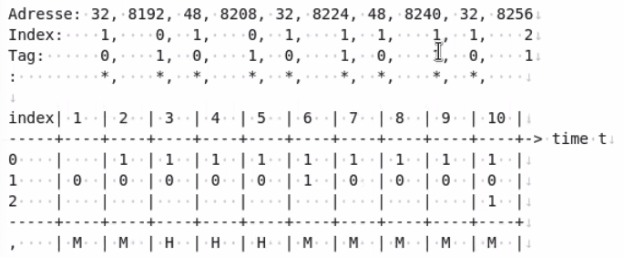  

### Aufgabe 3
- 2-fach•satz-assoziativ - Assoziativität=2
- Kapazität = 8KiB = 8 • 1024 Bytes = 2^13 Bytes
- Cacheblockgröße = 8 Wörter = 8•4 Bytes = 2^5 Bytes
- Byteaddressengröße = 40 Bits
- Prozessor schickt Byteadresse (1 Byte = 2 Nybble = Hexadezimalziffer):
a) 
**Wie größ ist der Index?**
- Satzgröße = Blockgröße * Assoziativität = 2^5 • 2^1 Bytes = 2^6 Bytes 
- Anzahn an Sätze = Kapazität / Satzgröße = 2^13 / 2^6 • Bytes = 2^7 Bytes:
- Indexgröße = log2 ( Anzahl an Sätze ) = 7 Bit
**Wie groß ist der Tag?**
- Blockoffsetgröße = log2 ( Blockgröße)Bits = log2 (2^5)Bits = 5 Bits
- Adressgröße - Indexgröße - Blockoffsetgröße = 40 - 7 - 5 = 28  Bits
b) 
Adresse = [tag = 28 Bits, index = 7 Bits, blockoffset = 5 Bits ]
Adresse = 55236
Blockadresse = (Adresse / Blockgröße)
Index = Blockadresse % 2^7 = 62

### Aufgabe 4
AMAT  = Average Memory Access Time (durchschnittliche Zugriffszeit)
Es gibt jetzt verschiedene Fälle (verschiedene Fälle).
1. Fall: wir-finden den• Cache-Block im sog. L1-Cache
2. Fall: wenn nicht im LI-Cache, finden wir den Cache-Block im L2-Cache
3. Fall: wenn nicht im L2-Cache, finden wir den-Cache-Block im RAM (Random Access Memory) 
Für jeden Fall die Häufigkeit (Wahrscheinlichkeit) berechnen.
Für jeden Fall die Zeitdauer berechnen.

-> AMAT = gewichtete Mittelwert
-> Miss-Rate = Häufigkeit eines Cache-Misses (in Prozent)
   - lokal: für jeden Cache-Zugriff, wie häufig gibt es einen Cache-Miss? (Dieser ist gegeben!! wenn nichts weiter gesagt ist.).
   - global: wie viele Speicherzugriffe vom Prozessor landen im Cache und erzeugen einen Cache-Miss?

1.Fall (L1-Cache):

- Zeit = 3 Takte

- globale Häufigkeit = 100% - 7% = 93%

- 100% der Fälle erreichen L1-Cache, davon 93% der Fälle ein Cache-Hit

1.Fall (L2-Cache):

- Zeit = L1-Cache-Zeit + 15 Takte = 18 Takte

- globale Häufigkeit = 7% * (100% - 34%) = 7% * 66% = 4.62%

- 7% der Fälle erreichen den L2-Cache, davon 66% der Fälle ein Cache-Hit

2.Fall (RAM):

- Zeit = L2-Cache-Zeit + 100 Takte = 118 Takte

- globale Häufigkeit = 7% * 34% = 100% - 93% - 4.62% = 2.38%

- 7% der Fälle erreichen L2-Cache und dort in 34% der Fälle gehen wir zum RAM weiter

AMAT = 93% * 3 Takte + 4.62% * 18 Takte + 2.38% * 118 Takte AMAT = 6.43 Takte